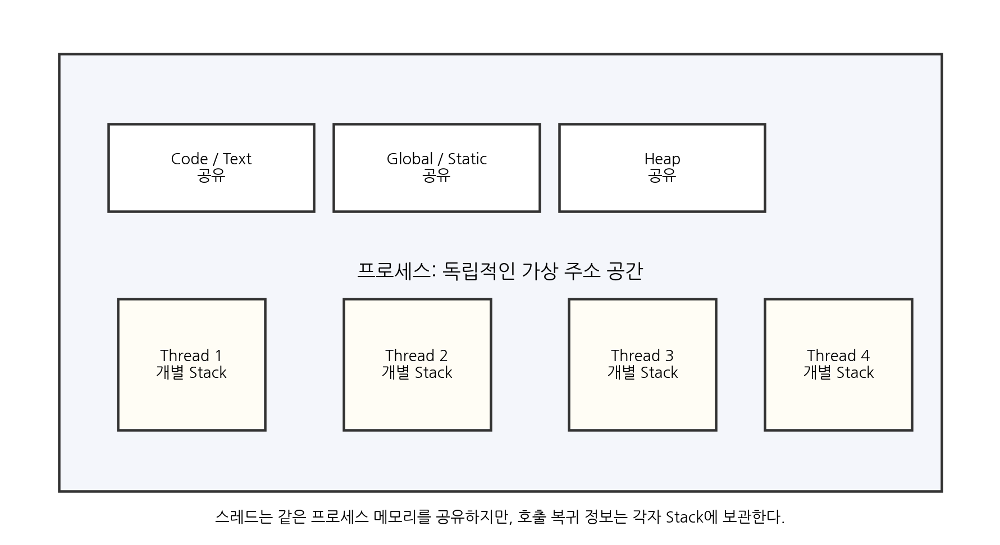
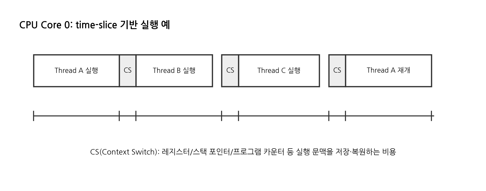
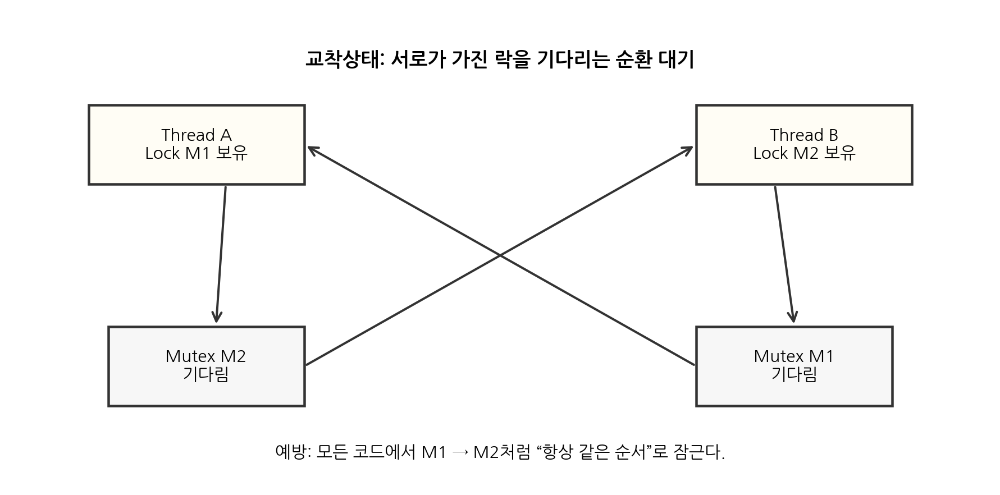
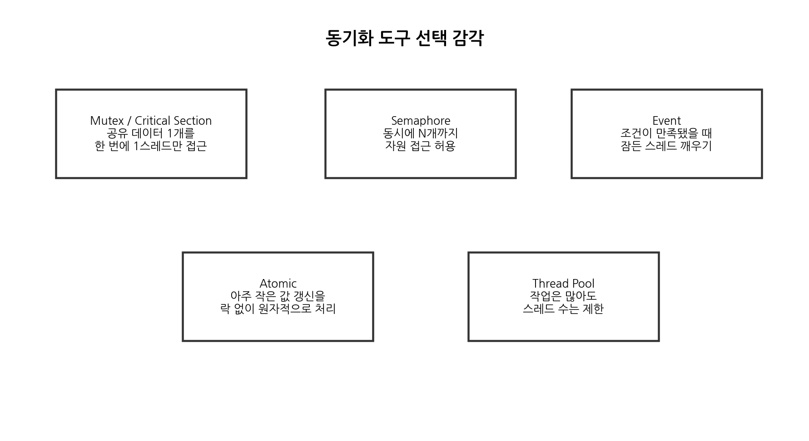

# 게임 서버 프로그래밍 1장: 멀티스레딩 핵심 정리

> 목적: 게임 서버에서 멀티스레딩을 왜 쓰는지, 언제 위험해지는지, 어떤 동기화 도구를 선택해야 하는지 빠르게 복습하기 위한 요약 교재.

---

## 0. 이 장에서 가져갈 핵심

멀티스레딩은 “스레드를 많이 만들면 빨라진다”가 아니다. 게임 서버에서 멀티스레딩의 목표는 보통 다음 셋이다.

1. **CPU 코어를 여러 개 사용해서 연산량을 분산한다.**
2. **파일, DB, 네트워크 같은 대기 시간을 다른 작업으로 숨긴다.**
3. **긴 작업 때문에 짧은 작업이 막히지 않게 한다.**

하지만 공유 메모리를 쓰는 순간부터 **데이터 레이스, 교착상태, 락 경합, 직렬 병목**이 생긴다. 따라서 게임 서버 멀티스레딩은 단순히 스레드를 늘리는 기술이 아니라, **공유 상태를 최소화하고, 잠금 범위를 줄이며, 대기 시간을 분리하는 설계 기술**이다.

---

## 1. 프로그램, 프로세스, 스레드

### 1.1 프로그램과 프로세스

**프로그램**은 디스크에 있는 실행 파일이다. 예를 들어 `GameServer.exe` 자체는 아직 실행 중인 개체가 아니라 파일이다.

**프로세스**는 실행 중인 프로그램이다. 운영체제는 프로세스마다 독립적인 가상 주소 공간, 핸들, 보안 정보, 실행 상태 등을 관리한다. Windows 문서에서도 프로세스는 실행에 필요한 자원을 제공하고, 스레드는 그 프로세스 안에서 스케줄링 가능한 실행 단위라고 설명한다.

게임 서버 관점에서는 `AuthServer.exe`, `GameServer.exe`, `DBProxy.exe`를 따로 띄우면 각각 별도 프로세스다. 프로세스가 분리되면 메모리도 기본적으로 분리되므로 한 프로세스의 버그가 다른 프로세스의 메모리를 직접 망가뜨리기 어렵다. 대신 프로세스 간 통신, 즉 IPC나 네트워크 통신 비용이 든다.

### 1.2 프로세스 메모리 구조

일반적으로 프로세스 안에는 다음과 같은 영역이 있다.

| 영역 | 의미 | 스레드 간 공유 여부 |
|---|---|---|
| Code/Text | 실행 코드 | 공유 |
| Global/Static | 전역 변수, 정적 변수 | 공유 |
| Heap | 동적 할당 메모리 | 공유 |
| Stack | 함수 호출 정보, 지역 변수 일부, 복귀 주소 | 스레드마다 별도 |



핵심은 **힙과 전역 데이터는 같은 프로세스의 모든 스레드가 공유하지만, 스택은 스레드마다 따로 가진다**는 점이다. 함수 호출이 끝난 뒤 caller의 실행 지점으로 돌아갈 수 있는 이유는 호출 정보가 stack frame에 저장되기 때문이다. 스레드마다 호출 흐름이 다르므로 각 스레드는 자기 call stack을 가진다.

---

## 2. 스레드란 무엇인가

스레드는 **프로세스 안에서 CPU에 의해 실행될 수 있는 작업 단위**다. 하나의 프로세스는 최소 하나의 스레드를 가진다. 보통 프로그램 시작 시 생성되는 첫 스레드를 main thread 또는 primary thread라고 부른다.

스레드의 특징은 다음과 같다.

- 같은 프로세스의 주소 공간을 공유한다.
- 전역 변수, 힙 객체, 싱글턴, 매니저 객체 등에 함께 접근할 수 있다.
- 각 스레드는 자기 stack과 CPU 문맥을 가진다.
- 운영체제 스케줄러가 어떤 스레드를 언제 실행할지 결정한다.

따라서 다음 코드는 순서가 항상 같다고 보장할 수 없다.

```cpp
#include <iostream>
#include <thread>

void Work(const char* name)
{
    for (int i = 0; i < 3; ++i)
        std::cout << name << " " << i << "\n";
}

int main()
{
    std::thread t1(Work, "A");
    std::thread t2(Work, "B");

    t1.join();
    t2.join();
}
```

`A 0, A 1, A 2, B 0...`처럼 나올 수도 있고, `A`와 `B`가 섞여 나올 수도 있다. 이것은 스레드 실행 순서가 운영체제 스케줄링에 의해 달라지기 때문이다.

### 주의: “좀비 프로세스” 표현

“메인 함수는 끝났는데 다른 스레드가 실행 중”인 상태를 무조건 좀비 프로세스라고 부르면 안 된다. Unix 계열에서 좀비 프로세스는 보통 **자식 프로세스가 종료됐지만 부모가 종료 상태를 회수하지 않은 상태**를 말한다. C++ 서버 코드에서 더 중요한 문제는 다음이다.

- `std::thread`를 `join()` 또는 `detach()`하지 않고 파괴하면 `std::terminate()`가 호출된다.
- 프로세스 종료 시 남은 스레드가 강제로 끝나면 리소스 정리, 로그 flush, DB 작업 완료가 깨질 수 있다.
- 게임 서버에서는 종료 플래그, 이벤트, join, graceful shutdown 정책을 명확히 둬야 한다.

---

## 3. 멀티스레딩은 언제 쓰는가

### 3.1 오래 걸리는 일과 짧은 일을 같이 처리할 때

예를 들어 게임 서버가 맵 데이터를 로딩하거나 DB에서 플레이어 정보를 읽는 동안, 다른 클라이언트의 ping, 채팅, 이동 패킷까지 전부 멈추면 안 된다. 긴 작업을 별도 스레드나 비동기 작업으로 분리하면 짧은 요청이 덜 막힌다.

### 3.2 CPU 코어를 모두 활용해야 할 때

싱글 스레드는 한 순간에 보통 하나의 CPU 코어에서만 실행된다. 8코어 서버에서 게임 로직이 완전히 싱글 스레드라면 CPU 전체를 활용하지 못한다. 다만 스레드를 100개 만든다고 100배 빨라지는 것은 아니다. CPU 작업이라면 대체로 **동시에 실행 가능한 코어 수**가 상한선이 된다.

### 3.3 디바이스 타임을 숨길 때

**CPU 타임**은 CPU가 실제로 코드를 실행하는 시간이다.  
**디바이스 타임**은 디스크, 네트워크, DB, 콘솔 출력, 파일 시스템 같은 외부 장치나 커널 I/O를 기다리는 시간이다.

게임 서버에서 디바이스 타임이 긴 작업 예시는 다음과 같다.

- DB 쿼리 대기
- 파일 로딩/저장
- 로그 파일 flush
- 콘솔 출력 과다
- 원격 인증 서버 요청
- 블로킹 네트워크 I/O

디바이스 타임 동안 스레드는 CPU를 거의 쓰지 않고 기다린다. 그래서 I/O 대기가 많은 서버에서는 스레드 수가 CPU 코어 수보다 많을 수 있다. 반대로 순수 CPU 연산만 하는 작업은 스레드 수를 코어 수보다 훨씬 많이 늘려도 context switch 비용만 커질 수 있다.

---

## 4. 스레드 상태와 Context Switch

스레드는 대략 다음 상태를 오간다.

| 상태 | 의미 |
|---|---|
| Runnable/Ready | 실행 가능하지만 CPU를 배정받지 못한 상태 |
| Running | CPU에서 실행 중인 상태 |
| Blocked/Waiting | 락, 이벤트, I/O 완료 등을 기다리는 상태 |
| Dead/Terminated | 실행이 끝난 상태 |

운영체제는 time slice 또는 quantum 단위로 CPU를 나누어 여러 스레드가 번갈아 실행되는 것처럼 보이게 한다.



**Context switch**는 실행 중이던 스레드의 CPU 문맥을 저장하고, 다음 스레드의 문맥을 복원하는 과정이다. 여기에는 레지스터, 스택 포인터, 명령어 포인터, 스케줄링 상태 등이 관련된다. 그래서 context switch는 공짜가 아니다.

정리하면 다음과 같다.

- CPU 코어 수보다 runnable 스레드가 많으면 context switch가 늘어난다.
- blocked/waiting 스레드는 CPU를 거의 쓰지 않으므로 runnable 스레드와 구분해야 한다.
- 스레드를 많이 만든다고 성능이 좋아지는 것이 아니라, 동시에 실행 가능한 작업과 대기 작업의 비율을 봐야 한다.

---

## 5. 데이터 레이스와 동기화

### 5.1 데이터 레이스

두 스레드가 같은 메모리에 동시에 접근하고, 그중 하나 이상이 쓰기이며, 적절한 동기화가 없다면 **data race**가 발생한다.

예를 들어 다음 코드는 안전하지 않다.

```cpp
#include <thread>
#include <vector>

int g_count = 0;

void AddMany()
{
    for (int i = 0; i < 100000; ++i)
        ++g_count; // 읽기 + 증가 + 쓰기. 원자적이지 않다.
}

int main()
{
    std::thread t1(AddMany);
    std::thread t2(AddMany);
    t1.join();
    t2.join();
}
```

`++g_count`는 한 줄처럼 보이지만 실제로는 보통 다음 단계로 나뉜다.

1. 메모리에서 `g_count` 읽기
2. 값 증가
3. 메모리에 다시 쓰기

두 스레드가 이 과정을 동시에 수행하면 증가 결과가 유실될 수 있다.

### 5.2 원자성과 일관성

멀티스레딩에서 중요한 기준은 두 가지다.

**원자성**은 중간 상태가 관찰되지 않는다는 뜻이다. 예를 들어 `count++`가 완전히 한 번의 작업처럼 처리되면 원자적이다.

**일관성**은 여러 데이터의 관계가 깨지지 않는다는 뜻이다. 예를 들어 `player.hp <= player.maxHp`라는 규칙이 있다면, 여러 스레드가 동시에 접근해도 이 규칙이 깨지면 안 된다.

동기화는 원자성과 일관성을 지키기 위해 사용한다.

---

## 6. 임계 영역, 뮤텍스, Critical Section

### 6.1 임계 영역

**임계 영역**은 공유 데이터에 접근하는 코드 구간이다. 이 구간은 한 번에 하나의 스레드만 들어가게 해야 하는 경우가 많다.

```cpp
std::mutex m;
int gold = 0;

void AddGold(int value)
{
    m.lock();
    gold += value; // 임계 영역
    m.unlock();
}
```

하지만 위 코드는 예외가 발생하거나 중간에 return이 추가되면 unlock을 빼먹을 수 있다. 그래서 C++에서는 RAII 방식의 `std::lock_guard`를 쓰는 것이 좋다.

```cpp
#include <mutex>

std::mutex m;
int gold = 0;

void AddGold(int value)
{
    std::lock_guard<std::mutex> lock(m);
    gold += value;
} // scope를 벗어나면 자동 unlock
```

### 6.2 Mutex와 Windows Critical Section

Windows에서 **Mutex object**는 커널 동기화 객체이며, 한 번에 하나의 스레드만 소유할 수 있다. 이름 있는 mutex를 사용하면 프로세스 간 동기화도 가능하다.

Windows의 **Critical Section object**는 mutex와 비슷하지만 같은 프로세스 안의 스레드 사이에서만 사용할 수 있다. 프로세스 간 공유가 필요 없다면 일반적으로 critical section이 더 가볍게 쓰인다. 다만 C++ 코드에서는 플랫폼 독립성을 위해 보통 `std::mutex`부터 고려한다.

정리하면 다음과 같다.

| 도구 | 범위 | 특징 | 사용 예 |
|---|---|---|---|
| `std::mutex` | C++ 표준 | 이식성 좋음 | 일반적인 공유 데이터 보호 |
| Windows Mutex | 스레드/프로세스 간 가능 | 커널 객체, 이름 가능 | 프로세스 간 단일 실행 보장 |
| Windows Critical Section | 같은 프로세스 내부 | Windows 전용, 가벼운 편 | Windows 서버 내부 락 |

### 6.3 뮤텍스의 단점

뮤텍스는 안전성을 주지만 비용도 만든다.

- lock/unlock 자체 비용
- 다른 스레드가 기다리는 contention 비용
- context switch 유발 가능성
- 잠금 순서가 꼬이면 deadlock 가능성
- 잠금 범위가 넓으면 병렬성이 사라짐

따라서 뮤텍스의 핵심은 “무조건 많이 쓰기”가 아니라 **공유 데이터의 불변식을 지키는 최소 구간에만 쓰기**다.

---

## 7. 교착상태와 잠금 순서

### 7.1 교착상태란

**교착상태(deadlock)**는 두 개 이상의 스레드가 서로 상대방이 가진 자원을 기다리면서 영원히 진행하지 못하는 상태다.

예를 들어 다음 상황을 보자.

1. Thread A가 `mutexPlayer`를 잡았다.
2. Thread B가 `mutexRoom`을 잡았다.
3. Thread A는 `mutexRoom`을 기다린다.
4. Thread B는 `mutexPlayer`를 기다린다.
5. 둘 다 영원히 진행하지 못한다.



게임 서버에서 교착상태가 발생하면 다음 증상이 나타날 수 있다.

- CPU 사용량이 낮거나 0%에 가까움
- 서버 프로세스는 살아 있는데 응답이 없음
- 로그인 요청, 방 입장 요청, 매칭 요청 등이 멈춤
- 특정 worker thread가 wait 상태에서 빠져나오지 못함

### 7.2 잠금 순서 규칙

교착상태를 줄이는 가장 기본적인 규칙은 **모든 코드에서 여러 락을 잡을 때 항상 같은 순서로 잡는 것**이다.

예를 들어 서버 전체에서 다음 순서를 정했다고 하자.

```text
GlobalLock → RoomLock → PlayerLock → InventoryLock
```

그러면 어떤 함수에서도 `PlayerLock`을 잡은 뒤 `RoomLock`을 잡으면 안 된다. 거꾸로 가는 순간 순환 대기 가능성이 생긴다.

나쁜 예:

```cpp
void MoveItem(Player& player, Room& room)
{
    std::lock_guard<std::mutex> p(player.mutex);
    std::lock_guard<std::mutex> r(room.mutex); // 순서 위반 가능
}
```

좋은 예:

```cpp
void MoveItem(Player& player, Room& room)
{
    std::lock_guard<std::mutex> r(room.mutex);
    std::lock_guard<std::mutex> p(player.mutex);
}
```

더 좋은 방법은 아예 여러 락을 동시에 잡아야 하는 설계를 줄이는 것이다. 예를 들어 방 단위 actor/queue 모델로 만들어 특정 room state는 한 스레드 또는 한 job queue에서만 수정하게 하면 락 설계가 단순해진다.

### 7.3 재귀 뮤텍스

재귀 뮤텍스는 같은 스레드가 같은 락을 여러 번 잡을 수 있게 해준다. C++에서는 `std::recursive_mutex`가 있다.

하지만 재귀 뮤텍스는 신중하게 써야 한다. 함수 호출 구조가 꼬여 있어 “이미 락을 잡았는지 모르겠다”는 문제를 숨길 수 있기 때문이다. 게임 서버에서는 재귀 뮤텍스를 남용하기보다 **락을 잡는 계층과 책임을 명확히 분리**하는 쪽이 좋다.

---

## 8. 병렬성과 시리얼 병목

### 8.1 직렬 병목

멀티스레딩의 목표는 여러 작업을 병렬로 처리하는 것이다. 그런데 코드 중 일부가 반드시 한 번에 하나씩만 처리되어야 한다면 그 부분이 전체 성능을 제한한다.

대표적인 직렬 병목은 다음과 같다.

- 하나의 큰 mutex로 서버 전체 상태를 보호
- 모든 패킷 처리에서 global lock 사용
- DB 요청 결과를 받는 동안 lock 유지
- 파일/콘솔 로그 출력 중 lock 유지
- room 전체를 한 스레드에서만 순차 처리

### 8.2 Amdahl's Law

Amdahl's Law는 병렬화할 수 없는 직렬 구간이 전체 속도 향상의 상한을 정한다는 법칙이다.

```text
Speedup = 1 / (S + P / N)

S = 직렬 구간 비율
P = 병렬화 가능한 구간 비율
N = CPU 코어 또는 병렬 처리 단위 수
```

예를 들어 전체 작업의 20%가 직렬 구간이라면, 코어를 무한히 늘려도 이론상 최대 속도 향상은 `1 / 0.2 = 5배`를 넘기 어렵다.

게임 서버에서 이 법칙이 중요한 이유는 간단하다.

> 락으로 보호된 구간이 길면, worker thread를 4개에서 16개로 늘려도 실제 성능은 거의 오르지 않을 수 있다.

따라서 최적화 우선순위는 “스레드 수 늘리기”가 아니라 다음 순서에 가깝다.

1. 공유 상태를 줄인다.
2. 잠금 범위를 줄인다.
3. lock 안에서 I/O를 하지 않는다.
4. lock contention을 측정한다.
5. 병렬화 가능한 작업 단위로 나눈다.

---

## 9. 싱글 스레드 게임 서버와 멀티스레드 게임 서버

### 9.1 싱글 스레드 게임 서버

싱글 스레드 서버는 구조가 단순하다. 공유 메모리 경쟁이 거의 없고 디버깅도 쉽다. 작은 규모의 방 서버, 턴제 게임 서버, 로직이 단순한 매치 서버라면 싱글 스레드 이벤트 루프도 충분히 실용적일 수 있다.

하지만 다음 상황에서는 병목이 커진다.

- DB나 파일 I/O가 블로킹 방식이다.
- 한 room의 긴 연산 때문에 다른 room 처리까지 밀린다.
- 서버 한 프로세스가 CPU 한 코어만 사용한다.
- 동시 접속자 증가에 따라 패킷 처리량이 부족해진다.

이때 선택지는 두 가지다.

1. 비동기 I/O, 코루틴, 이벤트 루프를 사용해서 대기 시간을 줄인다.
2. 멀티스레드 구조로 CPU 코어를 활용한다.

중요한 점은 **방 개수나 플레이어 수만큼 스레드를 만들면 안 된다**는 것이다. 플레이어 1만 명에 스레드 1만 개를 만들면 stack 메모리, 스케줄링 비용, context switch 비용 때문에 서버가 무너진다.

### 9.2 멀티스레드 게임 서버가 필요한 경우

멀티스레드 서버가 필요한 대표 상황은 다음과 같다.

- MMO처럼 한 프로세스가 큰 월드 상태를 유지한다.
- 서버 한 대에서 여러 CPU 코어를 써야 할 만큼 로직 연산량이 많다.
- pathfinding, visibility, physics, AI 등 CPU 작업이 크다.
- 비동기 함수만으로는 감추기 어려운 디바이스 타임이 있다.
- 여러 room이 공통 메모리나 공통 서비스를 접근해야 한다.

다만 멀티스레드 구조는 다음 문제를 반드시 같이 가져온다.

- 데이터 레이스
- 교착상태
- 락 경합
- 재현 어려운 버그
- 순서 의존성
- 디버깅 난이도 상승

---

## 10. 스레드 풀링

### 10.1 왜 스레드 풀을 쓰는가

클라이언트마다 스레드를 하나씩 만들면 안 된다. 클라이언트가 10,000명이면 스레드도 10,000개가 된다. 각 스레드는 stack을 가지고, 운영체제 스케줄링 대상이 된다. 대부분의 스레드가 잠들어 있어도 관리 비용이 커진다.

**스레드 풀**은 제한된 수의 worker thread를 미리 만들어두고, 작업 queue에서 일을 꺼내 처리하는 구조다.

```text
작업 Queue
  ├─ Packet Job
  ├─ DB Result Job
  ├─ Room Tick Job
  └─ Log Job
        ↓
Worker Thread Pool
  ├─ Worker 1
  ├─ Worker 2
  ├─ Worker 3
  └─ Worker 4
```

비유하면 공중화장실과 같다. 사람이 올 때마다 화장실을 새로 짓는 게 아니라, 정해진 칸 수를 여러 사람이 번갈아 사용한다.

### 10.2 스레드 풀 크기 감각

스레드 풀 크기는 작업 성격에 따라 다르다.

| 작업 성격 | 스레드 수 감각 |
|---|---|
| 순수 CPU 연산 | 보통 CPU 코어 수 근처 |
| I/O 대기 많음 | CPU 코어 수보다 많을 수 있음 |
| DB 블로킹 호출 많음 | 별도 DB worker pool 고려 |
| 로그/파일 출력 | 별도 비동기 logger queue 고려 |

주의할 점은 runnable thread가 너무 많으면 context switch와 cache miss가 늘어난다는 것이다. 반대로 I/O 대기 스레드는 CPU를 거의 쓰지 않으므로 CPU 작업 스레드와 같은 기준으로 보면 안 된다.

---

## 11. Event

### 11.1 Event의 의미

Event는 **잠자는 스레드를 깨우는 동기화 객체**다. Windows에서는 `CreateEvent`, `SetEvent`, `ResetEvent`, `WaitForSingleObject`, `CloseHandle` 등을 사용한다.

개념적으로는 다음과 같다.

```text
Worker Thread: "할 일 없으니 잠듦"
Main Thread:   "작업 넣었음. SetEvent로 깨움"
Worker Thread: "WaitForSingleObject가 반환됨. 작업 처리"
```

간단한 Windows 스타일 예시는 다음과 같다.

```cpp
#include <windows.h>

HANDLE g_event = CreateEvent(
    nullptr,
    FALSE,  // auto-reset event
    FALSE,  // initial state: nonsignaled
    nullptr
);

DWORD WINAPI WorkerThread(LPVOID)
{
    WaitForSingleObject(g_event, INFINITE);
    // 깨어난 뒤 작업 처리
    return 0;
}

void NotifyWorker()
{
    SetEvent(g_event);
}

void Shutdown()
{
    CloseHandle(g_event);
}
```

### 11.2 Manual-reset과 Auto-reset

| 종류 | 의미 | 사용 감각 |
|---|---|---|
| Manual-reset event | `ResetEvent`를 호출하기 전까지 signaled 유지 | 여러 스레드를 한 번에 깨우는 신호 |
| Auto-reset event | 하나의 대기 스레드를 깨우면 자동으로 nonsignaled | 작업 하나에 worker 하나 깨우기 |

### 11.3 PulseEvent 주의

Windows에는 `PulseEvent`라는 함수가 있지만 Microsoft 문서에서는 이 함수가 신뢰할 수 없으며 사용하지 말라고 안내한다. 따라서 새 코드에서는 `SetEvent`/`ResetEvent`, condition variable, semaphore, IOCP 같은 대안을 쓰는 것이 좋다.

---

## 12. Semaphore

### 12.1 Semaphore의 의미

Mutex가 “한 번에 1명만” 들어가게 한다면, Semaphore는 “한 번에 N명까지” 들어가게 한다.

예를 들어 DB connection pool이 8개라면 동시에 DB connection을 사용하는 스레드를 8개로 제한할 수 있다.

```cpp
// 개념 예시: Windows Semaphore
HANDLE g_sem = CreateSemaphore(
    nullptr,
    8,   // initial count
    8,   // maximum count
    nullptr
);

void UseDbConnection()
{
    WaitForSingleObject(g_sem, INFINITE); // count 감소. 0이면 대기

    // DB connection 사용

    ReleaseSemaphore(g_sem, 1, nullptr);  // count 증가
}
```

### 12.2 Event와 Semaphore 차이

Event와 Semaphore는 둘 다 스레드를 깨울 수 있지만 의미가 다르다.

| 도구 | 핵심 의미 | 예시 |
|---|---|---|
| Event | 조건 발생을 알림 | “서버 종료 신호가 왔다”, “새 작업이 들어왔다” |
| Semaphore | 남은 자원 개수를 관리 | “DB connection 8개 중 몇 개 사용 가능” |

Event는 신호 중심이고, Semaphore는 카운트 중심이다. 그래서 작업 queue에서 “작업 개수만큼 worker를 깨우는” 용도로 semaphore를 쓰기도 한다.

---

## 13. Atomic Operation

### 13.1 Atomic이란

Atomic operation은 여러 스레드가 동시에 접근해도 중간 상태가 깨지지 않는 원자적 연산이다. C++에서는 `std::atomic<T>`를 사용한다.

```cpp
#include <atomic>
#include <thread>

std::atomic<int> g_count = 0;

void AddMany()
{
    for (int i = 0; i < 100000; ++i)
        g_count.fetch_add(1, std::memory_order_relaxed);
}
```

이 코드는 단순 카운터 증가에는 mutex 없이도 안전하다.

### 13.2 Atomic이 Mutex를 완전히 대체하지는 않는다

Atomic은 작은 값 하나를 안전하게 바꾸는 데 강하다. 하지만 여러 값 사이의 일관성을 지켜야 한다면 mutex가 더 적합할 수 있다.

예를 들어 다음 상태를 보자.

```cpp
struct PlayerState
{
    int hp;
    int maxHp;
    int shield;
};
```

`hp`, `maxHp`, `shield`가 서로 관계를 가진다면 값 하나만 atomic으로 만든다고 전체 상태가 안전해지지 않는다. 이럴 때는 하나의 mutex로 상태 전체의 불변식을 보호하거나, 상태 변경을 단일 스레드 queue에서 처리하는 구조를 고려해야 한다.

### 13.3 Memory Order는 고급 주제

`std::atomic`은 단순히 “연산이 찢어지지 않는다”만 의미하지 않는다. 멀티코어 환경에서는 스레드마다 메모리 변경을 관찰하는 순서가 달라질 수 있으므로 memory ordering 문제가 있다. `memory_order_relaxed`, `acquire`, `release`, `seq_cst` 같은 개념은 lock-free 구조를 만들 때 중요하다.

처음에는 다음 기준으로 접근하면 된다.

- 단순 통계 카운터: `memory_order_relaxed` 고려 가능
- 스레드 간 데이터 공개/소유권 전달: acquire/release 이해 필요
- 잘 모르겠으면 기본값 `seq_cst` 또는 mutex 사용
- lock-free는 “고급 최적화”이지 기본 설계가 아니다

---

## 14. 동기화 도구 선택 지도



| 상황 | 우선 고려할 도구 |
|---|---|
| 공유 객체 하나를 보호 | `std::mutex`, critical section |
| 동시에 N개 자원만 허용 | semaphore |
| 작업 도착/종료 신호 | event, condition variable |
| 작은 카운터 증가 | `std::atomic` |
| 많은 요청을 제한된 스레드로 처리 | thread pool |
| 네트워크 I/O 완료 기반 서버 | IOCP, epoll, kqueue 등 OS 비동기 I/O |

---

## 15. 멀티스레드 프로그래밍의 흔한 실수

### 15.1 읽기에는 잠금하지 않는 실수

쓰기만 lock하고 읽기는 lock하지 않으면 안전하지 않을 수 있다.

```cpp
// 나쁜 예
void SetHp(int v)
{
    std::lock_guard<std::mutex> lock(m);
    hp = v;
}

int GetHp()
{
    return hp; // lock 없이 읽기. data race 가능
}
```

공유 데이터라면 읽기와 쓰기 모두 같은 규칙을 따라야 한다.

### 15.2 잠금 순서 꼬임

여러 mutex를 잡는 코드가 여러 곳에 있다면 순서를 통일해야 한다.

```text
항상 Room → Player → Inventory 순서로 잠근다.
```

순서가 코드마다 달라지면 deadlock 가능성이 급격히 올라간다.

### 15.3 잠금 범위가 너무 좁은 경우

잠금 범위가 너무 좁으면 보호해야 할 불변식이 깨진다.

```cpp
// 나쁜 예: hp와 maxHp의 관계가 중간에 깨질 수 있음
{
    std::lock_guard<std::mutex> lock(m);
    hp = newHp;
}
{
    std::lock_guard<std::mutex> lock(m);
    maxHp = newMaxHp;
}
```

`hp <= maxHp` 같은 규칙이 있다면 둘을 하나의 임계 영역에서 함께 바꿔야 한다.

### 15.4 잠금 범위가 너무 넓은 경우

잠금 범위가 너무 넓으면 병렬성이 사라진다.

```cpp
// 나쁜 예: lock 잡은 채로 DB/파일/콘솔 I/O 수행
std::lock_guard<std::mutex> lock(playerMutex);
UpdatePlayerMemory();
SavePlayerToDatabase();
WriteLogToConsole();
```

가능하면 lock 안에서는 메모리 상태만 빠르게 복사/변경하고, DB나 파일 I/O는 lock 밖에서 처리한다.

```cpp
PlayerSnapshot snapshot;
{
    std::lock_guard<std::mutex> lock(playerMutex);
    snapshot = MakeSnapshot(player);
}

SavePlayerToDatabase(snapshot); // lock 밖에서 I/O
```

### 15.5 디바이스 타임이 섞인 잠금

콘솔 출력, 파일 로그, DB 쿼리는 생각보다 느릴 수 있다. 특히 디버깅 목적으로 lock 안에서 `std::cout`을 많이 찍으면 서버 CPU 사용률은 낮은데 처리량이 떨어지는 이상한 병목이 생길 수 있다.

해결 방향은 다음과 같다.

- lock 안에서 로그 문자열만 생성하지 말고 필요한 데이터만 복사한다.
- 로그는 비동기 queue에 넣는다.
- 별도 logger thread가 파일에 기록한다.
- hot path에서는 콘솔 출력 금지.

### 15.6 잠금의 전염성

잠금으로 보호되는 객체에서 포인터나 참조를 꺼내온 뒤 lock을 풀면 위험할 수 있다.

```cpp
Player* p = nullptr;
{
    std::lock_guard<std::mutex> lock(playersMutex);
    p = players[id].get();
}

p->hp -= 10; // 위험: p가 여전히 유효하다는 보장이 약함
```

이런 경우에는 다음 중 하나를 선택해야 한다.

- lock을 유지한 상태에서 필요한 작업까지 끝낸다.
- `shared_ptr` 등으로 생명주기를 보장한다.
- ID만 꺼내고 실제 수정은 해당 owner thread/queue로 넘긴다.
- snapshot을 복사해서 lock 밖에서 사용한다.

### 15.7 잠긴 mutex 삭제

어떤 스레드가 mutex를 기다리거나 소유 중인데 해당 mutex가 포함된 객체를 삭제하면 미정의 동작이나 크래시가 날 수 있다. 서버 종료 시에는 다음 순서를 지켜야 한다.

1. 새 작업 유입 차단
2. worker에게 종료 신호 전달
3. queue drain 또는 취소 정책 수행
4. worker join
5. 공유 객체 삭제

---

## 16. Concurrency Visualizer로 무엇을 봐야 하나

Visual Studio의 Concurrency Visualizer는 멀티스레드 프로그램에서 CPU 사용률, 스레드 실행/대기 타임라인, 동기화 경합 등을 분석하는 데 도움이 된다.

확인 포인트는 다음이다.

1. **CPU Utilization**  
   CPU 코어를 충분히 쓰는지 본다. worker가 많은데 CPU 사용률이 낮다면 I/O 대기, lock 대기, event 대기일 수 있다.

2. **Threads View**  
   각 스레드가 실행 중인지, blocked 상태인지, synchronization에서 기다리는지 본다.

3. **Contention 패턴**  
   특정 mutex나 critical section 때문에 여러 스레드가 줄 서는지 본다.

4. **디바이스 타임**  
   파일, 네트워크, 콘솔, DB 같은 외부 대기 때문에 CPU가 놀고 있는지 본다.

5. **스레드 풀 크기 조정**  
   CPU 작업 pool과 I/O 작업 pool을 분리해야 하는지 판단한다.

참고 링크:

- Microsoft 공식 문서: Utilization View  
  https://learn.microsoft.com/en-us/visualstudio/profiling/utilization-view?view=visualstudio
- Microsoft 공식 문서: Threads View timeline reports  
  https://learn.microsoft.com/en-us/visualstudio/profiling/threads-view-timeline-reports?view=visualstudio
- Microsoft 공식 문서: Concurrency Visualizer SDK  
  https://learn.microsoft.com/en-us/visualstudio/profiling/concurrency-visualizer-sdk?view=visualstudio
- Microsoft Docs GitHub: Poorly behaved multithreaded applications patterns  
  https://github.com/MicrosoftDocs/visualstudio-docs/blob/main/docs/profiling/common-patterns-for-poorly-behaved-multithreaded-applications.md
- MSDN Magazine 아카이브: Performance Tuning with the Concurrency Visualizer  
  https://learn.microsoft.com/en-us/archive/msdn-magazine/2010/march/thread-diagnostics-performance-tuning-with-the-concurrency-visualizer-in-visual-studio-2010

---

## 17. 게임 서버 설계 체크리스트

### 공유 상태 체크

- 이 데이터는 정말 여러 스레드가 동시에 접근해야 하는가?
- 한 room의 상태를 한 owner thread/queue에서만 바꿀 수 없는가?
- 읽기 전용 데이터로 만들 수 없는가?
- snapshot으로 복사해서 lock 밖에서 처리할 수 없는가?

### 락 체크

- 읽기와 쓰기가 같은 락 규칙을 따르는가?
- lock 안에서 DB, 파일, 콘솔, 네트워크 I/O를 하지 않는가?
- 여러 락을 잡는 순서가 전역적으로 정해져 있는가?
- lock 범위가 불변식을 지킬 만큼 충분한가?
- lock 범위가 불필요하게 넓지는 않은가?

### 스레드 체크

- 클라이언트 수만큼 스레드를 만들고 있지 않은가?
- CPU 작업과 I/O 작업을 같은 pool에 몰아넣고 있지 않은가?
- worker thread 종료 절차가 있는가?
- join/detach 정책이 명확한가?

### 성능 체크

- CPU 사용률이 낮은데 처리량도 낮다면 lock/I/O 대기부터 의심한다.
- CPU 사용률이 높은데 처리량이 낮다면 과도한 context switch, cache miss, busy waiting을 의심한다.
- thread 수를 늘리기 전에 serial bottleneck을 측정한다.
- Concurrency Visualizer나 프로파일러로 실제 병목을 확인한다.

---

## 18. 한 페이지 요약

멀티스레딩은 게임 서버 성능을 올리는 중요한 도구지만, 동시에 가장 위험한 버그의 원인이 된다.

- 프로세스는 독립 메모리 공간을 가진 실행 중 프로그램이다.
- 스레드는 프로세스 안의 실행 단위다.
- 스레드는 heap/global을 공유하고 stack은 각자 가진다.
- 실행 순서는 예측하면 안 된다.
- 공유 데이터에는 data race가 생길 수 있다.
- mutex/critical section은 공유 데이터의 일관성을 지킨다.
- lock은 안전성을 주지만 병목과 deadlock을 만든다.
- 여러 lock은 항상 같은 순서로 잡는다.
- lock 안에서 I/O를 하지 않는다.
- thread를 클라이언트 수만큼 만들지 말고 thread pool을 쓴다.
- event는 신호, semaphore는 카운트 자원, atomic은 작은 원자 연산에 적합하다.
- Amdahl's Law 때문에 직렬 구간이 길면 코어를 늘려도 성능이 안 오른다.
- 실제 병목은 Concurrency Visualizer 같은 도구로 확인한다.

---

## 참고 자료

1. Microsoft Learn, **About Processes and Threads**  
   https://learn.microsoft.com/en-us/windows/win32/procthread/about-processes-and-threads
2. Microsoft Learn, **Thread Stack Size**  
   https://learn.microsoft.com/en-us/windows/win32/procthread/thread-stack-size
3. Microsoft Learn, **Mutex Objects**  
   https://learn.microsoft.com/en-us/windows/win32/sync/mutex-objects
4. Microsoft Learn, **Critical Section Objects**  
   https://learn.microsoft.com/en-us/windows/win32/sync/critical-section-objects
5. Microsoft Learn, **WaitForSingleObject function**  
   https://learn.microsoft.com/en-us/windows/win32/api/synchapi/nf-synchapi-waitforsingleobject
6. Microsoft Learn, **Using Event Objects**  
   https://learn.microsoft.com/en-us/windows/win32/sync/using-event-objects
7. Microsoft Learn, **PulseEvent function**  
   https://learn.microsoft.com/en-us/windows/win32/api/winbase/nf-winbase-pulseevent
8. Microsoft Learn, **Semaphore Objects**  
   https://learn.microsoft.com/en-us/windows/win32/sync/semaphore-objects
9. cppreference, **std::mutex**  
   https://en.cppreference.com/w/cpp/thread/mutex
10. cppreference, **Concurrency support library**  
    https://en.cppreference.com/w/cpp/atomic
11. cppreference, **std::memory_order**  
    https://en.cppreference.com/w/cpp/atomic/memory_order
12. Intel, **VTune Profiler Performance Analysis Cookbook**  
    https://cdrdv2-public.intel.com/773629/vtune-profiler_cookbook_2023.1-766316-773629.pdf
13. Microsoft Learn, **Utilization View - Concurrency Visualizer**  
    https://learn.microsoft.com/en-us/visualstudio/profiling/utilization-view?view=visualstudio
14. Microsoft Learn, **Threads View timeline reports**  
    https://learn.microsoft.com/en-us/visualstudio/profiling/threads-view-timeline-reports?view=visualstudio
15. Microsoft Learn, **Concurrency Visualizer SDK**  
    https://learn.microsoft.com/en-us/visualstudio/profiling/concurrency-visualizer-sdk?view=visualstudio
16. Microsoft Docs GitHub, **Common patterns for poorly behaved multithreaded applications**  
    https://github.com/MicrosoftDocs/visualstudio-docs/blob/main/docs/profiling/common-patterns-for-poorly-behaved-multithreaded-applications.md
