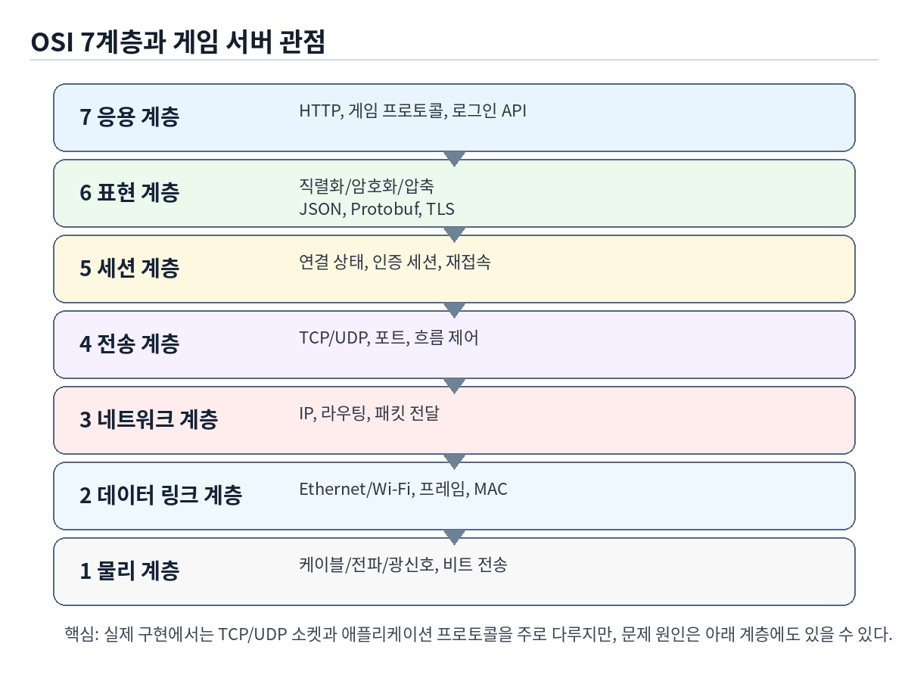
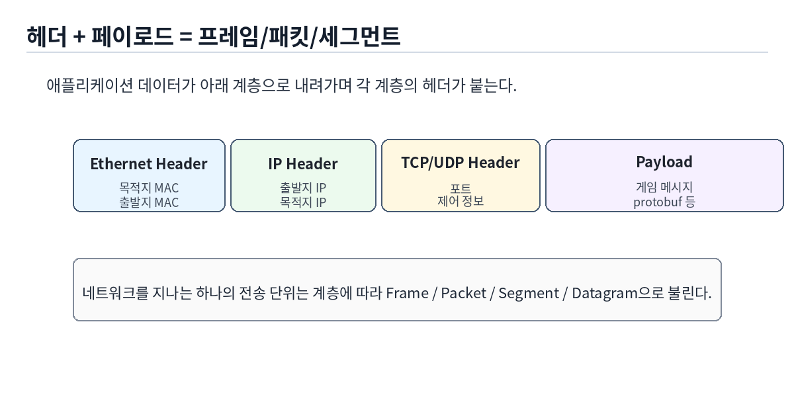
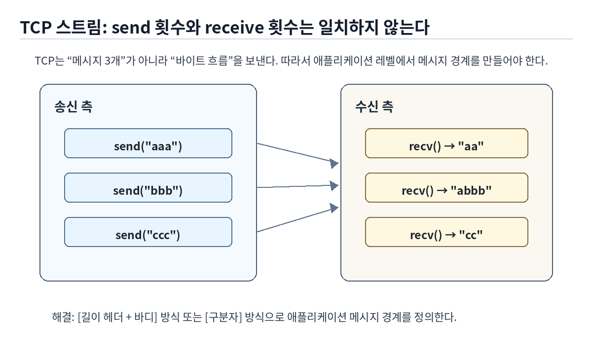
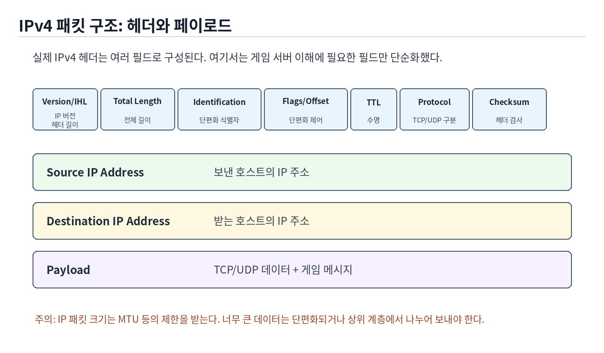
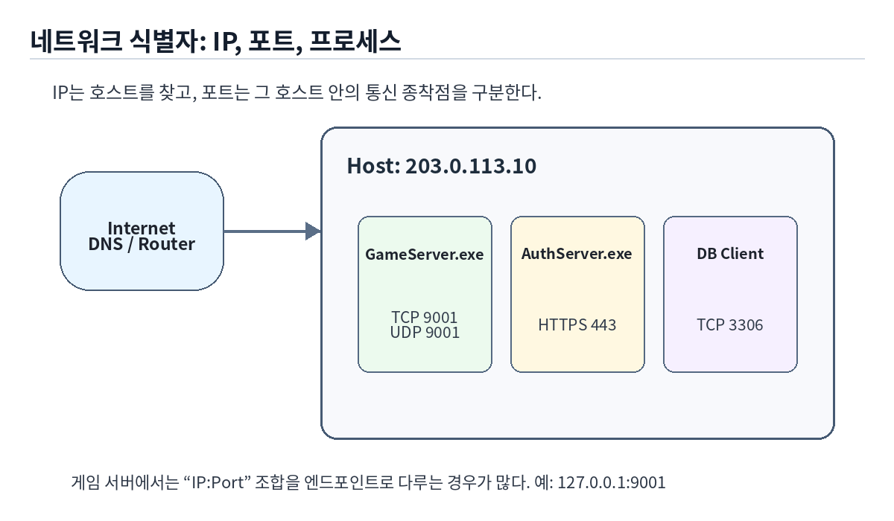
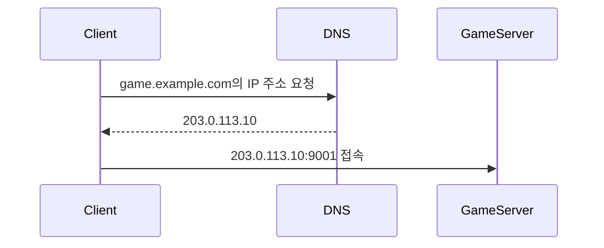
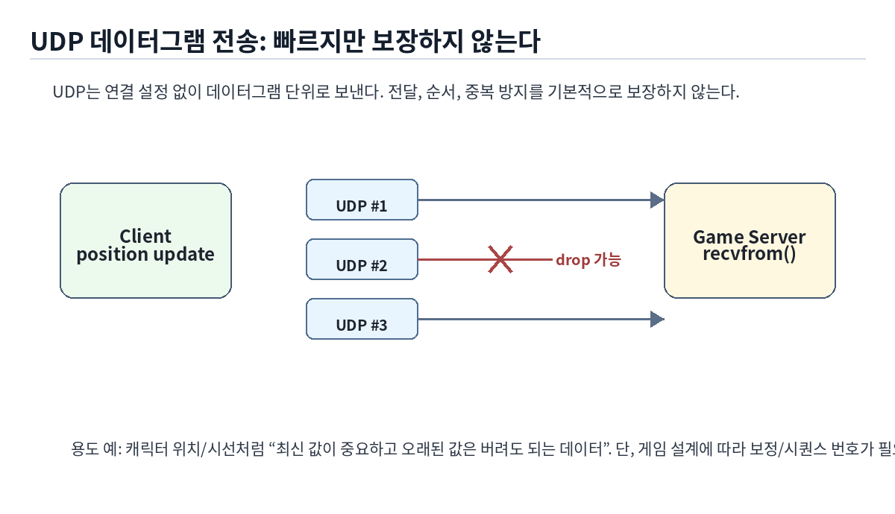
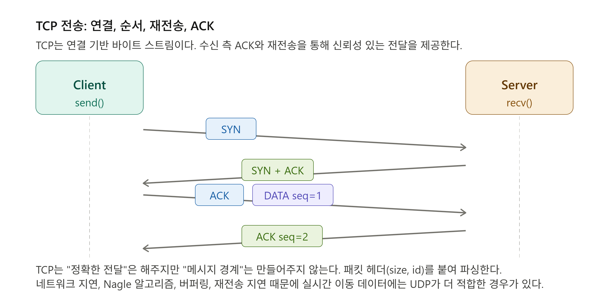

# 2장. 컴퓨터 네트워크

> 주 서적: 『게임 서버 프로그래밍 교과서』  
> 정리 방식: 직접 정리한 키워드를 기반으로 AI를 활용해 설명을 보충하고, RFC/공식 문서/네트워크 교재 관점에서 검토했다.

---

## 2.1 이 장에서 잡아야 할 핵심

게임 서버 프로그래밍에서 네트워크를 공부할 때 목표는 “OSI 7계층을 외우는 것”이 아니다. 실제 목표는 다음을 이해하는 것이다.

1. 게임 데이터가 어떤 단위로 쪼개져 이동하는가
2. TCP와 UDP가 왜 다르게 동작하는가
3. `send()` 한 번이 `recv()` 한 번으로 오지 않는 이유는 무엇인가
4. IP, 포트, DNS가 각각 무엇을 식별하는가
5. 전송 속도, 레이턴시, 패킷 유실이 게임 서버 품질에 어떤 영향을 주는가
6. 게임 메시지를 어떤 형식으로 설계해야 하는가

게임 서버 입장에서 가장 중요한 감각은 이것이다.

> 네트워크는 함수 호출처럼 즉시, 정확히, 한 덩어리로 도착하지 않는다.  
> 데이터는 쪼개지고, 합쳐지고, 늦게 오고, 순서가 바뀌거나, 아예 사라질 수 있다.

---

## 2.2 OSI 7계층

OSI 모델은 네트워크 통신을 7개의 계층으로 나누어 설명하는 개념 모델이다. 실제 인터넷은 TCP/IP 모델을 더 많이 사용하지만, OSI 모델은 “문제가 어느 계층에서 발생했는지”를 구분할 때 유용하다.



| 계층 | 이름 | 게임 서버 관점 |
|---|---|---|
| 7 | 응용 계층 | 로그인 API, 게임 패킷, 매칭 요청, 채팅 메시지 |
| 6 | 표현 계층 | JSON, Protobuf, 압축, 암호화, 인코딩 |
| 5 | 세션 계층 | 로그인 세션, 재접속, 인증 상태 |
| 4 | 전송 계층 | TCP, UDP, 포트, 흐름 제어, 재전송 |
| 3 | 네트워크 계층 | IP 주소, 라우팅, 패킷 전달 |
| 2 | 데이터 링크 계층 | Ethernet, Wi-Fi, MAC 주소, 프레임 |
| 1 | 물리 계층 | 케이블, 전파, 광신호, 비트 전송 |

게임 서버 코드를 작성할 때 직접 만지는 것은 보통 4계층 이상의 개념이다. 예를 들어 `socket()`, `send()`, `recv()`는 전송 계층 위에서 사용하는 API이고, 그 위에 게임만의 패킷 규칙을 만든다.

하지만 장애 분석에서는 아래 계층도 중요하다. 예를 들어 서버 코드는 멀쩡한데 특정 지역 유저만 끊긴다면, 애플리케이션 코드보다 라우팅, ISP, 무선 품질, 패킷 유실 문제일 수 있다.

---

## 2.3 헤더, 페이로드, 프레임

네트워크 데이터는 보통 **헤더(Header)**와 **페이로드(Payload)**로 나뉜다.

- **페이로드**: 실제로 보내고 싶은 데이터
- **헤더**: 데이터를 전달하기 위해 필요한 부가 정보

예를 들어 게임 서버에서 “플레이어가 이동했다”는 메시지를 보낸다고 하자. 실제 좌표 값은 페이로드이고, 이 데이터가 누구에게 가야 하는지, 어떤 프로토콜인지, 길이가 얼마인지 같은 정보는 헤더에 들어간다.



계층마다 부르는 이름이 조금씩 다르다.

| 계층 | 전송 단위 이름 |
|---|---|
| 데이터 링크 계층 | Frame |
| 네트워크 계층 | Packet / Datagram |
| 전송 계층 | Segment(TCP), Datagram(UDP) |
| 응용 계층 | Message / Packet |

게임 서버 코드에서 “패킷”이라고 부르는 것은 보통 응용 계층에서 정의한 게임 메시지를 말한다. 즉, TCP/IP의 IP 패킷과 게임 서버의 패킷은 같은 단어를 쓰지만 계층이 다를 수 있다.

---

## 2.4 라우터와 IP 패킷 전달

라우터는 네트워크 계층에서 IP 패킷을 목적지 쪽으로 전달하는 장비다. 클라이언트가 게임 서버에 패킷을 보낼 때, 데이터가 한 번에 서버까지 직행하는 것이 아니라 여러 라우터를 거쳐 갈 수 있다.


라우터는 IP 헤더의 목적지 주소를 보고 다음 홉으로 패킷을 넘긴다. 이 과정에서 각 라우터의 처리 시간, 경로 혼잡, 장비 성능이 레이턴시에 영향을 줄 수 있다.

---

## 2.5 프로토콜이란?

프로토콜은 통신 규칙이다.

사람끼리 대화할 때도 “한국어로 말한다”, “질문하면 대답한다”, “먼저 인사한다” 같은 규칙이 필요하다. 네트워크도 마찬가지로 데이터를 주고받기 위한 규칙이 필요하다.

예를 들어 다음은 모두 프로토콜이다.

- IP: 패킷을 목적지 네트워크까지 보내기 위한 규칙
- TCP: 신뢰성 있는 바이트 스트림 전송 규칙
- UDP: 단순한 데이터그램 전송 규칙
- HTTP: 웹 요청/응답 규칙
- DNS: 도메인 이름을 IP 주소로 바꾸는 규칙
- 게임 프로토콜: `LoginReq`, `MoveReq`, `ChatReq` 같은 게임 메시지 규칙

게임 서버를 만든다는 것은 결국 “우리 게임만의 응용 계층 프로토콜”을 설계하는 일이기도 하다.

---

## 2.6 스트림과 메시지

네트워크 데이터는 크게 **스트림(Stream)** 방식과 **메시지(Message)** 방식으로 이해할 수 있다.

### 스트림

스트림은 데이터가 하나의 바이트 흐름으로 이어지는 방식이다. TCP가 대표적이다.

중요한 점은 `send()` 횟수와 `recv()` 횟수가 일치하지 않는다는 것이다.



예를 들어 송신 측에서 다음과 같이 보냈다고 하자.

```cpp
send(sock, "aaa", 3, 0);
send(sock, "bbb", 3, 0);
send(sock, "ccc", 3, 0);
```

수신 측에서는 다음처럼 받을 수 있다.

```text
recv() -> "aa"
recv() -> "abbb"
recv() -> "cc"
```

이건 오류가 아니다. TCP는 “aaa”, “bbb”, “ccc”라는 메시지 경계를 보존하지 않는다. TCP는 순서가 보장된 바이트 스트림을 제공할 뿐이다.

그래서 TCP 게임 서버에서는 반드시 메시지 경계를 직접 만들어야 한다.

---

## 2.7 TCP에서 메시지 경계를 만드는 방법

TCP에서 게임 패킷을 구분하는 대표 방식은 두 가지다.

### 1. 길이 헤더 방식

패킷 앞에 전체 길이를 붙인다.

```text
[ size ][ packet_id ][ payload ... ]
```

예시:

```cpp
#pragma pack(push, 1)
struct PacketHeader
{
    uint16_t size; // header + body 전체 크기
    uint16_t id;   // 패킷 종류
};
#pragma pack(pop)
```

수신 버퍼에서는 다음 순서로 처리한다.

```cpp
while (recvBuffer.size() >= sizeof(PacketHeader))
{
    PacketHeader header = PeekHeader(recvBuffer);

    if (recvBuffer.size() < header.size)
        break; // 아직 패킷 전체가 도착하지 않음

    auto packet = ReadBytes(recvBuffer, header.size);
    Dispatch(packet);
}
```

게임 서버에서는 이 방식이 가장 흔하다. 바이너리 프로토콜과 잘 맞고, 빠르게 파싱할 수 있다.

### 2. 구분자 방식

메시지 끝에 특정 구분자를 붙인다.

```text
LOGIN user pass\n
MOVE 10 20 30\n
CHAT hello\n
```

이 방식은 텍스트 기반 프로토콜에서 이해하기 쉽다. 하지만 페이로드 안에 구분자가 들어갈 수 있으면 문제가 생긴다. 예를 들어 채팅 메시지에 `\n`이 포함되면 어디까지가 메시지인지 헷갈릴 수 있다.

따라서 구분자 방식은 다음 처리가 필요하다.

- 이스케이프 처리
- 인코딩 규칙
- 최대 메시지 길이 제한
- 잘못된 구분자 입력 방어

게임 서버의 바이너리 패킷에는 보통 길이 헤더 방식이 더 적합하다.

---

## 2.8 IP 패킷 구조와 단편화

IP 패킷은 네트워크 계층에서 전달되는 데이터 단위다. IPv4 패킷은 IP 헤더와 페이로드로 구성된다.



IPv4 헤더에는 대표적으로 다음 정보가 들어간다.

| 필드 | 의미 |
|---|---|
| Source Address | 출발지 IP 주소 |
| Destination Address | 목적지 IP 주소 |
| Total Length | IP 패킷 전체 길이 |
| Identification | 단편화된 패킷 조각을 다시 합치기 위한 식별자 |
| Flags / Fragment Offset | 단편화 여부와 조각 위치 |
| TTL | 패킷이 네트워크에서 살아남을 수 있는 최대 홉 수 |
| Protocol | 상위 프로토콜이 TCP인지 UDP인지 등을 구분 |
| Header Checksum | IPv4 헤더 오류 검출 |

### IP 패킷 크기는 왜 제한될까?

네트워크에는 MTU(Maximum Transmission Unit)라는 제한이 있다. 예를 들어 Ethernet의 일반적인 MTU는 1500바이트다. 이보다 큰 IP 패킷은 한 번에 지나가지 못할 수 있다.

이때 IP 계층은 패킷을 여러 조각으로 나누는 **단편화(Fragmentation)**를 수행할 수 있다. 하지만 단편화는 비용이 크고, 조각 중 하나라도 유실되면 전체 데이터를 복원하기 어렵다.

게임 서버에서는 보통 다음 원칙을 잡는 것이 좋다.

- UDP 패킷은 너무 크게 만들지 않는다.
- 큰 데이터는 애플리케이션 레벨에서 직접 나누어 보낸다.
- 실시간 이동/전투 데이터는 작고 자주 보내는 구조로 설계한다.
- 에셋 다운로드처럼 큰 데이터는 게임 서버 TCP 패킷이 아니라 HTTP/CDN 등을 고려한다.

---

## 2.9 스트림과 메시지는 크기 제한이 없는가?

필기에서 “IP 패킷 크기는 제한적인데 스트림이나 메시지에서는 제한이 없음”이라고 정리한 부분은 다음처럼 이해하면 된다.

TCP 스트림은 애플리케이션 입장에서는 긴 바이트 흐름처럼 보인다. 그래서 코드상으로는 큰 데이터를 계속 `send()`할 수 있다. 하지만 실제 네트워크 아래에서는 TCP가 데이터를 여러 세그먼트로 나누고, IP 계층에서 패킷 단위로 전달한다.

즉, “제한이 없다”는 뜻은 물리적으로 무한하다는 뜻이 아니다.

> 애플리케이션은 큰 데이터 흐름을 다루는 것처럼 보지만, OS의 네트워크 스택은 내부적으로 작은 전송 단위로 나누어 보낸다.

UDP 메시지도 이론상 큰 데이터그램을 만들 수 있지만, 실제 인터넷 환경에서는 큰 UDP 데이터그램은 단편화와 유실 위험이 커진다. 따라서 게임에서는 작은 단위로 설계하는 것이 안전하다.

---

## 2.10 컴퓨터 네트워크 식별자

네트워크 통신에서는 “어느 컴퓨터의 어느 프로그램과 통신할 것인가”를 식별해야 한다.



### IP 주소

IP 주소는 네트워크에서 호스트를 식별한다.

- IPv4: `127.0.0.1`, `192.168.0.10` 같은 32비트 주소
- IPv6: 더 큰 주소 공간을 제공하는 128비트 주소

`127.0.0.1`은 루프백 주소로, 자기 자신을 가리킨다. 로컬에서 게임 서버와 클라이언트를 테스트할 때 자주 사용한다.

### 포트

포트는 한 호스트 안에서 어떤 통신 엔드포인트로 보낼지 구분한다.

예를 들어 한 컴퓨터에서 다음 서버들이 동시에 실행될 수 있다.

```text
AuthServer  : 127.0.0.1:443
GameServer1 : 127.0.0.1:9001
GameServer2 : 127.0.0.1:9002
Database   : 127.0.0.1:3306
```

IP만 있으면 컴퓨터까지는 찾을 수 있지만, 그 안에서 어떤 서버 프로세스가 받을지는 알 수 없다. 그래서 포트가 필요하다.

### 호스트 이름과 DNS

사람은 `203.0.113.10` 같은 IP 주소보다 `game.example.com` 같은 이름을 기억하기 쉽다. DNS는 호스트 이름을 IP 주소로 변환해 주는 시스템이다.



실제 서비스에서는 서버 IP가 바뀔 수 있으므로 클라이언트에 IP를 하드코딩하기보다 DNS 또는 서버 목록 API를 사용하는 것이 일반적이다.

---

## 2.11 네트워크 품질과 특성

게임 서버에서 네트워크 품질을 판단할 때 중요한 기준은 다음 세 가지다.

| 기준 | 의미 | 게임에서의 영향 |
|---|---|---|
| 스루풋 | 단위 시간당 전송 가능한 데이터량 | 패치, 큰 상태 동기화, 대량 전송 |
| 레이턴시 | 요청 후 응답까지 걸리는 시간 | 조작감, 피격 판정, 이동 보정 |
| 패킷 유실률 | 보낸 패킷 중 사라지는 비율 | 끊김, 위치 튐, 재전송 지연 |

### 패킷 드롭과 유실

패킷은 여러 이유로 유실될 수 있다.

- 네트워크 혼잡
- 라우터/스위치 버퍼 초과
- 무선 신호 품질 저하
- 물리 회선 잡음
- 방화벽/보안 장비 정책
- TTL 만료

### 데이터 오류와 체크섬

네트워크를 지나며 데이터가 손상될 수 있다. 이를 검출하기 위해 여러 계층에서 체크섬이나 오류 검출 기법을 사용한다. 오류를 복구하기 어렵다면 보통 해당 패킷은 버려진다.

TCP는 손실된 데이터를 재전송해 신뢰성을 제공하지만, UDP는 기본적으로 그런 보장을 하지 않는다. 그래서 UDP를 사용할 때는 게임 로직에서 유실을 감안해야 한다.

---

## 2.12 전송 속도와 레이턴시

전송 속도와 레이턴시는 다르다.

### 전송 속도

전송 속도는 얼마나 많은 데이터를 보낼 수 있는지를 의미한다.

영향 요소:

- 선로의 종류와 품질
- 네트워크 장비 성능
- 운영체제 네트워크 스택
- NIC 성능
- 서버/클라이언트 소프트웨어 구현
- 혼잡 제어와 버퍼 상태

### 레이턴시

레이턴시는 작은 데이터를 보냈을 때 상대방에게 도달하거나 응답받기까지 걸리는 시간이다.

영향 요소:

- 물리적 거리
- 라우터 홉 수
- 라우터 처리 시간
- 무선/유선 매체 특성
- 서버 처리 시간
- 클라이언트 처리 시간
- 큐잉 지연
- 재전송 지연

게임에서는 스루풋보다 레이턴시가 더 중요한 경우가 많다. 예를 들어 1Gbps 회선이라도 왕복 시간이 200ms라면 액션 게임 조작감은 나빠진다.

---

## 2.13 UDP 네트워킹

UDP(User Datagram Protocol)는 데이터그램 단위로 데이터를 보내는 전송 계층 프로토콜이다.



UDP의 특징은 다음과 같다.

- 연결 설정이 없다.
- 데이터그램 단위로 보낸다.
- 전달을 보장하지 않는다.
- 순서를 보장하지 않는다.
- 중복 수신을 막아주지 않는다.
- TCP보다 프로토콜 자체는 단순하다.
- 하나의 소켓으로 여러 상대와 통신하기 쉽다.

UDP는 다음 데이터에 적합하다.

- 최신 상태가 중요한 데이터
- 오래된 데이터는 버려도 되는 데이터
- 약간의 유실보다 지연이 더 큰 문제인 데이터

게임 예시:

- 캐릭터 위치
- 바라보는 방향
- 이동 입력
- 총알 발사 방향
- 음성/영상 스트리밍

단, “캐릭터 이동은 무조건 UDP”라는 뜻은 아니다. MMO처럼 서버 권위가 강하고 이동 빈도/정확성/보정 방식이 복잡한 경우 TCP를 쓰는 구조도 가능하다. 중요한 것은 데이터 성격에 맞게 선택하는 것이다.

UDP를 쓸 때는 보통 직접 보완 기능을 설계한다.

```text
[ sequence ][ timestamp ][ payload ... ]
```

- sequence: 오래된 패킷 무시
- timestamp: 보간/예측/지연 측정
- ack bitfield: 필요한 경우 일부 신뢰성 구현
- snapshot id: 상태 동기화 기준점 제공

---

## 2.14 TCP 네트워킹

TCP(Transmission Control Protocol)는 연결 기반의 신뢰성 있는 바이트 스트림을 제공한다.



TCP의 특징은 다음과 같다.

- 연결 설정이 필요하다.
- 데이터 순서를 보장한다.
- 손실된 데이터는 재전송한다.
- 중복 데이터를 처리한다.
- 흐름 제어를 제공한다.
- 혼잡 제어를 제공한다.
- 메시지 경계는 보존하지 않는다.

TCP는 다음 데이터에 적합하다.

- 로그인
- 회원가입
- 인벤토리
- 상점 구매
- 채팅
- 퀘스트 수락/완료
- 매칭 요청
- 서버 입장
- DB에 영향을 주는 중요한 요청

게임 서버에서 TCP를 사용할 때 가장 중요한 구현 포인트는 다음이다.

> TCP가 신뢰성은 제공하지만, 게임 메시지 단위까지 알아서 나누어 주지는 않는다.

그래서 TCP 게임 서버에서는 보통 다음과 같은 패킷 헤더를 둔다.

```cpp
struct PacketHeader
{
    uint16_t size;
    uint16_t packetId;
};
```

그리고 수신 버퍼에서 `size`만큼 완성된 패킷이 도착했는지 확인한 뒤 처리한다.

---

## 2.15 UDP와 TCP 비교

| 항목 | TCP | UDP |
|---|---|---|
| 연결 | 필요 | 불필요 |
| 데이터 형태 | 바이트 스트림 | 데이터그램 |
| 전달 보장 | 보장 | 보장하지 않음 |
| 순서 보장 | 보장 | 보장하지 않음 |
| 중복 처리 | 처리 | 직접 처리 필요 |
| 메시지 경계 | 없음 | 있음 |
| 지연 | 재전송 때문에 증가 가능 | 상대적으로 낮음 |
| 사용 예 | 로그인, 채팅, 인벤토리 | 이동, 음성, 실시간 상태 |

게임 서버에서는 보통 다음처럼 생각하면 된다.

- 정확히 도착해야 하는 데이터 → TCP
- 최신 상태가 중요하고 오래된 데이터는 버려도 되는 데이터 → UDP
- 둘 다 필요한 데이터 → TCP + UDP 혼합 또는 UDP 위에 부분 신뢰성 구현

---

## 2.16 게임에서 자주 사용하는 메시지 형식

게임 메시지는 크게 텍스트 형식과 이진 형식으로 나눌 수 있다.

### 텍스트 형식

예시:

```json
{
  "type": "Move",
  "x": 10,
  "y": 20,
  "z": 30
}
```

장점:

- 사람이 읽기 쉽다.
- 디버깅하기 쉽다.
- 웹 API와 잘 맞는다.

단점:

- 크기가 커질 수 있다.
- 파싱 비용이 상대적으로 크다.
- 실시간 게임 패킷에는 비효율적일 수 있다.

### 이진 형식

예시:

```text
[ size ][ id ][ x ][ y ][ z ]
```

장점:

- 크기가 작다.
- 파싱이 빠르다.
- 실시간 게임 서버에 적합하다.

단점:

- 사람이 바로 읽기 어렵다.
- 버전 관리와 호환성 설계가 필요하다.

### 메타데이터와 하위 호환성

메타데이터를 추가하면 메시지를 더 유연하게 만들 수 있다.

예를 들어 Protobuf 같은 IDL 기반 직렬화는 필드 번호를 사용하기 때문에 필드를 추가해도 기존 클라이언트와 어느 정도 호환성을 유지하기 쉽다.

하지만 메타데이터가 많아지면 통신량이 증가할 수 있다. 따라서 게임 서버에서는 다음 균형이 중요하다.

- 개발 편의성
- 디버깅 편의성
- 패킷 크기
- 파싱 속도
- 하위 호환성
- 보안 검증

---

## 2.17 게임 서버 관점 정리

이 장에서 반드시 기억해야 할 내용은 다음이다.

1. 네트워크 데이터는 헤더와 페이로드로 구성된다.
2. IP는 호스트를 찾고, 포트는 프로세스의 통신 엔드포인트를 구분한다.
3. TCP는 신뢰성 있는 바이트 스트림이지만 메시지 경계는 없다.
4. UDP는 데이터그램 단위지만 전달/순서/중복을 보장하지 않는다.
5. TCP에서 게임 패킷을 만들려면 길이 헤더가 거의 필수다.
6. UDP는 실시간 상태 전송에 적합하지만 유실/순서 뒤바뀜을 직접 고려해야 한다.
7. 레이턴시, 스루풋, 패킷 유실률은 게임 품질을 결정하는 핵심 지표다.
8. 큰 패킷은 단편화와 유실 위험이 있으므로 작게 설계하는 것이 좋다.
9. 게임 서버 프로토콜은 결국 “우리 게임이 데이터를 어떻게 나누고 해석할지”를 정하는 규칙이다.

---

## 2.18 간단 복습 질문

- OSI 7계층에서 TCP와 UDP는 몇 계층인가?
- TCP에서 `send()` 3번이 `recv()` 3번으로 오지 않는 이유는?
- TCP 게임 서버에서 패킷 헤더에 `size`가 필요한 이유는?
- UDP가 캐릭터 이동에 자주 쓰이는 이유는?
- IP 주소와 포트의 차이는?
- 패킷 유실률과 레이턴시는 게임 플레이에 각각 어떤 영향을 주는가?
- 구분자 방식 프로토콜에서 페이로드 안에 구분자가 들어가면 어떤 문제가 생기는가?
- 큰 UDP 데이터그램을 피해야 하는 이유는?

---

## 참고 자료

- 『게임 서버 프로그래밍 교과서』
- Andrew S. Tanenbaum, David J. Wetherall, *Computer Networks*
- James F. Kurose, Keith W. Ross, *Computer Networking: A Top-Down Approach*
- W. Richard Stevens, *UNIX Network Programming, Volume 1: The Sockets Networking API*
- IETF, [RFC 791: Internet Protocol](https://datatracker.ietf.org/doc/html/rfc791)
- IETF, [RFC 768: User Datagram Protocol](https://www.rfc-editor.org/rfc/rfc768.html)
- IETF, [RFC 9293: Transmission Control Protocol](https://datatracker.ietf.org/doc/html/rfc9293)
- IETF, [About RFCs](https://www.ietf.org/process/rfcs/)
- Microsoft, [TCP/IP Fundamentals for Microsoft Windows](https://download.microsoft.com/download/9/4/6/946958ef-7b86-4ddc-bfdb-c7ed2af4ce51/tcpip_fund.pdf)
