# 3장. 소켓 프로그래밍

> 주 서적: **『게임 서버 프로그래밍 교과서』**  
> 정리 방식: 책을 읽으며 정리한 키워드를 기반으로, 게임 서버 관점에서 필요한 개념·주의점·코드 예제를 보충했다.  
> 핵심 주제: **블로킹 소켓 → 논블로킹 소켓 → Overlapped I/O → epoll / IOCP**

---

## 0. 이 장의 핵심 요약

소켓 프로그래밍은 결국 **“네트워크 I/O 때문에 스레드가 멈추는 문제를 어떻게 다룰 것인가”**를 다룬다.

처음에는 `send()`, `recv()`, `accept()` 같은 함수를 단순히 호출하면 된다. 하지만 게임 서버처럼 수천~수만 개의 클라이언트를 다루면, 단순한 블로킹 방식은 곧 한계에 부딪힌다.

이 장의 큰 흐름은 다음과 같다.

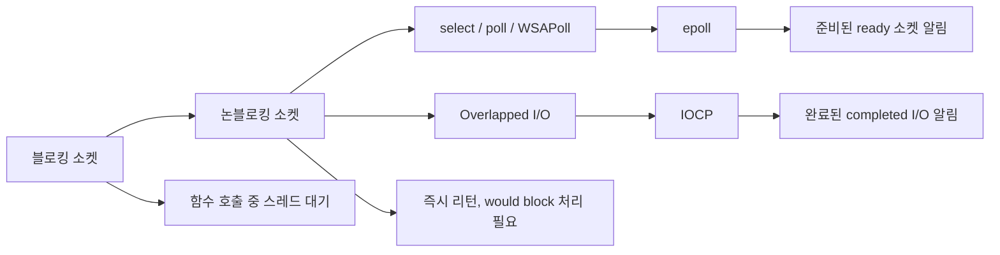

게임 서버에서 특히 중요한 결론은 다음과 같다.

| 구분 | 핵심 |
|---|---|
| 블로킹 소켓 | 이해하기 쉽지만 접속자가 많아지면 스레드 낭비가 커진다. |
| 논블로킹 소켓 | 함수가 즉시 리턴하므로 멈추지는 않지만, 재시도 로직과 이벤트 감시가 필요하다. |
| `select` / `poll` | 기본적인 이벤트 감시 방식이지만 대규모 소켓에는 비효율적이다. |
| `epoll` | Linux에서 대규모 소켓의 ready 이벤트를 효율적으로 감시한다. |
| Overlapped I/O | Windows에서 I/O 요청을 걸어두고 완료를 나중에 받는 방식이다. |
| IOCP | Windows에서 대규모 Overlapped I/O 완료를 스레드 풀로 효율적으로 처리하는 핵심 모델이다. |

---

## 1. 소켓과 비동기 입출력의 관계

소켓은 운영체제가 제공하는 **네트워크 통신용 핸들**이다. 애플리케이션은 소켓 API를 통해 데이터를 보내고 받지만, 실제 패킷 송수신은 네트워크 카드, 커널 네트워크 스택, 드라이버, 운영체제 버퍼 등을 거쳐 처리된다.

게임 서버에서 소켓 I/O를 비동기 또는 논블로킹 방식으로 다루는 이유는 단순하다.

> 네트워크는 CPU보다 훨씬 느리고, 언제 데이터가 도착할지 알 수 없다.

따라서 `recv()`를 호출했는데 아직 데이터가 없다면, 블로킹 소켓에서는 스레드가 멈춘다. 접속자가 1명이라면 괜찮지만, 접속자가 1만 명이면 각 클라이언트마다 스레드를 하나씩 두는 구조는 메모리와 컨텍스트 스위칭 비용 때문에 감당하기 어렵다.

그래서 대규모 서버는 보통 다음 방향으로 발전한다.

```text
블로킹 소켓
→ 논블로킹 소켓
→ 이벤트 기반 I/O
→ epoll 또는 IOCP 같은 고성능 I/O 모델
```

---

## 2. 블로킹 소켓

### 2.1 블로킹이란?

블로킹은 어떤 함수를 호출했을 때, 그 작업이 끝날 때까지 호출한 스레드가 대기하는 현상이다.

예를 들어 파일을 읽는 `ReadFile()`이나 소켓에서 데이터를 받는 `recv()`를 호출했는데 아직 처리할 데이터가 없다면, 스레드는 CPU를 쓰지 않고 대기 상태로 들어간다.

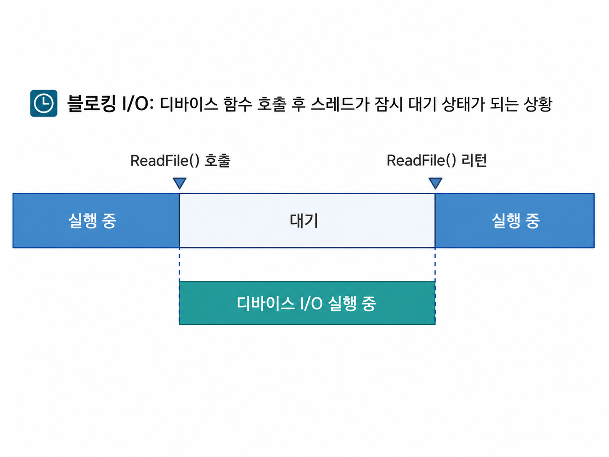

블로킹 상태의 스레드는 보통 CPU 연산을 하지 않는다. 운영체제는 해당 스레드를 잠시 재우고, I/O가 끝났거나 데이터가 도착했을 때 다시 실행 가능한 상태로 만든다.

즉, 블로킹은 “CPU를 100% 태우면서 기다리는 것”이 아니라 **운영체제에게 잠시 재워지는 것**에 가깝다.

### 2.2 소켓에서 블로킹이 발생하는 대표 상황

| 함수 | 블로킹될 수 있는 상황 |
|---|---|
| `accept()` | 아직 새 TCP 연결 요청이 없을 때 |
| `connect()` | 연결 시도가 완료되지 않았을 때 |
| `recv()` | 수신 버퍼에 읽을 데이터가 없을 때 |
| `send()` | 송신 버퍼가 가득 차서 더 넣을 수 없을 때 |
| `ReadFile()` | 파일 또는 장치 I/O가 끝나지 않았을 때 |

소켓 함수는 단순한 함수 호출처럼 보이지만, 실제로는 운영체제 네트워크 스택과 장치 I/O 상태에 의존한다.

---

## 3. TCP 소켓의 기본 연결과 송신

TCP 소켓은 연결 지향 프로토콜이다. 하나의 TCP 연결은 다음 정보로 식별된다.

```text
로컬 IP + 로컬 포트 + 원격 IP + 원격 포트
```

TCP 소켓 하나는 연결된 상대 endpoint 하나와 통신한다. 서버는 여러 클라이언트를 처리하기 위해 클라이언트마다 연결 소켓을 따로 가진다.

### 3.1 TCP 클라이언트 예제: connect, send, close

아래 코드는 Windows Winsock 기반의 아주 단순한 TCP 클라이언트 예제다.

```cpp
// Windows TCP client example
#include <winsock2.h>
#include <ws2tcpip.h>
#include <iostream>

#pragma comment(lib, "Ws2_32.lib")

int main()
{
    WSADATA wsaData{};
    if (WSAStartup(MAKEWORD(2, 2), &wsaData) != 0)
    {
        std::cerr << "WSAStartup failed\n";
        return 1;
    }

    SOCKET sock = socket(AF_INET, SOCK_STREAM, IPPROTO_TCP);
    if (sock == INVALID_SOCKET)
    {
        std::cerr << "socket failed\n";
        WSACleanup();
        return 1;
    }

    sockaddr_in serverAddr{};
    serverAddr.sin_family = AF_INET;
    serverAddr.sin_port = htons(9001);
    inet_pton(AF_INET, "127.0.0.1", &serverAddr.sin_addr);

    if (connect(sock, reinterpret_cast<sockaddr*>(&serverAddr), sizeof(serverAddr)) == SOCKET_ERROR)
    {
        std::cerr << "connect failed: " << WSAGetLastError() << "\n";
        closesocket(sock);
        WSACleanup();
        return 1;
    }

    const char* msg = "hello server";
    int sent = send(sock, msg, static_cast<int>(strlen(msg)), 0);
    if (sent == SOCKET_ERROR)
    {
        std::cerr << "send failed: " << WSAGetLastError() << "\n";
    }

    closesocket(sock);
    WSACleanup();
    return 0;
}
```

이 예제는 이해하기 쉽지만, 기본적으로 블로킹 방식이다. `connect()`나 `send()`가 바로 끝나지 않으면 호출한 스레드가 대기할 수 있다.

---

## 4. TCP 서버의 기본 연결 수락과 수신

서버는 보통 다음 순서로 TCP 연결을 받는다.

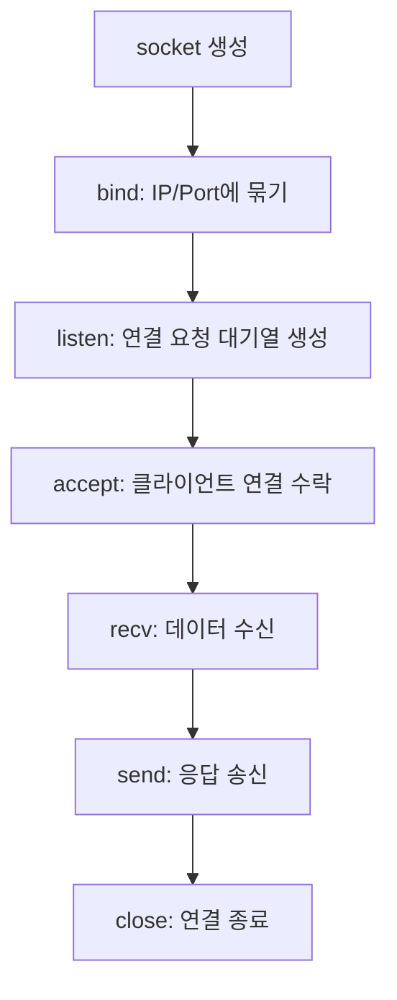

### 4.1 TCP 서버 예제: bind, listen, accept, recv

```cpp
// Windows TCP blocking server example
#include <winsock2.h>
#include <ws2tcpip.h>
#include <iostream>

#pragma comment(lib, "Ws2_32.lib")

int main()
{
    WSADATA wsaData{};
    WSAStartup(MAKEWORD(2, 2), &wsaData);

    SOCKET listenSock = socket(AF_INET, SOCK_STREAM, IPPROTO_TCP);

    sockaddr_in addr{};
    addr.sin_family = AF_INET;
    addr.sin_port = htons(9001);
    addr.sin_addr.s_addr = htonl(INADDR_ANY);

    bind(listenSock, reinterpret_cast<sockaddr*>(&addr), sizeof(addr));
    listen(listenSock, SOMAXCONN);

    std::cout << "waiting client...\n";

    SOCKET clientSock = accept(listenSock, nullptr, nullptr);
    if (clientSock == INVALID_SOCKET)
    {
        std::cerr << "accept failed: " << WSAGetLastError() << "\n";
        closesocket(listenSock);
        WSACleanup();
        return 1;
    }

    char buffer[1024]{};
    int received = recv(clientSock, buffer, sizeof(buffer), 0);

    if (received > 0)
    {
        std::cout << "received: " << std::string(buffer, received) << "\n";
    }
    else if (received == 0)
    {
        std::cout << "client disconnected\n";
    }
    else
    {
        std::cerr << "recv failed: " << WSAGetLastError() << "\n";
    }

    closesocket(clientSock);
    closesocket(listenSock);
    WSACleanup();
    return 0;
}
```

이 서버는 클라이언트 한 명을 받는 데는 충분하지만, `accept()`와 `recv()`에서 블로킹될 수 있다. 따라서 게임 서버 구조로는 부족하다.

---

## 5. 소켓 버퍼

소켓에는 일반적으로 운영체제가 관리하는 **송신 버퍼**와 **수신 버퍼**가 있다.

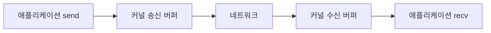

중요한 점은 `send()`가 호출되었다고 해서 데이터가 즉시 상대방 애플리케이션까지 도착했다는 뜻은 아니라는 것이다.

`send()`는 보통 애플리케이션 버퍼의 데이터를 운영체제 송신 버퍼로 복사하는 일을 한다. 이후 실제 네트워크 전송은 운영체제와 네트워크 장치가 처리한다.

### 5.1 TCP 송신 버퍼가 가득 차면?

TCP에서는 송신 측이 데이터를 너무 빨리 보내고, 수신 측이 데이터를 너무 느리게 처리하면 수신 버퍼가 가득 찰 수 있다. 이때 TCP는 흐름 제어를 통해 송신 속도를 늦춘다.

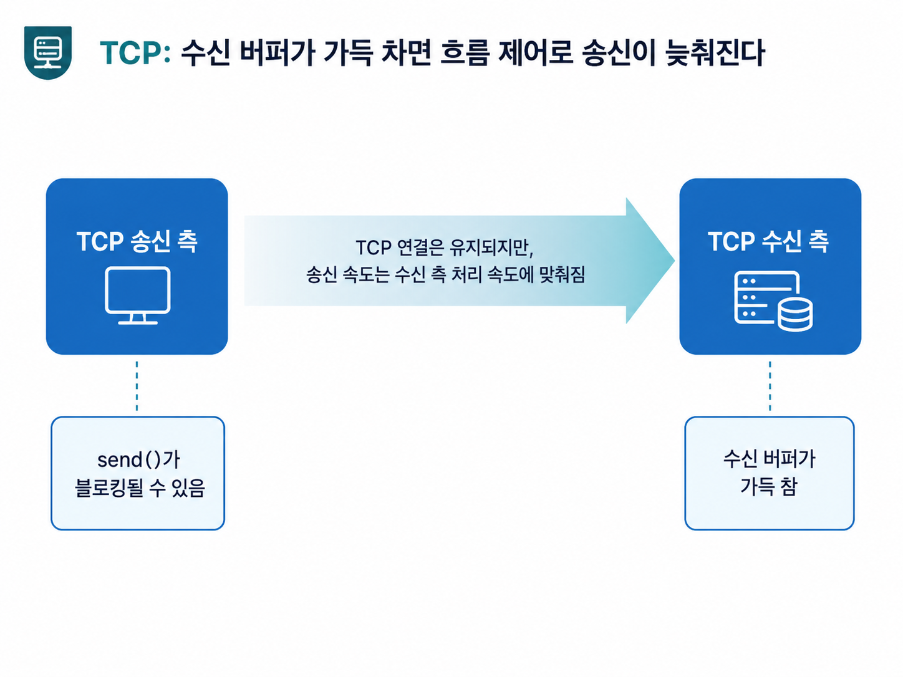

이 상황에서 TCP 연결은 끊어진 것이 아니다. 다만 실제 송신 속도가 느린 쪽에 맞춰진다. 그래서 블로킹 소켓의 `send()`는 송신 버퍼에 공간이 생길 때까지 멈출 수 있다.

이것은 TCP가 신뢰성 있는 스트림 전송을 제공하기 위해 필요한 동작이다. TCP는 애플리케이션에 순서가 보장되는 신뢰성 있는 바이트 스트림을 제공하며, 수신 측이 감당 가능한 범위를 고려해 전송한다.

### 5.2 UDP 수신 버퍼가 가득 차면?

UDP는 TCP처럼 연결 단위의 흐름 제어를 제공하지 않는다. 수신 측 버퍼가 가득 찼는데 데이터그램이 계속 들어오면, 일부 데이터그램은 버려질 수 있다.

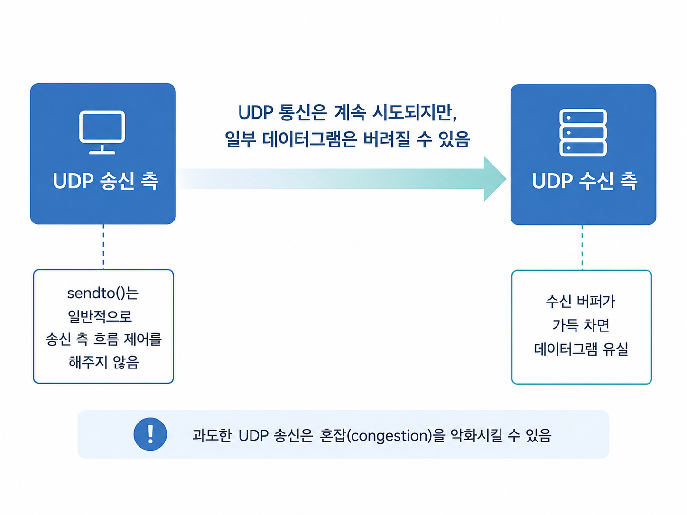

따라서 UDP를 사용할 때는 애플리케이션 레벨에서 송신량을 제한하거나, 유실을 감안한 프로토콜을 직접 설계해야 한다.

게임에서 캐릭터 이동, 위치 보정, 음성, 영상처럼 일부 데이터 유실이 치명적이지 않은 경우 UDP를 사용할 수 있다. 하지만 로그인, 결제, 아이템 지급, 채팅, 매칭 요청처럼 반드시 도착해야 하는 메시지는 보통 TCP 또는 별도 신뢰성 계층을 사용한다.

---

## 6. 논블로킹 소켓

### 6.1 왜 논블로킹 소켓이 필요한가?

클라이언트가 많아질수록 “클라이언트 1명 = 스레드 1개” 구조는 비효율적이다.

스레드가 많아지면 다음 문제가 생긴다.

- 각 스레드의 스택 메모리 비용이 커진다.
- 컨텍스트 스위칭 비용이 증가한다.
- 스레드 간 동기화가 복잡해진다.
- 실제로 대부분의 스레드는 네트워크 I/O를 기다리며 놀고 있을 수 있다.

논블로킹 소켓은 소켓 함수가 작업을 바로 끝낼 수 없을 때 스레드를 재우지 않고 즉시 리턴하게 만든다.

### 6.2 Windows에서 논블로킹 소켓 설정

Windows에서는 `ioctlsocket()`의 `FIONBIO` 옵션을 사용해 소켓을 논블로킹 모드로 전환할 수 있다.

```cpp
u_long nonBlocking = 1;
int result = ioctlsocket(sock, FIONBIO, &nonBlocking);

if (result == SOCKET_ERROR)
{
    std::cerr << "ioctlsocket failed: " << WSAGetLastError() << "\n";
}
```

논블로킹 소켓에서 `recv()`를 호출했는데 읽을 데이터가 없다면, 함수는 블로킹되지 않고 `SOCKET_ERROR`를 리턴한다. 이때 `WSAGetLastError()`가 `WSAEWOULDBLOCK`이면 “지금은 할 수 없으니 나중에 다시 시도하라”는 뜻이다.

```cpp
char buffer[1024];

int received = recv(sock, buffer, sizeof(buffer), 0);
if (received > 0)
{
    // 데이터 처리
}
else if (received == 0)
{
    // 연결 종료
}
else
{
    int error = WSAGetLastError();

    if (error == WSAEWOULDBLOCK)
    {
        // 지금 읽을 데이터가 없음
        // 오류라기보다 정상적인 재시도 상황
    }
    else
    {
        // 실제 오류 처리
    }
}
```

### 6.3 논블로킹의 함정: 바쁜 대기

논블로킹 소켓은 함수가 바로 리턴한다는 장점이 있다. 하지만 아무 생각 없이 반복문에서 계속 `recv()`를 호출하면 CPU 사용량이 폭주한다.

```cpp
while (true)
{
    int received = recv(sock, buffer, sizeof(buffer), 0);

    if (received == SOCKET_ERROR &&
        WSAGetLastError() == WSAEWOULDBLOCK)
    {
        // 나중에 다시 시도해야 하는데,
        // 이 루프가 너무 빠르게 돌면 CPU를 낭비한다.
        continue;
    }
}
```

게임 서버에서 특별히 처리할 일이 없다면 CPU는 어느 정도 쉬고 있어야 한다. CPU를 100% 쓰고 있다는 것은 항상 좋은 것이 아니다. 실제 유저 요청을 처리할 여유가 없다는 뜻일 수도 있다.

그래서 논블로킹 소켓은 보통 `select`, `poll`, `WSAPoll`, `epoll` 같은 이벤트 감시 함수와 함께 쓴다.

---

## 7. select, poll, WSAPoll

### 7.1 이벤트 감시가 필요한 이유

논블로킹 소켓은 I/O가 불가능할 때 즉시 리턴한다. 문제는 “언제 다시 시도해야 하는가?”다.

이때 이벤트 감시 함수를 사용하면, 운영체제에게 다음처럼 물어볼 수 있다.

> “이 소켓들 중에서 지금 읽거나 쓸 수 있는 소켓이 있으면 알려줘.”

### 7.2 select 예제

```cpp
fd_set readSet;
FD_ZERO(&readSet);
FD_SET(listenSock, &readSet);

timeval timeout{};
timeout.tv_sec = 1;
timeout.tv_usec = 0;

int result = select(0, &readSet, nullptr, nullptr, &timeout);

if (result > 0)
{
    if (FD_ISSET(listenSock, &readSet))
    {
        SOCKET clientSock = accept(listenSock, nullptr, nullptr);
        // 새 클라이언트 연결 처리
    }
}
else if (result == 0)
{
    // timeout
}
else
{
    // select error
}
```

`select()`는 이해하기 쉽지만, 대규모 서버에서는 한계가 있다. 소켓 수가 많아질수록 검사 비용이 커지고, 구현에 따라 감시 가능한 소켓 수 제한도 문제가 될 수 있다.

### 7.3 논블로킹 accept 패턴

리스닝 소켓을 논블로킹으로 만들면, 연결 요청이 없을 때 `accept()`는 즉시 실패하고 would block 상태를 반환할 수 있다.

따라서 보통은 다음 흐름을 쓴다.

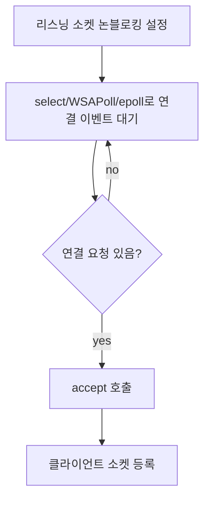

---

## 8. Overlapped I/O와 비동기 I/O

### 8.1 논블로킹 방식의 한계

논블로킹 방식은 스레드를 멈추지 않는다는 장점이 있다. 하지만 다음 부담이 있다.

- I/O가 가능한지 계속 감시해야 한다.
- would block 처리 코드가 많아진다.
- 이벤트가 왔더라도 실제 I/O 호출은 애플리케이션이 직접 해야 한다.
- 대규모 소켓에서는 이벤트 분배와 스레드 풀 설계가 복잡해진다.

Windows에서는 이를 해결하기 위해 **Overlapped I/O**와 **IOCP**를 제공한다.

### 8.2 Overlapped I/O의 핵심

Overlapped I/O는 함수를 호출한 순간에 I/O 완료를 기다리지 않고, 운영체제에 I/O 요청을 걸어둔다. 나중에 작업이 완료되면 완료 이벤트나 완료 포트를 통해 결과를 받는다.

일반적인 흐름은 다음과 같다.

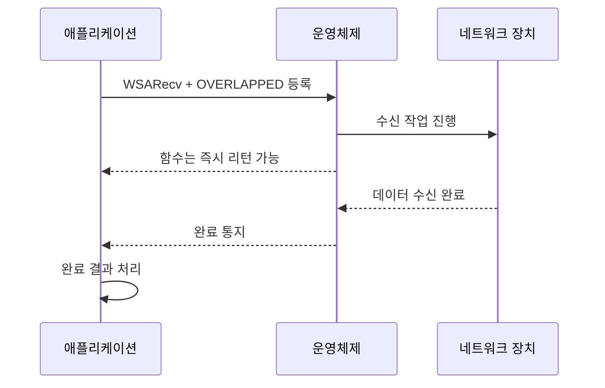

### 8.3 Overlapped I/O에서 가장 중요한 주의점

Overlapped I/O 요청을 건 뒤에는, 해당 요청이 완료되기 전까지 `OVERLAPPED` 구조체와 데이터 버퍼를 수정하거나 해제하면 안 된다.

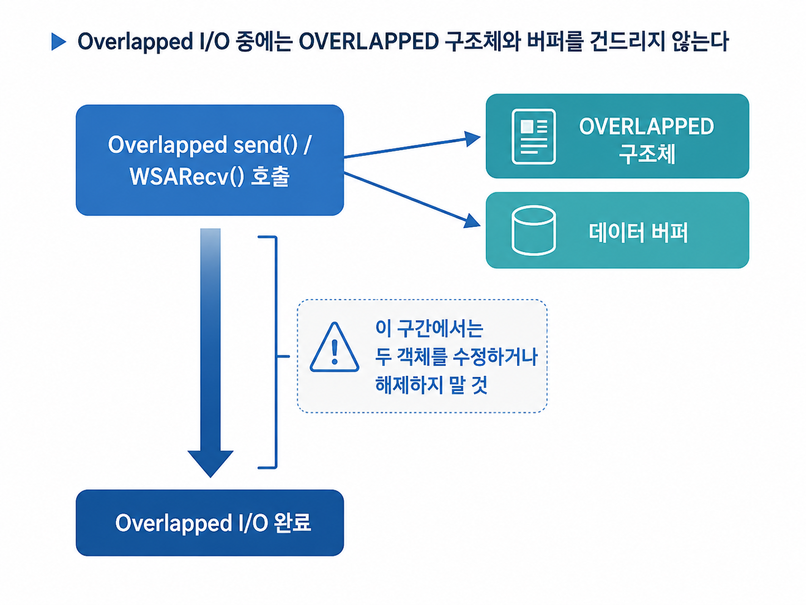

왜냐하면 I/O 작업은 함수가 리턴한 뒤에도 운영체제 내부에서 계속 진행될 수 있기 때문이다. 애플리케이션이 `OVERLAPPED` 구조체나 버퍼를 먼저 해제하면, 운영체제가 이미 사라진 메모리를 참조하는 심각한 문제가 발생할 수 있다.

### 8.4 Overlapped WSARecv 예제 구조

아래 코드는 전체 서버 코드가 아니라, Overlapped 수신 요청을 걸 때 필요한 형태를 보여주는 최소 예제다.

```cpp
struct IoContext
{
    OVERLAPPED overlapped{};
    WSABUF wsaBuf{};
    char buffer[4096]{};
};

IoContext* ctx = new IoContext;
ctx->wsaBuf.buf = ctx->buffer;
ctx->wsaBuf.len = sizeof(ctx->buffer);

DWORD flags = 0;
DWORD receivedBytes = 0;

int result = WSARecv(
    clientSock,
    &ctx->wsaBuf,
    1,
    &receivedBytes,
    &flags,
    &ctx->overlapped,
    nullptr
);

if (result == SOCKET_ERROR)
{
    int error = WSAGetLastError();

    if (error != WSA_IO_PENDING)
    {
        // 즉시 실패
        delete ctx;
        closesocket(clientSock);
    }
    // WSA_IO_PENDING이면 정상적으로 비동기 작업이 걸린 상태
}
else
{
    // 즉시 완료된 경우
    // IOCP와 함께 쓰는 경우에도 완료 통지가 큐에 들어갈 수 있으므로
    // 설계에 맞게 처리해야 한다.
}
```

핵심은 `WSA_IO_PENDING`을 실패로 보면 안 된다는 것이다. 이것은 “요청이 등록되었고, 완료는 나중에 알려주겠다”에 가깝다.

---

## 9. Reactor 패턴과 Proactor 패턴

소켓 I/O 모델을 이해할 때 자주 나오는 개념이 Reactor와 Proactor다.

| 구분 | Reactor | Proactor |
|---|---|---|
| 핵심 | “I/O 가능 상태”를 알려준다. | “I/O 완료 상태”를 알려준다. |
| 대표 예 | `select`, `poll`, `epoll` | Windows Overlapped I/O + IOCP |
| 애플리케이션 역할 | 이벤트를 받은 뒤 직접 `recv`/`send` 호출 | 미리 I/O 요청을 걸고 완료 결과 처리 |
| 비유 | “지금 읽을 수 있어” | “읽기가 끝났어” |

### 9.1 Reactor 방식

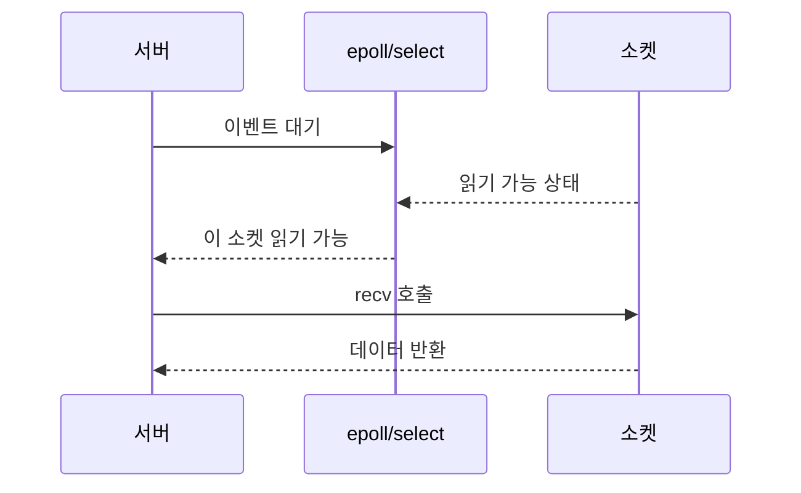

### 9.2 Proactor 방식

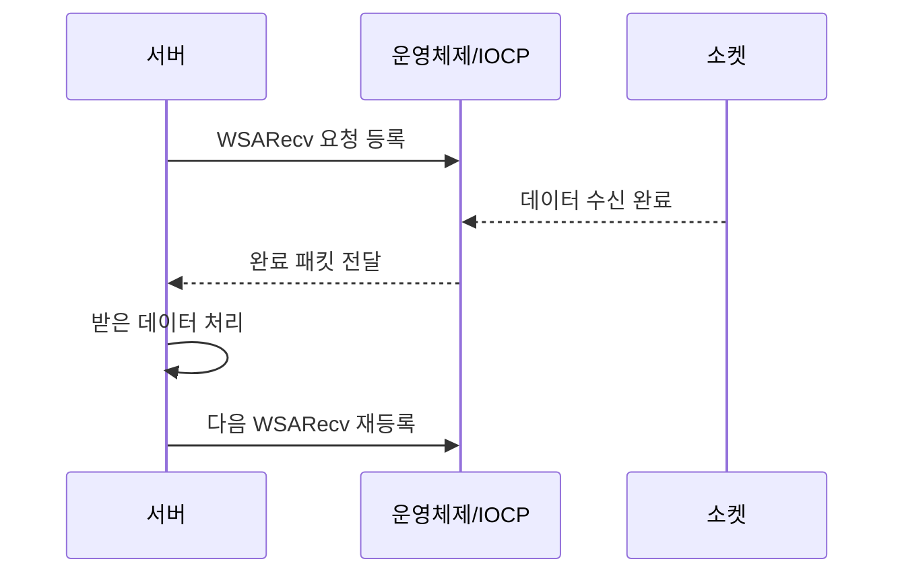

게임 서버 관점에서는 IOCP가 Proactor 방식에 가깝다. I/O가 가능해졌는지를 확인하는 것이 아니라, 이미 완료된 I/O 결과를 꺼내서 처리한다.

---

## 10. epoll

### 10.1 epoll이 하는 일

`epoll`은 Linux에서 대규모 파일 디스크립터의 I/O 이벤트를 효율적으로 감시하기 위한 인터페이스다. 소켓이 읽기 가능하거나 쓰기 가능한 상태가 되면, `epoll_wait()`을 통해 해당 이벤트를 받을 수 있다.

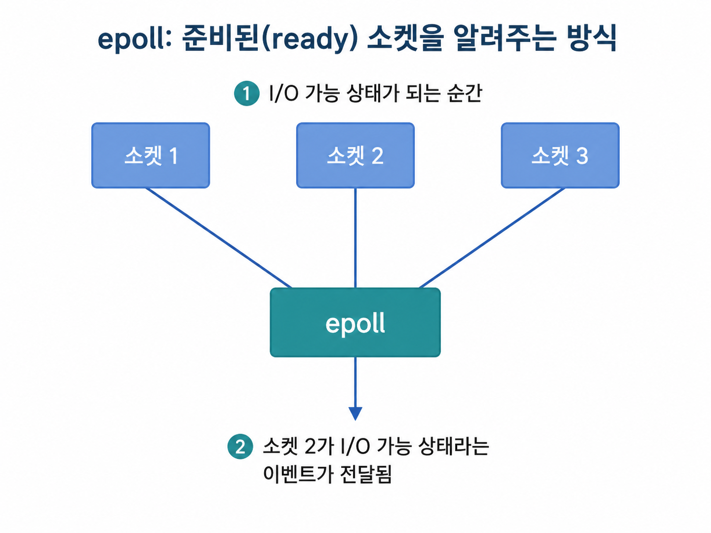

epoll의 핵심은 다음 문장으로 요약할 수 있다.

> epoll은 **I/O가 완료되었다**가 아니라, **I/O를 할 수 있는 상태가 되었다**를 알려준다.

즉, `epoll_wait()`에서 `EPOLLIN` 이벤트를 받았다면 “이 소켓에서 읽을 수 있을 가능성이 있다”는 뜻이다. 이후 실제 `recv()` 또는 `read()`는 애플리케이션이 호출해야 한다.

### 10.2 epoll 기본 예제

아래는 Linux C 스타일의 최소 흐름 예제다.

```cpp
#include <sys/epoll.h>
#include <unistd.h>
#include <fcntl.h>
#include <errno.h>
#include <cstring>
#include <iostream>

int set_nonblocking(int fd)
{
    int flags = fcntl(fd, F_GETFL, 0);
    if (flags == -1) return -1;
    return fcntl(fd, F_SETFL, flags | O_NONBLOCK);
}

void add_epoll(int epfd, int fd)
{
    epoll_event ev{};
    ev.events = EPOLLIN;
    ev.data.fd = fd;

    if (epoll_ctl(epfd, EPOLL_CTL_ADD, fd, &ev) == -1)
    {
        std::cerr << "epoll_ctl failed\n";
    }
}

int main()
{
    int epfd = epoll_create1(0);

    // listen_fd 생성, bind, listen은 생략
    // set_nonblocking(listen_fd);
    // add_epoll(epfd, listen_fd);

    epoll_event events[64];

    while (true)
    {
        int count = epoll_wait(epfd, events, 64, -1);

        for (int i = 0; i < count; ++i)
        {
            int fd = events[i].data.fd;

            if (events[i].events & EPOLLIN)
            {
                char buffer[4096];

                while (true)
                {
                    int n = read(fd, buffer, sizeof(buffer));

                    if (n > 0)
                    {
                        // 데이터 처리
                    }
                    else if (n == 0)
                    {
                        // 연결 종료
                        close(fd);
                        break;
                    }
                    else
                    {
                        if (errno == EAGAIN || errno == EWOULDBLOCK)
                        {
                            // 현재 더 읽을 데이터 없음
                            break;
                        }

                        // 실제 오류
                        close(fd);
                        break;
                    }
                }
            }
        }
    }
}
```

### 10.3 Level Trigger와 Edge Trigger

epoll에는 대표적으로 두 가지 감시 방식이 있다.

| 방식 | 의미 |
|---|---|
| Level Trigger | 조건이 계속 만족되는 동안 계속 이벤트를 준다. |
| Edge Trigger | 상태가 변하는 순간에만 이벤트를 준다. |

기본은 Level Trigger다. 수신 버퍼에 데이터가 남아 있으면 `epoll_wait()`은 계속 이벤트를 줄 수 있다.

Edge Trigger는 `EPOLLET` 옵션을 사용한다. 이벤트 발생 횟수를 줄일 수 있지만, 반드시 주의해야 한다.

> Edge Trigger에서는 이벤트를 받은 뒤 `read()` 또는 `recv()`를 **EAGAIN / EWOULDBLOCK이 나올 때까지 반복**해야 한다.

왜냐하면 Edge Trigger는 상태 변화 순간에만 이벤트를 주기 때문이다. 데이터를 조금만 읽고 남겨둔 채 다시 `epoll_wait()`으로 들어가면, 다음 edge가 발생하지 않아 남은 데이터를 영원히 처리하지 못할 수 있다.

### 10.4 Edge Trigger 예제

```cpp
epoll_event ev{};
ev.events = EPOLLIN | EPOLLET;
ev.data.fd = clientFd;
epoll_ctl(epfd, EPOLL_CTL_ADD, clientFd, &ev);

// 이벤트 수신 후
while (true)
{
    char buffer[4096];
    int n = read(clientFd, buffer, sizeof(buffer));

    if (n > 0)
    {
        // 데이터 처리
        continue;
    }

    if (n == -1 && (errno == EAGAIN || errno == EWOULDBLOCK))
    {
        // 더 이상 읽을 데이터 없음
        break;
    }

    if (n == 0)
    {
        // 연결 종료
        close(clientFd);
        break;
    }

    // 오류 처리
    close(clientFd);
    break;
}
```

---

## 11. IOCP

### 11.1 IOCP가 하는 일

IOCP는 Windows에서 비동기 I/O 완료를 효율적으로 처리하기 위한 메커니즘이다. 소켓에 Overlapped I/O 요청을 걸고, 완료되면 `GetQueuedCompletionStatus()`로 완료 패킷을 꺼낸다.

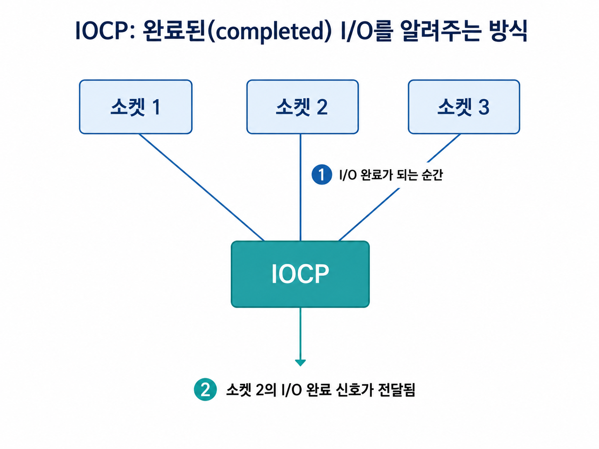

epoll과 IOCP의 가장 큰 차이는 다음이다.

```text
epoll: I/O 가능 상태를 알려준다.
IOCP : I/O 완료 상태를 알려준다.
```

### 11.2 IOCP 기본 흐름

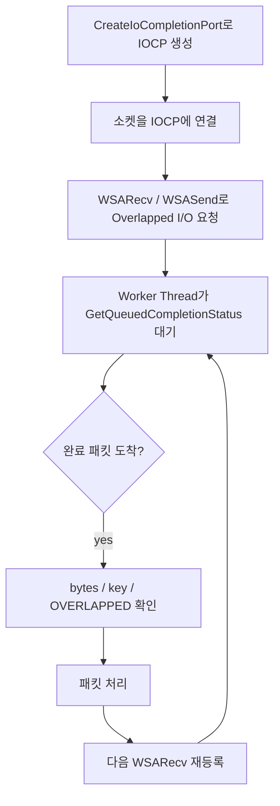

### 11.3 IOCP 예제 구조

아래 코드는 IOCP 서버 전체가 아니라, 핵심 구조만 보여주는 예제다.

```cpp
#include <winsock2.h>
#include <windows.h>
#include <iostream>

#pragma comment(lib, "Ws2_32.lib")

struct IoContext
{
    OVERLAPPED overlapped{};
    WSABUF wsaBuf{};
    char buffer[4096]{};
};

DWORD WINAPI WorkerThread(LPVOID param)
{
    HANDLE iocp = static_cast<HANDLE>(param);

    while (true)
    {
        DWORD bytesTransferred = 0;
        ULONG_PTR completionKey = 0;
        OVERLAPPED* overlapped = nullptr;

        BOOL ok = GetQueuedCompletionStatus(
            iocp,
            &bytesTransferred,
            &completionKey,
            &overlapped,
            INFINITE
        );

        if (overlapped == nullptr)
        {
            // 종료 신호 등으로 사용할 수 있음
            break;
        }

        IoContext* ctx = reinterpret_cast<IoContext*>(overlapped);
        SOCKET clientSock = static_cast<SOCKET>(completionKey);

        if (!ok || bytesTransferred == 0)
        {
            // 연결 종료 또는 오류
            closesocket(clientSock);
            delete ctx;
            continue;
        }

        // ctx->buffer[0..bytesTransferred] 데이터 처리
        std::cout << "received bytes: " << bytesTransferred << "\n";

        // 처리 후 다음 WSARecv 재등록 필요
        // 실제 서버에서는 ctx 재사용 또는 풀링
    }

    return 0;
}

int main()
{
    HANDLE iocp = CreateIoCompletionPort(INVALID_HANDLE_VALUE, nullptr, 0, 0);

    // clientSock은 accept 또는 AcceptEx로 얻었다고 가정
    SOCKET clientSock = INVALID_SOCKET;

    // 소켓을 IOCP에 연결
    CreateIoCompletionPort(
        reinterpret_cast<HANDLE>(clientSock),
        iocp,
        reinterpret_cast<ULONG_PTR>(clientSock),
        0
    );

    CreateThread(nullptr, 0, WorkerThread, iocp, 0, nullptr);

    // 이후 clientSock에 대해 WSARecv 요청 등록
}
```

실제 게임 서버에서는 다음 요소가 추가된다.

- `AcceptEx` 기반 비동기 accept
- 세션 객체
- 수신/송신용 `IoContext`
- 패킷 조립용 링버퍼
- 송신 큐
- 세션 풀
- graceful shutdown
- worker thread pool
- 동시성 제어

### 11.4 IOCP와 스레드 풀

IOCP의 장점 중 하나는 worker thread pool과 잘 맞는다는 것이다. 여러 스레드가 `GetQueuedCompletionStatus()`에서 대기하고 있다가 완료 패킷이 도착하면 그중 하나가 깨어나 처리한다.

이 구조는 게임 서버에서 멀티코어를 활용하기 좋다. 특히 수천~수만 소켓을 모두 루프 돌면서 검사하지 않아도 된다.

다만 IOCP가 모든 문제를 자동으로 해결하는 것은 아니다. 완료 패킷을 받은 뒤 세션 상태, 송신 큐, 패킷 순서, disconnect 처리 등을 안전하게 설계해야 한다.

---

## 12. IOCP와 epoll 비교

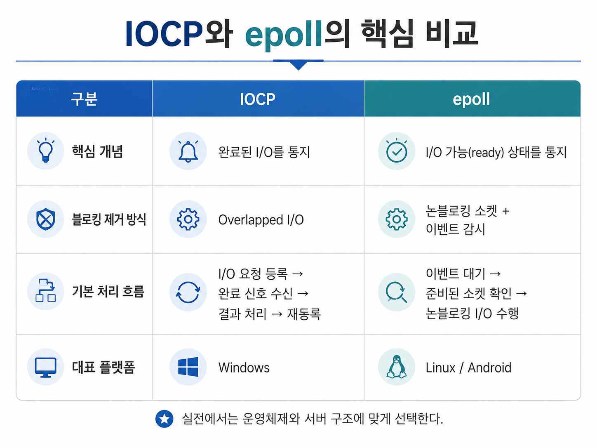

| 구분 | IOCP | epoll |
|---|---|---|
| 대표 플랫폼 | Windows | Linux, Android |
| 핵심 개념 | 완료된 I/O를 통지 | 준비된 I/O 가능 상태를 통지 |
| 모델 | Proactor에 가까움 | Reactor에 가까움 |
| 기본 I/O 방식 | Overlapped I/O | Nonblocking I/O |
| 이벤트 의미 | “작업이 끝났다” | “작업할 수 있다” |
| 애플리케이션 역할 | 완료 결과 처리 후 다음 I/O 재등록 | 이벤트 받은 뒤 직접 read/write 반복 |
| 대규모 소켓 처리 | 완료 패킷 기반 | ready 이벤트 기반 |
| 주의점 | `OVERLAPPED`와 버퍼 수명 관리 | Edge Trigger에서 EAGAIN까지 반복 |

한 줄로 정리하면 다음과 같다.

```text
epoll은 “지금 읽을 수 있는 소켓”을 알려주고,
IOCP는 “읽기가 완료된 결과”를 알려준다.
```

---

## 13. TCP와 UDP의 송수신 버퍼 차이

### 13.1 TCP

TCP는 신뢰성 있는 바이트 스트림을 제공한다. 따라서 수신 측이 데이터를 빨리 꺼내지 못하면, TCP 흐름 제어에 의해 송신 측의 전송 속도가 늦춰진다.

```text
수신 애플리케이션이 느림
→ 수신 버퍼가 차기 시작
→ TCP 윈도우가 줄어듦
→ 송신 측이 보내는 속도를 줄임
→ 연결은 유지되지만 처리량이 낮아짐
```

이때 블로킹 소켓에서는 `send()`가 멈출 수 있고, 논블로킹 소켓에서는 `send()`가 일부만 보내거나 `would block`을 반환할 수 있다.

### 13.2 UDP

UDP는 데이터그램 단위로 동작한다. TCP처럼 연결 단위의 흐름 제어와 재전송을 제공하지 않는다.

```text
수신 애플리케이션이 느림
→ 수신 버퍼가 참
→ 이후 도착한 UDP 데이터그램 일부가 버려질 수 있음
```

그래서 UDP는 게임에서 다음 상황에 적합하다.

- 약간의 유실이 허용되는 위치 정보
- 최신 상태가 과거 상태보다 중요한 데이터
- 음성, 영상처럼 지연이 재전송보다 더 치명적인 데이터

반대로 다음 데이터에는 부적합하다.

- 로그인
- 결제
- 아이템 지급
- 퀘스트 완료
- 채팅
- 매칭 결과
- 서버 선택 및 입장 토큰

---

## 14. 실전 게임 서버 관점 정리

### 14.1 블로킹 소켓을 그대로 쓰면 안 되는 이유

블로킹 소켓은 학습용으로 좋다. 하지만 게임 서버에서 클라이언트마다 스레드 하나씩 만드는 구조는 대규모 접속자 처리에 적합하지 않다.

예를 들어 10,000명이 접속하면 10,000개의 스레드가 필요할 수 있다. 대부분은 I/O 대기 상태라 해도 스레드 스택 메모리와 스케줄링 비용이 커진다.

### 14.2 논블로킹 소켓만으로도 부족한 이유

논블로킹 소켓은 스레드가 멈추지 않는다는 장점이 있다. 하지만 소켓이 많아질수록 “어떤 소켓을 다시 시도해야 하는가?”를 효율적으로 찾는 문제가 생긴다.

그래서 Linux에서는 `epoll`, Windows에서는 `IOCP`가 중요하다.

### 14.3 IOCP 서버에서 중요한 설계 포인트

Windows C++ 게임 서버를 IOCP로 만든다면 다음을 특히 조심해야 한다.

| 항목 | 주의점 |
|---|---|
| `OVERLAPPED` 수명 | I/O 완료 전까지 절대 해제하면 안 된다. |
| 버퍼 수명 | 커널이 접근 중일 수 있으므로 완료 전까지 유지해야 한다. |
| 세션 수명 | disconnect와 pending I/O가 동시에 얽힐 수 있다. |
| 패킷 조립 | TCP는 스트림이므로 recv 1회가 패킷 1개라는 보장이 없다. |
| 송신 큐 | 여러 스레드가 동시에 send 요청을 걸지 않도록 설계해야 한다. |
| 재등록 | 수신 완료 후 다음 `WSARecv`를 다시 걸어야 계속 받을 수 있다. |

### 14.4 epoll 서버에서 중요한 설계 포인트

Linux epoll 기반 게임 서버에서는 다음이 중요하다.

| 항목 | 주의점 |
|---|---|
| 논블로킹 설정 | epoll, 특히 Edge Trigger에서는 필수에 가깝다. |
| EAGAIN까지 반복 | Edge Trigger에서 데이터를 남기면 이벤트를 놓칠 수 있다. |
| 송신 버퍼링 | `write()`가 일부만 성공할 수 있으므로 애플리케이션 송신 큐가 필요하다. |
| 멀티스레드 분배 | 여러 스레드가 같은 소켓을 동시에 처리하지 않도록 구조화해야 한다. |
| 이벤트 등록/해제 | close와 epoll 이벤트가 꼬이지 않도록 수명 관리가 필요하다. |

---

## 15. 자주 헷갈리는 질문

### Q1. 논블로킹 소켓이면 비동기 I/O인가?

완전히 같은 말은 아니다.

논블로킹 소켓은 “함수가 기다리지 않고 즉시 리턴하는 방식”이다. I/O가 가능한지는 애플리케이션이 이벤트 감시 후 다시 호출해야 한다.

비동기 I/O는 “I/O 요청을 등록해두고 완료를 나중에 통지받는 방식”이다. Windows의 Overlapped I/O + IOCP가 여기에 가깝다.

### Q2. epoll은 비동기 I/O인가?

엄밀히 말하면 epoll 자체는 비동기 I/O라기보다 **I/O 이벤트 통지 메커니즘**이다. epoll은 소켓이 준비되었음을 알려주고, 실제 read/write는 애플리케이션이 수행한다.

### Q3. IOCP는 왜 게임 서버에서 많이 언급되나?

Windows에서 대규모 TCP 서버를 만들 때, 수많은 소켓의 Overlapped I/O 완료를 효율적으로 처리할 수 있기 때문이다. 특히 worker thread pool과 결합하기 좋아 멀티코어 활용에 유리하다.

### Q4. TCP는 수신 버퍼가 가득 차면 패킷을 버리나?

TCP는 신뢰성 있는 스트림을 제공하기 때문에 일반적으로 송신 속도를 늦추는 방향으로 동작한다. 반면 UDP는 수신 버퍼가 가득 차면 데이터그램이 버려질 수 있다.

### Q5. UDP는 항상 `sendto()`가 블로킹되지 않나?

일반적으로 UDP는 TCP처럼 연결 단위 흐름 제어를 하지 않는다. 하지만 운영체제 버퍼, 소켓 옵션, 네트워크 상태, 플랫폼 구현에 따라 송신 함수가 실패하거나 제한될 수 있다. 핵심은 UDP가 TCP처럼 안정적인 전달, 순서 보장, 흐름 제어를 제공하지 않는다는 점이다.

---

## 16. 이 장의 최종 정리

소켓 프로그래밍을 공부할 때는 API 이름보다 **I/O 모델의 차이**를 이해해야 한다.

```text
블로킹 소켓
- 이해하기 쉽다.
- 스레드가 멈춘다.
- 대규모 게임 서버에는 부적합하다.

논블로킹 소켓
- 함수가 즉시 리턴한다.
- would block 처리가 필요하다.
- select/poll/epoll 같은 이벤트 감시가 필요하다.

epoll
- Linux에서 사용한다.
- I/O 가능 상태를 알려준다.
- Edge Trigger에서는 EAGAIN까지 반복해야 한다.

Overlapped I/O
- Windows에서 비동기 I/O 요청을 걸 수 있다.
- OVERLAPPED 구조체와 버퍼 수명 관리가 핵심이다.

IOCP
- Windows에서 완료된 I/O를 효율적으로 처리한다.
- 대규모 접속자 게임 서버 구조와 잘 맞는다.
```

게임 서버 개발에서 중요한 관점은 다음이다.

> 소켓 함수가 블로킹되는지, I/O 가능 상태를 알려주는지, I/O 완료 결과를 알려주는지 구분해야 한다.

이 구분을 이해하면 이후 IOCP 서버, epoll 서버, 비동기 네트워크 엔진 구조를 훨씬 쉽게 이해할 수 있다.

---

## 참고 자료

- 『게임 서버 프로그래밍 교과서』
- Microsoft Learn, **Nonblocking I/O**
  - https://learn.microsoft.com/en-us/windows/win32/winsock/nonblocking-i-o-2
- Microsoft Learn, **Winsock IOCTLs**
  - https://learn.microsoft.com/en-us/windows/win32/winsock/winsock-ioctls
- Microsoft Learn, **Overlapped I/O and Event Objects**
  - https://learn.microsoft.com/en-us/windows/win32/winsock/overlapped-i-o-and-event-objects-2
- Microsoft Learn, **I/O Completion Ports**
  - https://learn.microsoft.com/en-us/windows/win32/fileio/i-o-completion-ports
- Microsoft Learn, **GetQueuedCompletionStatus function**
  - https://learn.microsoft.com/en-us/windows/win32/api/ioapiset/nf-ioapiset-getqueuedcompletionstatus
- Linux man-pages, **epoll(7)**
  - https://man7.org/linux/man-pages/man7/epoll.7.html
- RFC 9293, **Transmission Control Protocol**
  - https://datatracker.ietf.org/doc/html/rfc9293
- W. Richard Stevens, Bill Fenner, Andrew M. Rudoff, **UNIX Network Programming, Volume 1**
- Douglas E. Comer, **Internetworking with TCP/IP**
