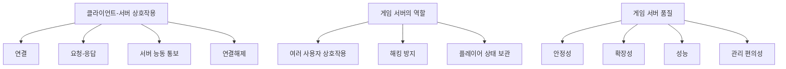
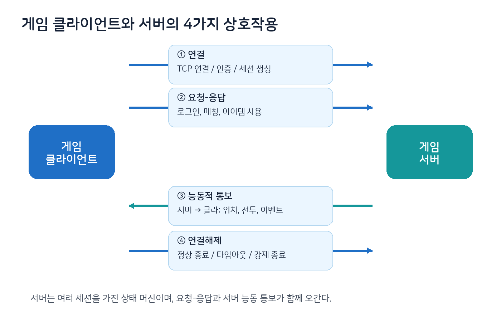
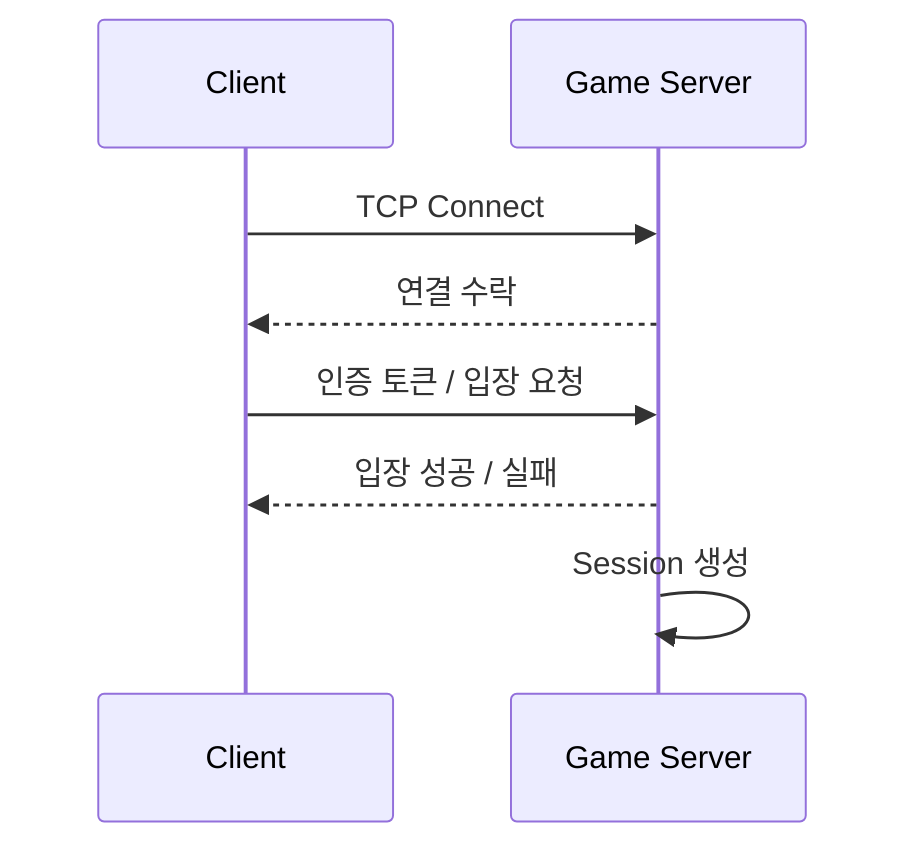
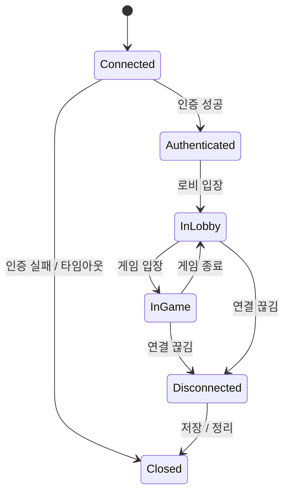
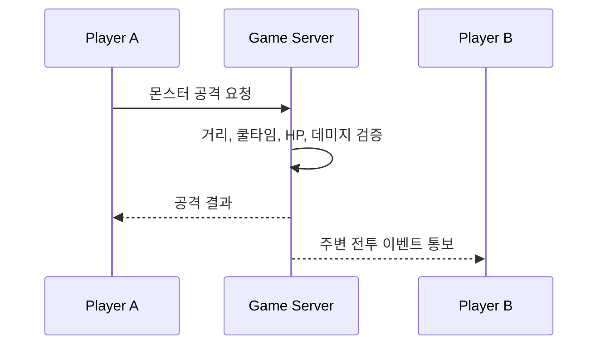
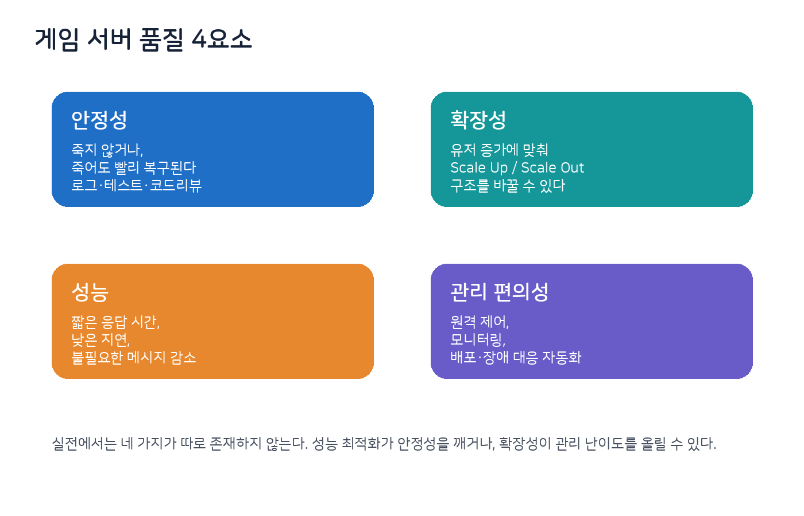
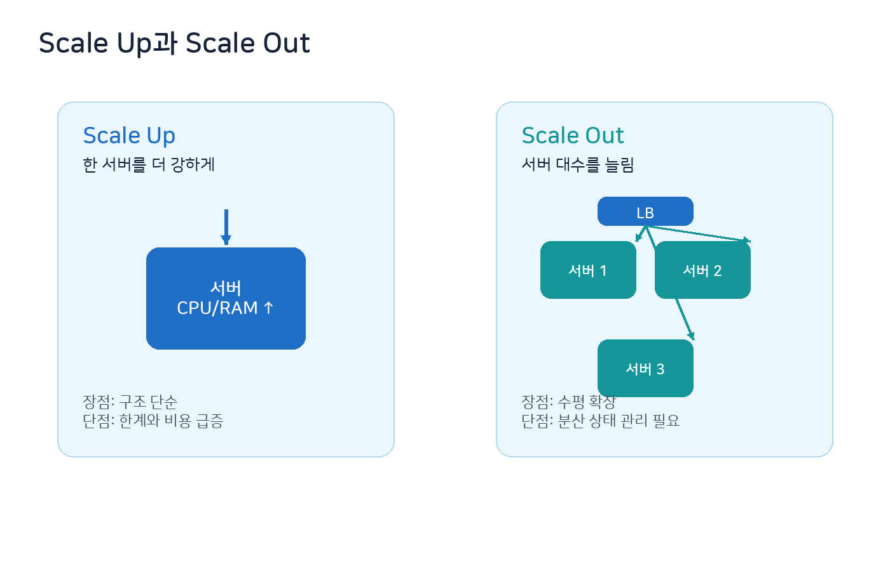
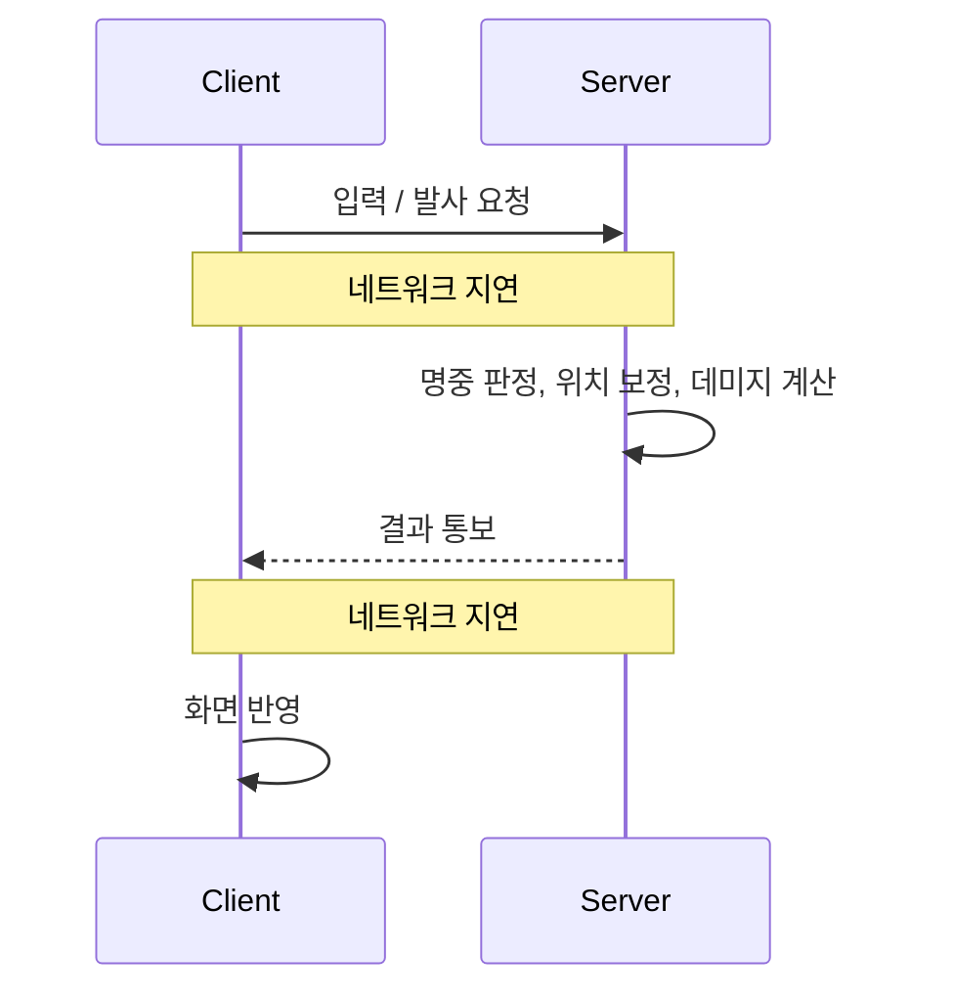
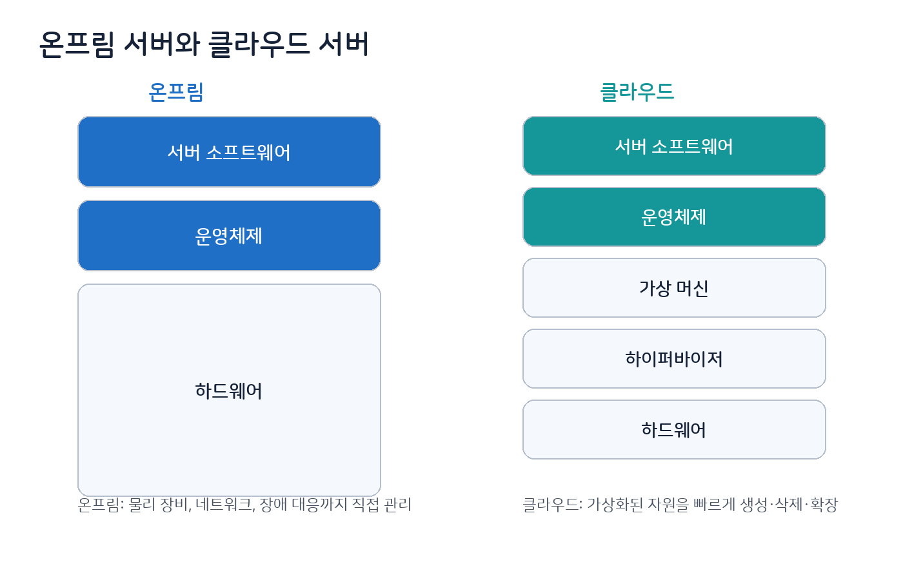
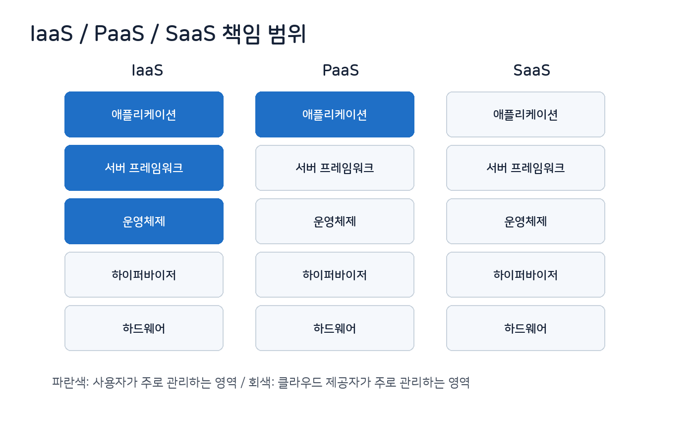

# 4장. 게임 서버와 클라이언트

> 주 서적: **『게임 서버 프로그래밍 교과서』**  
> 정리 방식: 책을 읽으며 정리한 키워드를 기반으로, 게임 서버 관점에서 필요한 개념·주의점·코드 예제를 보충했다.  
> 핵심 주제: **클라이언트-서버 상호작용, 서버의 역할, 서버 품질, 플레이어 정보 저장, 서버 구동 환경**

---

## 0. 이 장의 핵심 요약

게임 서버와 클라이언트 구조를 이해할 때 가장 먼저 봐야 하는 것은 “서버가 왜 필요한가?”이다.

게임 서버는 단순히 패킷을 중계하는 프로그램이 아니다. 서버는 여러 클라이언트의 상태를 관리하고, 클라이언트가 마음대로 조작하면 안 되는 처리를 검증하며, 플레이어 정보를 저장하고, 게임 세계의 기준 상태를 유지한다.

```text
게임 클라이언트
- 입력, 렌더링, 사운드, UI, 예측 처리
- 사용자가 직접 제어하는 환경
- 조작과 변조 가능성을 항상 고려해야 함

게임 서버
- 권위 있는 게임 상태 관리
- 여러 플레이어의 상호작용 처리
- 보안상 클라이언트에 맡기면 안 되는 처리 수행
- 플레이어 데이터 저장 및 복구
```

이 장에서 기억해야 할 큰 흐름은 다음과 같다.



---

## 1. 게임 클라이언트와 서버의 상호작용

게임 클라이언트와 서버 사이의 상호작용은 크게 네 가지로 볼 수 있다.

1. 연결
2. 요청-응답
3. 능동적 통보
4. 연결해제



### 1.1 연결

연결은 클라이언트와 서버가 통신 가능한 상태를 만드는 과정이다.

TCP 기반 게임 서버라면 보통 다음 흐름을 가진다.



서버 입장에서 연결은 단순히 소켓이 생기는 것이 아니다. 보통 서버는 연결마다 **세션(Session)** 객체를 만든다.

세션에는 다음 정보가 들어갈 수 있다.

| 항목 | 예시 |
|---|---|
| 네트워크 정보 | socket, remote address, send queue |
| 인증 정보 | account id, character id, token |
| 상태 정보 | connected, authenticated, in game |
| 버퍼 | recv buffer, packet assembly buffer |
| 시간 정보 | last ping time, timeout deadline |

### 1.2 요청-응답

요청-응답은 클라이언트가 서버에 요청을 보내고, 서버가 결과를 돌려주는 방식이다.

예를 들면 다음과 같다.

| 요청 | 응답 |
|---|---|
| 로그인 요청 | 로그인 성공/실패 |
| 캐릭터 목록 요청 | 캐릭터 목록 |
| 아이템 사용 요청 | 사용 성공/실패 |
| 매칭 요청 | 매칭 등록 결과 |
| 상점 구매 요청 | 구매 성공/실패 |

요청-응답 방식은 결과가 명확하다. 클라이언트가 “무엇을 해달라”고 요청하고, 서버는 검증 후 성공 또는 실패를 알려준다.

### 1.3 능동적 통보

능동적 통보는 클라이언트가 먼저 요청하지 않아도 서버가 클라이언트에게 메시지를 보내는 방식이다.

예를 들면 다음과 같다.

| 상황 | 서버 통보 |
|---|---|
| 다른 플레이어가 이동함 | 위치 갱신 패킷 |
| 몬스터가 공격함 | 전투 이벤트 |
| 파티원이 접속 종료함 | 파티 상태 변경 |
| 월드 이벤트가 발생함 | 이벤트 시작 알림 |
| 채팅 메시지가 도착함 | 채팅 브로드캐스트 |

게임 서버는 요청-응답만으로는 부족하다. 여러 플레이어가 같은 공간에서 상호작용하기 때문에, 서버가 변경된 상태를 관련 클라이언트에게 능동적으로 알려줘야 한다.

### 1.4 연결해제

연결해제는 클라이언트와 서버의 통신이 끝나는 과정이다.

연결해제에는 두 종류가 있다.

| 구분 | 설명 |
|---|---|
| 정상 연결해제 | 클라이언트가 로그아웃 또는 종료 요청을 보냄 |
| 비정상 연결해제 | 네트워크 단절, 클라이언트 크래시, 타임아웃, 서버 강제 종료 |

게임 서버에서는 비정상 연결해제를 항상 고려해야 한다. 유저가 Alt+F4를 누르거나, 네트워크가 끊기거나, 클라이언트가 죽어도 서버는 세션과 플레이어 상태를 정리해야 한다.

---

## 2. 게임 서버는 상태 머신이다

게임 서버는 단순한 반복문이 아니라, 여러 세션을 가진 상태 머신으로 볼 수 있다.



### 2.1 세션 상태 예제 코드

```cpp
enum class SessionState
{
    Connected,
    Authenticated,
    InLobby,
    InGame,
    Disconnecting,
    Closed
};

class Session
{
public:
    void OnLoginSuccess(int accountId)
    {
        if (state_ != SessionState::Connected)
            return;

        accountId_ = accountId;
        state_ = SessionState::Authenticated;
    }

    void EnterLobby()
    {
        if (state_ != SessionState::Authenticated)
            return;

        state_ = SessionState::InLobby;
    }

    void EnterGame(int characterId)
    {
        if (state_ != SessionState::InLobby)
            return;

        characterId_ = characterId;
        state_ = SessionState::InGame;
    }

    void Disconnect()
    {
        if (state_ == SessionState::Closed)
            return;

        state_ = SessionState::Disconnecting;

        // 송신 큐 정리, DB 저장 요청, 월드에서 제거 등
    }

private:
    SessionState state_ = SessionState::Connected;
    int accountId_ = 0;
    int characterId_ = 0;
};
```

세션 상태를 명확히 두면 잘못된 패킷을 막기 쉽다. 예를 들어 아직 로그인하지 않은 세션이 “아이템 사용 요청”을 보내면 서버는 거부해야 한다.

---

## 3. 게임 서버가 하는 일

게임 서버의 대표 역할은 세 가지다.

1. 여러 사용자와 상호작용
2. 클라이언트에서 해킹당하면 안 되는 처리 수행
3. 플레이어 상태 보관

### 3.1 여러 사용자와 상호작용

싱글플레이 게임에서는 대부분의 상태가 로컬에서 처리된다. 하지만 멀티플레이 게임에서는 한 플레이어의 행동이 다른 플레이어에게 영향을 준다.

예를 들어 MMO에서 한 플레이어가 몬스터를 공격하면 서버는 다음을 처리해야 한다.



서버는 단순히 A에게 결과를 돌려주는 것이 아니라, 같은 지역에 있는 다른 플레이어에게도 상태 변화를 알려줘야 한다.

### 3.2 클라이언트에서 해킹당하면 안 되는 처리

클라이언트는 사용자의 컴퓨터에서 실행된다. 따라서 변조될 수 있다.

서버가 반드시 검증해야 하는 대표 항목은 다음과 같다.

| 항목 | 서버 검증 예시 |
|---|---|
| 이동 | 속도, 거리, 지형 충돌, 순간이동 여부 |
| 전투 | 사거리, 쿨타임, 데미지 공식, 대상 유효성 |
| 아이템 | 소유 여부, 수량, 거래 가능 여부 |
| 재화 | 결제/지급/소모 기록 |
| 경험치 | 획득 조건, 중복 지급 여부 |
| 퀘스트 | 완료 조건, 보상 중복 수령 여부 |

핵심 원칙은 다음이다.

> 클라이언트는 “의도”를 보내고, 서버는 “검증 후 결과”를 만든다.

예를 들어 클라이언트가 “내 HP는 100이다”라고 보내면 안 된다. 대신 “포션을 사용하고 싶다”라고 요청하고, 서버가 실제 HP 증가 여부를 계산해야 한다.

### 3.3 플레이어 상태 보관

게임 서버는 플레이어의 상태를 저장해야 한다.

대표적인 저장 대상은 다음과 같다.

| 종류 | 예시 |
|---|---|
| 계정 정보 | account id, login id, ban status |
| 캐릭터 정보 | level, exp, hp, position |
| 인벤토리 | item id, count, durability |
| 재화 | gold, cash, mileage |
| 진행도 | quest, achievement, tutorial flag |
| 소셜 | friend list, guild id, mail |

플레이어 정보는 보통 데이터베이스에 저장된다. 단, 모든 변경마다 즉시 DB에 쓰면 성능 문제가 생길 수 있으므로 캐시, 배치 저장, 트랜잭션 설계가 필요하다.

---

## 4. 요청-응답 메시지 예제

게임 서버에서는 패킷을 명확하게 구분하기 위해 보통 패킷 헤더를 둔다.

```cpp
#pragma pack(push, 1)
struct PacketHeader
{
    uint16_t size; // header + payload 전체 크기
    uint16_t id;   // packet id
};
#pragma pack(pop)
```

예를 들어 아이템 사용 요청은 다음처럼 설계할 수 있다.

```cpp
enum PacketId : uint16_t
{
    C_USE_ITEM_REQ = 1001,
    S_USE_ITEM_RES = 1002,
};

struct CUseItemReq
{
    int64_t characterId;
    int32_t itemId;
    int32_t count;
};

struct SUseItemRes
{
    bool success;
    int32_t errorCode;
    int32_t remainingCount;
};
```

서버 처리 흐름은 다음과 같다.

```cpp
void HandleUseItem(Session& session, const CUseItemReq& req)
{
    if (session.GetState() != SessionState::InGame)
    {
        SendUseItemFail(session, ErrorCode::InvalidState);
        return;
    }

    Character* character = FindCharacter(req.characterId);
    if (character == nullptr)
    {
        SendUseItemFail(session, ErrorCode::CharacterNotFound);
        return;
    }

    if (!character->Inventory().HasItem(req.itemId, req.count))
    {
        SendUseItemFail(session, ErrorCode::NotEnoughItem);
        return;
    }

    // 서버 권위로 아이템 효과 적용
    character->Inventory().Remove(req.itemId, req.count);
    character->ApplyItemEffect(req.itemId);

    SendUseItemSuccess(session, req.itemId);
}
```

중요한 점은 서버가 클라이언트 요청을 그대로 믿지 않는다는 것이다. 서버는 현재 세션 상태, 캐릭터 소유 여부, 아이템 보유 여부를 모두 확인해야 한다.

---

## 5. 게임 서버의 품질

게임 서버 품질은 크게 네 가지로 볼 수 있다.



| 품질 | 의미 |
|---|---|
| 안정성 | 서버가 쉽게 죽지 않고, 죽더라도 빠르게 복구되는 능력 |
| 확장성 | 유저 증가에 맞춰 처리량을 늘릴 수 있는 능력 |
| 성능 | 낮은 지연 시간과 높은 처리량을 유지하는 능력 |
| 관리 편의성 | 배포, 모니터링, 장애 대응, 운영 제어를 쉽게 하는 능력 |

### 5.1 안정성

안정성은 “서버가 죽지 않는 것”만 의미하지 않는다.

실전에서는 서버가 언젠가는 죽을 수 있다고 가정하고 설계해야 한다.

안정성을 높이는 방법은 다음과 같다.

| 방법 | 설명 |
|---|---|
| 유닛 테스트 | 핵심 로직을 자동으로 검증 |
| 코드 리뷰 | 한 명 이상이 위험한 변경을 확인 |
| 방어적 프로그래밍 | 입력값과 상태를 가정하지 않고 검증 |
| 로깅 | 장애 원인을 추적할 수 있게 기록 |
| 장애 격리 | 한 기능 장애가 전체 서버 장애로 번지지 않게 설계 |
| 빠른 재시작 | 서버 프로세스가 죽어도 자동 복구되게 구성 |

서버 개발에서는 “내 코드가 맞을 것이다”보다 “어떤 입력이 와도 서버가 망가지지 않아야 한다”가 더 중요하다.

### 5.2 확장성

확장성은 유저 수가 증가했을 때 서버가 더 많은 부하를 처리할 수 있는 능력이다.

확장 방식은 크게 두 가지다.



| 방식 | 의미 | 장점 | 단점 |
|---|---|---|---|
| Scale Up | 한 서버의 CPU, RAM, 디스크 성능을 높임 | 구조가 단순함 | 물리적/비용적 한계가 있음 |
| Scale Out | 서버 대수를 늘림 | 대규모 처리에 유리함 | 분산 상태 관리가 어려움 |

MMO나 대규모 온라인 게임은 보통 Scale Out 구조를 피하기 어렵다. 하지만 Scale Out은 서버 간 상태 동기화, 로드밸런싱, DB 병목, 캐시 일관성 같은 문제를 함께 가져온다.

### 5.3 성능

게임 서버 성능은 단순히 초당 처리량만 의미하지 않는다. 유저가 체감하는 응답 시간과 지연 시간도 중요하다.

성능을 높이는 대표 방법은 다음과 같다.

| 방법 | 설명 |
|---|---|
| 코드 프로파일링 | 실제 병목 함수를 찾아 최적화 |
| 메시지 크기 감소 | 불필요한 필드 제거 |
| 메시지 교환 횟수 감소 | 왕복 횟수 줄이기 |
| 양자화 | 위치/회전 값을 적은 비트로 표현 |
| 가까운 데이터센터 | 물리적 왕복 지연 감소 |
| 캐싱 | DB 접근 횟수 감소 |
| 비동기 I/O | 디바이스 대기 시간에 스레드 낭비 방지 |

실시간 멀티플레이 게임에서 가장 많이 오가는 데이터는 보통 이동, 회전, 입력, 상태 동기화 데이터다. 이런 값은 단위 크기가 작기 때문에 일반 압축보다 **전송 빈도 조절, 관심 영역 필터링, 양자화**가 더 중요할 수 있다.

### 5.4 FPS 게임에서 서버 처리 시간

FPS 게임에서는 입력부터 결과 반영까지 시간이 매우 중요하다.



서버 처리 시간이 길어지면 네트워크 지연과 합쳐져 유저가 “늦게 맞는다”, “분명 피했는데 맞았다”고 느끼게 된다.

따라서 FPS나 액션 게임에서는 서버 틱, 입력 처리 순서, 보간/예측, 랙 보상 같은 개념이 중요해진다.

---

## 6. 관리 도구와 운영

게임 서버는 개발만큼 운영도 중요하다.

운영 환경에서는 서버 프로그램을 직접 콘솔에서 실행하는 것이 아니라, 보통 관리 도구와 데몬/서비스 형태로 관리한다.

### 6.1 관리 도구가 제공해야 하는 기능

| 기능 | 설명 |
|---|---|
| 서버 시작/중지 | 원격으로 프로세스 제어 |
| 동시접속자 확인 | 현재 접속자 수, 지역별 접속자 수 |
| CPU/RAM 확인 | 서버 부하 확인 |
| 네트워크 사용량 | 송수신량, 패킷 수 |
| 로그 조회 | 오류, 경고, 유저 행동 로그 |
| 알림 | 장애 발생 시 Slack, Discord, SMS 등 |
| 배포 | 새 버전 롤아웃과 롤백 |
| 설정 변경 | 이벤트, 드랍률, 서버 메시지 등 |

### 6.2 간단한 헬스 체크 예제

아래는 ASP.NET Core Minimal API 형태의 간단한 서버 상태 API 예제다.

```csharp
var builder = WebApplication.CreateBuilder(args);
var app = builder.Build();

app.MapGet("/health", () =>
{
    return Results.Ok(new
    {
        status = "ok",
        serverTime = DateTimeOffset.UtcNow,
        processId = Environment.ProcessId,
        workingSetMB = Environment.WorkingSet / 1024 / 1024
    });
});

app.Run();
```

운영 도구는 이런 API를 주기적으로 호출해 서버가 살아 있는지 확인할 수 있다.

### 6.3 데몬과 서비스

Linux에서는 서버 프로그램을 `systemd` 서비스로 등록하고, Windows에서는 Windows Service 또는 별도의 supervisor를 사용할 수 있다.

Linux `systemd` 서비스 파일 예시는 다음과 같다.

```ini
[Unit]
Description=Game Server
After=network.target

[Service]
ExecStart=/opt/game-server/GameServer
Restart=always
RestartSec=3
User=gameserver
WorkingDirectory=/opt/game-server

[Install]
WantedBy=multi-user.target
```

`Restart=always`를 설정하면 프로세스가 죽었을 때 자동 재시작할 수 있다. 다만 무한 재시작만으로 안정성이 해결되는 것은 아니다. 반드시 로그와 덤프, 알림도 함께 설계해야 한다.

---

## 7. 플레이어 정보의 저장

플레이어 정보는 보통 데이터베이스에 저장한다.

게임 서버에서 DB가 필요한 이유는 다음과 같다.

- 서버가 재시작되어도 플레이어 정보가 보존되어야 한다.
- 여러 서버가 같은 플레이어 정보를 참조할 수 있어야 한다.
- 아이템, 재화, 결제 기록은 신뢰성 있게 저장되어야 한다.
- 운영자가 유저 상태를 조회하고 복구할 수 있어야 한다.

### 7.1 간단한 플레이어 테이블 예시

```sql
CREATE TABLE players (
    player_id BIGINT PRIMARY KEY AUTO_INCREMENT,
    account_id BIGINT NOT NULL,
    character_name VARCHAR(32) NOT NULL,
    level INT NOT NULL DEFAULT 1,
    exp BIGINT NOT NULL DEFAULT 0,
    gold BIGINT NOT NULL DEFAULT 0,
    pos_x FLOAT NOT NULL DEFAULT 0,
    pos_y FLOAT NOT NULL DEFAULT 0,
    pos_z FLOAT NOT NULL DEFAULT 0,
    updated_at TIMESTAMP DEFAULT CURRENT_TIMESTAMP
        ON UPDATE CURRENT_TIMESTAMP
);
```

### 7.2 저장할 때 주의할 점

| 항목 | 설명 |
|---|---|
| 트랜잭션 | 아이템 지급과 재화 차감은 함께 성공하거나 함께 실패해야 함 |
| 중복 처리 | 같은 보상이 두 번 지급되지 않게 idempotency 고려 |
| 캐시 | 매 프레임 DB 접근 금지 |
| 저장 주기 | 중요 데이터는 즉시 저장, 위치 등은 주기적 저장 |
| 장애 복구 | 서버 크래시 시 마지막 저장 시점 고려 |
| 감사 로그 | 재화/아이템 변화는 추적 가능하게 기록 |

아이템과 재화는 특히 중요하다. 단순히 현재 값만 저장하면 장애나 버그 발생 시 원인을 추적하기 어렵다. 변화 이력을 별도 로그로 남기는 것이 좋다.

---

## 8. 서버 구동 환경

게임 서버는 개발 PC에서만 도는 프로그램이 아니다. 실제 서비스에서는 데이터센터, 클라우드, 운영 도구, 모니터링 시스템 위에서 실행된다.

대표적인 서버 구동 환경은 다음과 같다.

| 환경 | 설명 |
|---|---|
| 개발 PC | 로컬 테스트 |
| 사내 테스트 서버 | QA, 내부 테스트 |
| 온프림 서버 | 직접 소유 또는 임대한 물리 서버 |
| 클라우드 서버 | AWS, Azure, GCP 등에서 가상 자원 사용 |
| 하이브리드 | 온프림과 클라우드를 혼합 |

---

## 9. 온프림 서버와 클라우드 서버

온프림은 물리 서버를 직접 보유하거나 임대해 운영하는 방식이다. 클라우드는 물리 서버 위에 가상화 계층을 두고, 사용자가 필요한 만큼 가상 서버와 네트워크, 스토리지를 할당받는 방식이다.



### 9.1 온프림 서버의 장단점

| 장점 | 단점 |
|---|---|
| 하드웨어와 네트워크를 세밀하게 통제 가능 | 초기 비용이 큼 |
| 장기적으로 일정 부하에서는 비용 예측이 쉬움 | 서버 증설이 느림 |
| 특정 성능 요구에 맞춘 구성 가능 | 장애 대응과 교체를 직접 해야 함 |
| 보안 정책을 직접 통제 가능 | 운영 인력이 필요함 |

### 9.2 클라우드 서버의 장단점

| 장점 | 단점 |
|---|---|
| 빠르게 서버 생성 가능 | 장기 고정 부하는 비용이 커질 수 있음 |
| Scale Out이 쉬움 | 클라우드 구조 학습 필요 |
| 관리형 DB, 로드밸런서, 모니터링 사용 가능 | 벤더 종속 가능성 |
| 지역별 데이터센터 선택 가능 | 네트워크 비용과 egress 비용 고려 필요 |
| 장애 대응 자동화가 쉬움 | 물리 장비 수준의 직접 통제는 어려움 |

### 9.3 언제 온프림, 언제 클라우드?

| 상황 | 적합한 방식 |
|---|---|
| 유저 수 예측이 어렵고 빠른 출시가 중요 | 클라우드 |
| 이벤트성 트래픽이 크고 변동이 심함 | 클라우드 |
| 장기적으로 일정한 고부하가 유지됨 | 온프림 또는 예약형 클라우드 |
| 특수 하드웨어나 네트워크 튜닝이 필요 | 온프림 |
| 글로벌 지역 배포가 중요 | 클라우드 |
| 보안/규정상 물리 위치 통제가 중요 | 온프림 또는 프라이빗 클라우드 |
| 핵심 서버는 온프림, 이벤트/웹/API는 클라우드 | 하이브리드 |

실무에서는 둘 중 하나만 쓰기보다 혼합하는 경우도 많다. 예를 들어 게임 월드 서버는 특정 데이터센터에 두고, 인증 서버·웹 API·로그 분석·운영 도구는 클라우드에 두는 식이다.

---

## 10. IaaS, PaaS, SaaS

클라우드 서비스는 사용자가 어디까지 관리하고, 클라우드 제공자가 어디까지 관리하는지에 따라 나눌 수 있다.



### 10.1 IaaS

IaaS는 Infrastructure as a Service의 약자다. 사용자는 가상 머신, 네트워크, 스토리지 같은 인프라 자원을 빌려 쓴다.

예시는 다음과 같다.

- AWS EC2
- Azure Virtual Machines
- Google Compute Engine

게임 서버 입장에서 IaaS는 가장 자유도가 높다. 직접 OS를 설정하고, 게임 서버 바이너리를 배포하고, 방화벽과 포트를 설정할 수 있다. 대신 운영 부담도 크다.

### 10.2 PaaS

PaaS는 Platform as a Service의 약자다. 사용자는 애플리케이션을 배포하고, OS나 런타임, 일부 서버 프레임워크 관리는 플랫폼이 대신한다.

예시는 다음과 같다.

- Azure App Service
- Google App Engine
- AWS Elastic Beanstalk

PaaS는 웹 API, 운영 도구, 관리자 페이지, 간단한 매칭 API 등에 적합할 수 있다. 하지만 실시간 게임 서버처럼 커스텀 네트워크, 장시간 연결, 세밀한 소켓 제어가 필요한 경우에는 제한이 있을 수 있다.

### 10.3 SaaS

SaaS는 Software as a Service의 약자다. 사용자는 완성된 소프트웨어를 인터넷으로 사용한다.

예시는 다음과 같다.

- Gmail
- Slack
- Notion
- Datadog
- Grafana Cloud

게임 서버 개발자가 SaaS를 직접 게임 서버로 쓰는 경우는 적지만, 운영과 모니터링에서는 많이 사용한다.

---

## 11. 게임 서버 관점에서 클라우드 서비스 선택

게임 서버 프로젝트에서는 모든 기능을 같은 방식으로 배포할 필요가 없다.

| 기능 | 적합한 환경 예시 |
|---|---|
| 실시간 게임 월드 서버 | IaaS, 베어메탈, 전용 서버 |
| 인증 서버 | IaaS, PaaS, 컨테이너 |
| 매칭 서버 | IaaS, Kubernetes, PaaS 일부 |
| 운영 관리자 페이지 | PaaS, SaaS |
| 로그/모니터링 | SaaS 또는 관리형 서비스 |
| DB | 직접 설치 또는 관리형 DB |
| Redis 캐시 | 직접 설치 또는 관리형 Redis |

실시간 게임 서버는 네트워크 지연과 소켓 제어가 중요하므로 IaaS나 베어메탈이 자주 고려된다. 반면 웹 기반 인증 서버나 운영 페이지는 PaaS나 컨테이너 기반 배포가 더 편할 수 있다.

---

## 12. 서버 품질을 높이는 개발 습관

### 12.1 가정하지 말고 검증하기

서버는 클라이언트 입력을 믿으면 안 된다.

```cpp
void HandleMove(Session& session, const MoveRequest& req)
{
    if (!session.IsInGame())
        return;

    Player* player = session.GetPlayer();
    if (player == nullptr)
        return;

    const float maxDistance = player->MoveSpeed() * req.deltaTime + 0.5f;
    const float requestedDistance = Distance(player->Position(), req.targetPosition);

    if (requestedDistance > maxDistance)
    {
        // 비정상 이동: 로그 기록 또는 보정
        LogSuspiciousMove(session.AccountId(), requestedDistance);
        SendPositionCorrection(session, player->Position());
        return;
    }

    player->SetPosition(req.targetPosition);
}
```

클라이언트가 보낸 위치를 그대로 적용하면 순간이동 핵에 취약하다. 서버는 이동 가능 거리, 지형, 상태 이상, 스킬 사용 여부 등을 검증해야 한다.

### 12.2 장애가 나도 전체가 죽지 않게 만들기

서버가 죽더라도 최대한 적은 범위만 죽게 하는 것이 중요하다.

예를 들어 다음처럼 기능을 분리할 수 있다.

```text
Auth Server
- 로그인
- 토큰 발급
- 서버 목록

Game Server
- 실시간 플레이
- 월드 상태
- 전투 처리

Chat Server
- 채팅

DB / Redis
- 영속 데이터
- 캐시
```

Auth 서버 장애가 Game 서버 전체 크래시로 이어지지 않게 하고, Chat 서버 장애가 전투 서버에 영향을 주지 않게 설계하는 것이 좋다.

### 12.3 로그는 나중이 아니라 처음부터 설계하기

장애가 발생했을 때 로그가 없으면 원인을 찾기 어렵다.

게임 서버에서 남기면 좋은 로그는 다음과 같다.

| 로그 | 예시 |
|---|---|
| 접속 로그 | account id, ip, server id |
| 인증 로그 | 성공/실패, 실패 이유 |
| 경제 로그 | 아이템 지급/소모, 재화 변화 |
| 에러 로그 | 예외, assert, DB 실패 |
| 성능 로그 | tick time, packet queue length |
| 보안 로그 | 비정상 이동, 잘못된 패킷, 중복 요청 |

---

## 13. 이 장의 최종 정리

4장은 게임 서버와 클라이언트의 전체 구조를 이해하는 장이다.

핵심은 다음이다.

```text
1. 클라이언트와 서버의 상호작용은 연결, 요청-응답, 능동적 통보, 연결해제로 나눌 수 있다.

2. 게임 서버는 여러 세션을 가진 상태 머신이다.

3. 클라이언트는 변조 가능하므로, 서버는 권위 있는 상태를 관리해야 한다.

4. 게임 서버 품질은 안정성, 확장성, 성능, 관리 편의성으로 볼 수 있다.

5. 플레이어 정보는 데이터베이스에 저장하며, 트랜잭션과 로그가 중요하다.

6. 서버 구동 환경은 온프림, 클라우드, 하이브리드로 나뉜다.

7. IaaS, PaaS, SaaS는 사용자가 어디까지 관리하는지에 따라 구분된다.
```

게임 서버 개발에서 가장 중요한 태도는 다음이다.

> 서버는 클라이언트를 믿지 않고, 장애를 가정하며, 운영 가능한 구조로 만들어야 한다.

---

## 참고 자료

- 『게임 서버 프로그래밍 교과서』
- NIST SP 800-145, **The NIST Definition of Cloud Computing**
  - https://csrc.nist.gov/pubs/sp/800/145/final
- Microsoft Azure, **Shared responsibility in the cloud**
  - https://learn.microsoft.com/en-us/azure/security/fundamentals/shared-responsibility
- Google Cloud, **PaaS vs IaaS vs SaaS**
  - https://cloud.google.com/learn/paas-vs-iaas-vs-saas
- AWS Well-Architected Framework, **Operational Excellence Pillar**
  - https://docs.aws.amazon.com/wellarchitected/latest/operational-excellence-pillar/welcome.html
- AWS Well-Architected Framework, **Reliability Pillar**
  - https://docs.aws.amazon.com/wellarchitected/latest/reliability-pillar/welcome.html
- Martin Kleppmann, **Designing Data-Intensive Applications**
- Andrew S. Tanenbaum, Maarten Van Steen, **Distributed Systems**
