# 5장. 게임 네트워킹

> 주 서적: **『게임 서버 프로그래밍 교과서』**  
> 정리 방식: 책을 읽으며 정리한 키워드를 기반으로, 게임 서버 관점에서 필요한 개념·주의점·코드 예제를 보충했다.  
> 핵심 주제: **UML, 게임플레이 네트워킹, 상태 동기화, 추측항법, 레이턴시 마스킹, AOI, 락스텝, 보안**  
> 최신화: 2026년 기준으로 알아두면 좋은 **client prediction, server reconciliation, rollback, Unreal Iris/Network Prediction, Unity Netcode Client Anticipation, TLS 1.3** 관점을 추가했다.

---

## 0. 이 장의 핵심 요약

게임 네트워킹은 단순히 패킷을 보내고 받는 기술이 아니다. 핵심은 다음 질문에 답하는 것이다.

> 네트워크 지연, 패킷 유실, 해킹 가능성이 있는 환경에서 여러 플레이어가 같은 게임 세계를 보고 있다고 느끼게 만들려면 어떻게 해야 하는가?

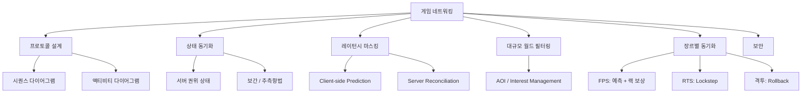

| 문제 | 대표 해결책 |
|---|---|
| 입력 반응이 늦음 | 클라이언트 예측, 선연출 |
| 원격 플레이어 움직임이 끊김 | 보간, 추측항법, 스냅샷 버퍼 |
| 서버 상태와 클라이언트 상태가 다름 | 서버 권위, 보정, reconciliation |
| 월드가 넓고 객체가 많음 | AOI, 관심 영역 필터링 |
| RTS처럼 많은 유닛을 동기화 | lockstep, 결정론적 시뮬레이션 |
| 격투 게임처럼 입력 반응성이 중요 | rollback netcode |
| 클라이언트 변조 가능성 | 서버 검증, 암호화, 인증, 안티치트 |

---

## 1. UML을 왜 쓰는가?

게임 네트워킹에서는 “패킷 구조”만 중요한 것이 아니다. 더 중요한 것은 **컴퓨터 사이에 어떤 대화가 어떤 순서로 오가는가**이다.

| UML 종류 | 용도 |
|---|---|
| 시퀀스 다이어그램 | 객체나 시스템 사이의 메시지 순서 표현 |
| 액티비티 다이어그램 | 조건 분기, 처리 흐름, 내부 로직 표현 |
| 클래스 다이어그램 | 데이터 구조와 관계 표현 |
| 상태 다이어그램 | 세션, 방, 매치 상태 변화 표현 |

실무에서는 모든 것을 UML로 그리기보다, **로그인 / 매치메이킹 / 방 입장 / 아이템 처리 / 게임 시작**처럼 버그가 생기면 위험한 흐름을 문서화하는 데 집중하는 것이 좋다.

---

## 2. 시퀀스 다이어그램

시퀀스 다이어그램은 “누가 누구에게 어떤 순서로 메시지를 보내는가”를 표현한다.

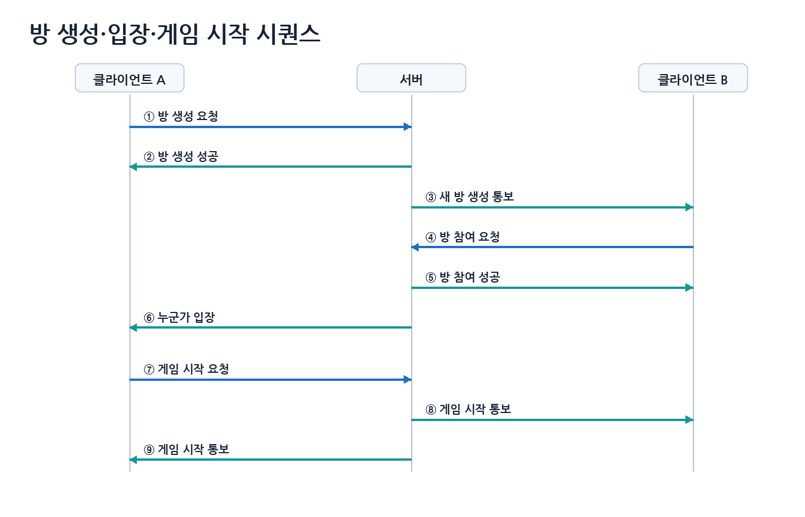

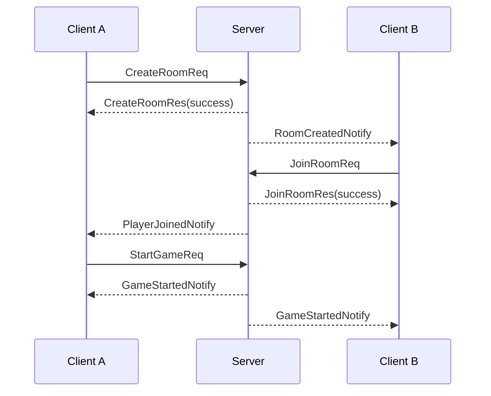

시퀀스 다이어그램은 메시지 순서는 잘 보여주지만, 서버 내부에서 어떤 검증을 하는지는 자세히 보여주기 어렵다. 이럴 때 액티비티 다이어그램을 함께 사용한다.

---

## 3. 액티비티 다이어그램

액티비티 다이어그램은 처리 흐름, 조건 분기, 반복, 검증 과정을 표현하기 좋다.

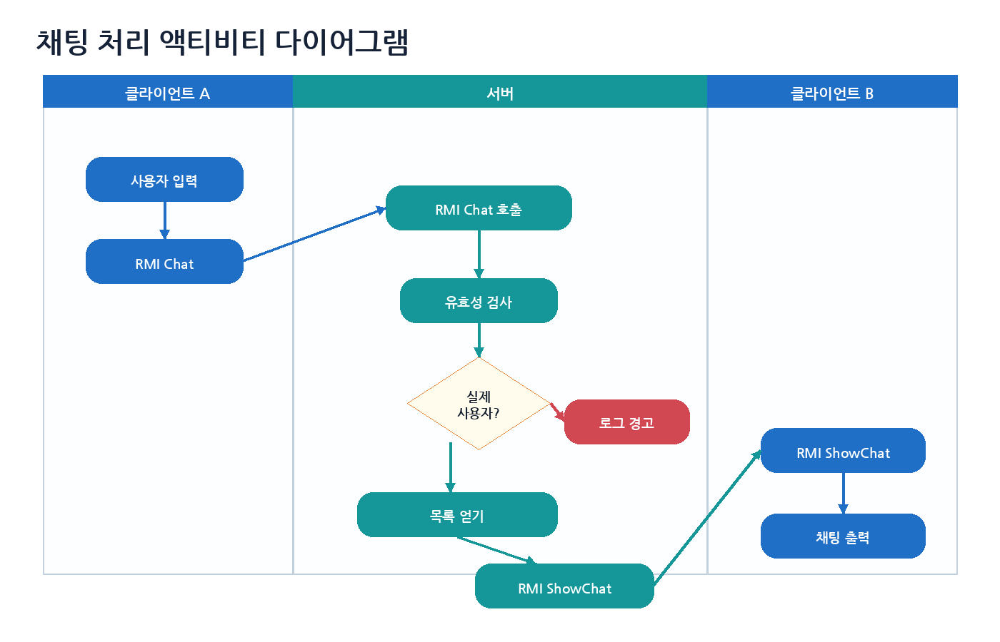

아이템 사용 처리 같은 흐름도 액티비티 다이어그램으로 표현하기 좋다.

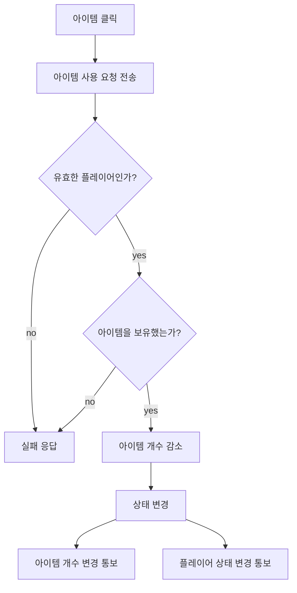

서버는 클라이언트가 “아이템을 사용했다”고 말하는 것을 믿지 않는다. 클라이언트는 “아이템을 사용하고 싶다”고 요청하고, 서버가 검증 후 결과를 결정해야 한다.

---

## 4. 게임플레이 네트워킹의 발전 흐름

초기 네트워크 게임 모델은 서버가 거의 모든 것을 처리하고, 클라이언트는 입력과 출력만 담당하는 구조에 가까웠다.

```text
클라이언트: 입력 전송 + 화면 출력
서버: 게임 로직 + 월드 상태 + 충돌 + 렌더링 결과 생성
```

현대 게임은 대부분 다음 구조를 사용한다.

```text
서버: 권위 있는 게임 상태 계산
클라이언트: 입력, 예측, 보간, 렌더링, 사운드, UI
```

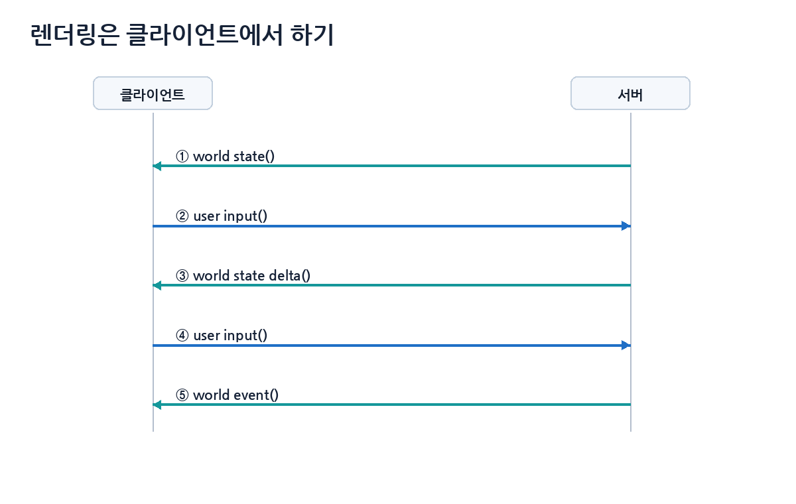

서버와 클라이언트가 완전히 같은 화면을 매 순간 공유하는 것이 아니라, 서버는 권위 있는 상태를 보내고 클라이언트는 그 상태를 보기 좋게 렌더링한다.

---

## 5. 상태 동기화와 월드 스냅샷

서버는 주기적으로 월드 상태를 클라이언트에 보낸다. 이를 스냅샷(snapshot)이라고 부를 수 있다.

```text
서버 상태 전송: 1초에 10번
클라이언트 렌더링: 1초에 60번
```

서버 상태를 받은 순간에만 위치를 갱신하면 캐릭터 움직임이 끊겨 보인다. 그래서 클라이언트는 보간, 추측항법, 예측, 보정을 함께 사용한다.

| 기법 | 목적 |
|---|---|
| 보간 interpolation | 이미 받은 두 상태 사이를 부드럽게 연결 |
| 추측항법 dead reckoning | 위치와 속도로 미래 위치를 예측 |
| 예측 prediction | 내 입력 결과를 서버 응답 전에 로컬에서 먼저 적용 |
| 보정 correction | 서버 권위 상태와 차이가 날 때 부드럽게 맞춤 |

---

## 6. 상태 값 보정

상태 값 보정은 서버에서 받은 위치를 즉시 덮어쓰지 않고, 일정 시간에 걸쳐 서서히 목표 상태로 이동시키는 방법이다.

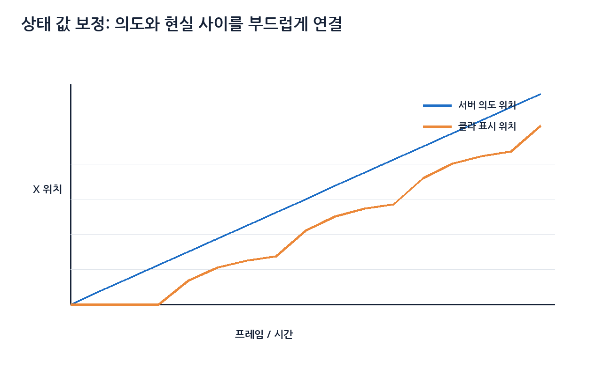

```cpp
struct Vec3
{
    float x, y, z;

    Vec3 operator+(const Vec3& rhs) const { return {x + rhs.x, y + rhs.y, z + rhs.z}; }
    Vec3 operator-(const Vec3& rhs) const { return {x - rhs.x, y - rhs.y, z - rhs.z}; }
    Vec3 operator*(float s) const { return {x * s, y * s, z * s}; }
};

Vec3 Lerp(const Vec3& a, const Vec3& b, float t)
{
    return a + (b - a) * t;
}

void UpdateRemoteCharacter(float deltaTime)
{
    float smoothing = 10.0f;
    float t = std::min(deltaTime * smoothing, 1.0f);

    renderPosition = Lerp(renderPosition, serverTargetPosition, t);
}
```

큰 오차가 생기면 캐릭터가 미끄러지는 느낌이 날 수 있다. 일정 거리 이상 차이가 나면 순간 보정, 짧은 시간 보간, 애니메이션 블렌딩을 혼합해야 한다.

---

## 7. 추측항법

추측항법은 원격 객체의 마지막 위치와 속도를 이용해 현재 또는 가까운 미래의 위치를 예측하는 방법이다.

```text
예측 위치 = 마지막으로 받은 위치 + 마지막으로 받은 속도 × 경과 시간
P(t + Δt) = P0 + V0 × Δt
```

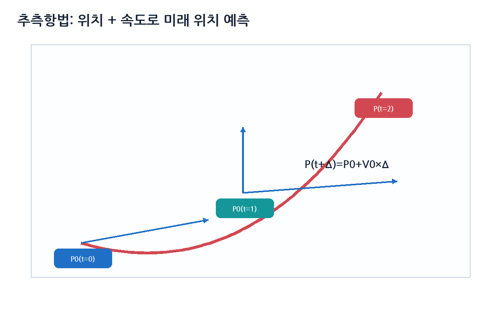

### 7.1 RTT 측정

두 기기 사이의 대략적인 단방향 지연은 Round Trip Time을 이용해 추정할 수 있다.

```text
RTT = 패킷 왕복 시간
단방향 지연 ≈ RTT / 2
```

단, 실제 인터넷에서는 왕복 경로가 비대칭일 수 있으므로 `RTT / 2`는 실용적인 근사치다.

```cpp
#include <chrono>
#include <cstdint>

using Clock = std::chrono::steady_clock;

struct PingRequest
{
    uint32_t sequence;
    int64_t clientSendTimeMs;
};

struct PingResponse
{
    uint32_t sequence;
    int64_t clientSendTimeMs;
    int64_t serverReceiveTimeMs;
};

int64_t NowMs()
{
    return std::chrono::duration_cast<std::chrono::milliseconds>(
        Clock::now().time_since_epoch()
    ).count();
}

void OnPingResponse(const PingResponse& res)
{
    int64_t now = NowMs();
    int64_t rtt = now - res.clientSendTimeMs;
    int64_t estimatedOneWay = rtt / 2;

    // 실제 서버에서는 이동 평균으로 튀는 값을 완화한다.
}
```

추측항법은 직선 이동에는 잘 맞지만 급정지, 방향 전환, 넉백, 점프, 충돌, 지형 막힘에서는 오차가 커진다.

---

## 8. 레이턴시 마스킹

레이턴시 마스킹은 네트워크 지연이 있어도 플레이어가 지연을 덜 느끼게 만드는 기법이다.

내 캐릭터 이동까지 서버 응답을 기다리면 입력이 둔하게 느껴진다. 그래서 많은 액션 게임은 클라이언트가 자신의 입력 결과를 즉시 화면에 반영한다. 이 방식은 보통 **Client-side Prediction**이라고 부른다. 나중에 서버 결과와 예측이 다르면 **Server Reconciliation**으로 맞춘다.

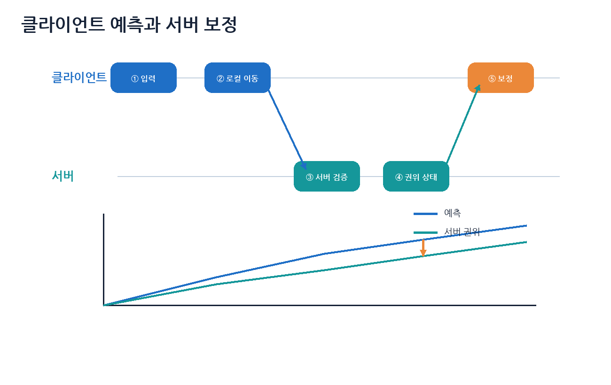

### 8.1 입력 시퀀스 기반 보정

```cpp
struct MoveInput
{
    uint32_t sequence;
    float dt;
    float moveX;
    float moveY;
};

struct ServerState
{
    uint32_t lastProcessedInput;
    Vec3 authoritativePosition;
};

std::deque<MoveInput> pendingInputs;

void ClientSendInput(float dt, float x, float y)
{
    MoveInput input{};
    input.sequence = ++lastSequence;
    input.dt = dt;
    input.moveX = x;
    input.moveY = y;

    localPosition = SimulateMove(localPosition, input);
    SendToServer(input);
    pendingInputs.push_back(input);
}

void OnServerState(const ServerState& state)
{
    localPosition = state.authoritativePosition;

    while (!pendingInputs.empty() &&
           pendingInputs.front().sequence <= state.lastProcessedInput)
    {
        pendingInputs.pop_front();
    }

    for (const MoveInput& input : pendingInputs)
    {
        localPosition = SimulateMove(localPosition, input);
    }
}
```

이 구조는 “로컬 반응성은 클라이언트가 확보하고, 최종 판정은 서버가 한다”는 서버 권위 구조의 대표 패턴이다.

---

## 9. 원격 캐릭터는 과거를 보여준다

멀티플레이에서 내 캐릭터는 예측으로 현재에 가깝게 보여주고, 원격 캐릭터는 보통 약간 과거의 스냅샷을 보간해서 보여준다.

```text
내 캐릭터: 입력 즉시 예측
원격 캐릭터: 과거 스냅샷 사이를 보간
```

```cpp
struct Snapshot
{
    double serverTime;
    Vec3 position;
    Vec3 velocity;
};

std::deque<Snapshot> snapshots;

Vec3 RenderRemoteCharacter(double renderTime)
{
    while (snapshots.size() >= 2 && snapshots[1].serverTime <= renderTime)
    {
        snapshots.pop_front();
    }

    if (snapshots.size() < 2)
    {
        return snapshots.empty() ? Vec3{} : snapshots.front().position;
    }

    const Snapshot& a = snapshots[0];
    const Snapshot& b = snapshots[1];

    double range = b.serverTime - a.serverTime;
    double t = (renderTime - a.serverTime) / range;
    t = std::clamp(t, 0.0, 1.0);

    return Lerp(a.position, b.position, static_cast<float>(t));
}
```

---

## 10. 넓은 월드와 많은 캐릭터 처리

MMORPG나 오픈월드 게임에서는 모든 플레이어에게 모든 객체 정보를 보내면 안 된다. 그래서 서버는 플레이어별로 **가시 영역** 또는 **관심 영역**을 계산한다.

```text
AOI: Area of Interest
Interest Management
```

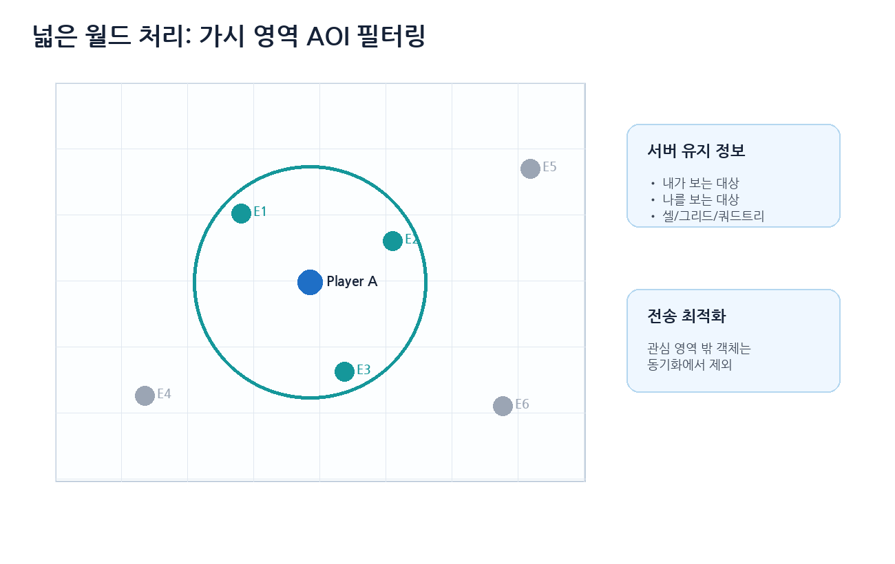

| 정보 | 의미 |
|---|---|
| 내가 볼 수 있는 객체 목록 | 이 플레이어에게 전송해야 할 대상 |
| 나를 볼 수 있는 플레이어 목록 | 내 상태 변경을 받아야 할 대상 |
| 공간 분할 정보 | 그리드, 쿼드트리, 옥트리, 섹터 |
| 입장/퇴장 이벤트 | 객체가 관심 영역에 들어오거나 나갈 때 알림 |

```cpp
struct Entity
{
    int id;
    Vec3 position;
};

struct CellCoord
{
    int x;
    int y;
};

CellCoord ToCell(const Vec3& pos, float cellSize)
{
    return {
        static_cast<int>(std::floor(pos.x / cellSize)),
        static_cast<int>(std::floor(pos.y / cellSize))
    };
}

std::vector<CellCoord> GetNeighborCells(CellCoord center)
{
    std::vector<CellCoord> result;

    for (int dy = -1; dy <= 1; ++dy)
    {
        for (int dx = -1; dx <= 1; ++dx)
        {
            result.push_back({ center.x + dx, center.y + dy });
        }
    }

    return result;
}
```

AOI는 게임 서버 최적화의 핵심이다. 특히 MMO에서는 “누구에게 무엇을 보낼 것인가”가 곧 서버 비용을 결정한다.

---

## 11. RTS와 락스텝 동기화

RTS는 유닛이 많기 때문에 모든 유닛의 위치와 상태를 매번 주고받으면 통신량이 너무 커진다. 그래서 전통적으로 **Lockstep** 방식이 많이 사용되었다.

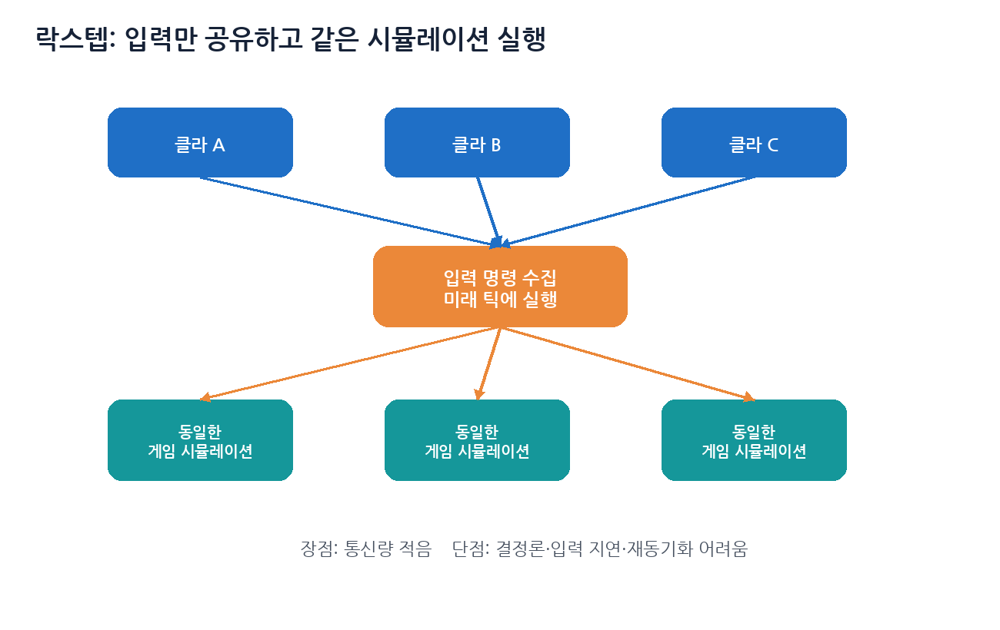

핵심은 다음이다.

```text
모든 클라이언트가 같은 초기 상태에서 시작한다.
각 플레이어의 입력 명령만 공유한다.
모든 클라이언트가 같은 틱에 같은 입력을 적용한다.
그러면 모든 클라이언트의 시뮬레이션 결과가 같아진다.
```

| 장점 | 단점 |
|---|---|
| 통신량이 적다 | 결정론적 시뮬레이션이 필요하다 |
| 유닛 수가 많아도 입력만 보내면 된다 | 한 명의 지연이 전체 진행에 영향을 줄 수 있다 |
| 리플레이 저장이 쉽다 | 부동소수점, 랜덤, 물리엔진 차이로 동기화가 깨질 수 있다 |
| 서버 부하를 줄일 수 있다 | 중간 참가, 재접속, 재동기화가 어렵다 |

입력은 현재 틱이 아니라 미래 틱에 적용하는 경우가 많다.

```text
입력 실행 시점 = 현재 틱 + 네트워크 지연 보정 틱 + 여유 틱
```

---

## 12. Rollback Netcode

2019년 이후 더 중요하게 봐야 할 개념 중 하나가 rollback netcode다. 특히 격투 게임, 2D 액션, 입력 반응성이 매우 중요한 게임에서 자주 언급된다.

```text
1. 입력이 아직 도착하지 않은 상대방은 일단 예측 입력으로 시뮬레이션한다.
2. 나중에 실제 입력이 도착했는데 예측과 다르면 과거 프레임으로 되돌린다.
3. 실제 입력을 적용하고 현재 프레임까지 빠르게 재시뮬레이션한다.
```

Rollback을 구현하려면 게임 루프가 다음을 지원해야 한다.

| 필요 기능 | 설명 |
|---|---|
| 상태 저장 | 특정 프레임의 전체 게임 상태 저장 |
| 상태 복원 | 과거 프레임 상태로 되돌리기 |
| 결정론적 시뮬레이션 | 같은 입력이면 같은 결과 |
| 빠른 재시뮬레이션 | 렌더링 없이 여러 프레임을 빠르게 재실행 |
| 입력 지연/예측 | 상대 입력이 늦을 때 임시 입력 사용 |

Rollback은 강력하지만 모든 게임에 쉽게 적용되는 만능 기술은 아니다. 상태가 크거나 물리 시뮬레이션이 복잡하거나 랜덤성이 많은 게임에서는 구현 난이도가 크게 올라간다.

---

## 13. 실제 레이턴시 줄이기

레이턴시 마스킹은 지연을 숨기는 기술이고, 실제 레이턴시 감소는 물리적인 왕복 시간을 줄이는 기술이다.

| 방법 | 설명 |
|---|---|
| 가까운 리전 선택 | 플레이어와 가까운 데이터센터 사용 |
| UDP 사용 | 실시간 데이터에서 TCP head-of-line blocking 회피 |
| 패킷 수 줄이기 | 작은 메시지를 적절히 묶어 전송 |
| 송신 주기 최적화 | 매 프레임 전송 대신 tick/update rate 조절 |
| 불필요한 데이터 제거 | AOI, delta compression, priority 기반 전송 |
| CDN/Edge 활용 | 로그인, 패치, 매치메이킹 일부를 가까운 위치에서 처리 |
| P2P 혼합 | 소규모 세션에서 경로 단축 가능하지만 NAT/보안 고려 필요 |

### 13.1 패킷 묶기 Coalescing

작은 메시지를 너무 자주 보내면 패킷 헤더 오버헤드가 커진다. 그래서 여러 작은 메시지를 짧은 시간 안에 묶어서 보낼 수 있다.

```cpp
struct OutPacket
{
    std::vector<uint8_t> bytes;
};

std::vector<OutPacket> pendingMessages;
double lastFlushTime = 0.0;

void QueueMessage(const OutPacket& msg)
{
    pendingMessages.push_back(msg);
}

void NetworkUpdate(double now)
{
    const double flushInterval = 0.010; // 10ms 예시

    if (now - lastFlushTime >= flushInterval || pendingMessages.size() >= 16)
    {
        FlushMessages(pendingMessages);
        pendingMessages.clear();
        lastFlushTime = now;
    }
}
```

실제 값은 장르, tick rate, 플랫폼, 네트워크 상황에 따라 조절해야 한다.

---

## 14. 로그인, 매치메이킹, 아이템 처리

게임플레이 네트워킹 외에도 온라인 게임에는 여러 네트워크 절차가 있다.

### 14.1 로그인

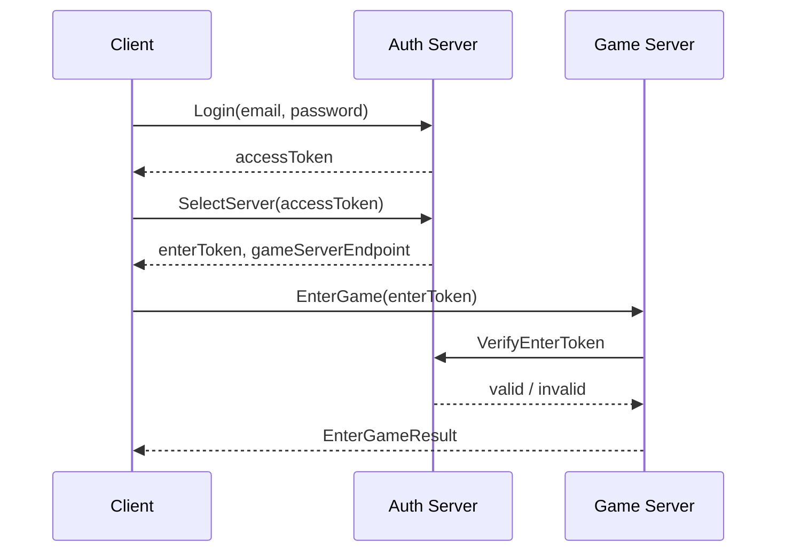

최신 구조에서는 로그인과 게임 서버 입장을 분리하는 것이 일반적이다. 게임 서버가 계정 비밀번호를 직접 받지 않고, 인증 서버가 발급한 토큰을 검증하는 구조가 보안과 운영에 유리하다.

### 14.2 매치메이킹

| 조건 | 예시 |
|---|---|
| 실력 | MMR, 랭크 |
| 지역 | 핑, 리전 |
| 파티 | 파티 인원, 파티 평균 실력 |
| 게임 모드 | 일반전, 랭크전, 이벤트전 |
| 대기 시간 | 너무 오래 기다리면 조건 완화 |
| 서버 용량 | 어느 게임 서버에 배치할지 |

### 14.3 아이템 사용 처리

```cpp
void HandleUseItem(Session& session, int itemId)
{
    Player* player = session.GetPlayer();
    if (player == nullptr)
    {
        SendUseItemResult(session, false, "invalid player");
        return;
    }

    if (!player->Inventory().Has(itemId))
    {
        SendUseItemResult(session, false, "item not found");
        return;
    }

    if (!CanUseItem(*player, itemId))
    {
        SendUseItemResult(session, false, "cannot use item");
        return;
    }

    player->Inventory().Remove(itemId, 1);
    ApplyItemEffect(*player, itemId);

    SendInventoryChanged(session, itemId, player->Inventory().Count(itemId));
    SendPlayerStateChanged(session, player->GetState());
}
```

---

## 15. 해킹과 보안

게임 보안은 크게 세 가지로 나눌 수 있다.

```text
1. 네트워크 해킹
2. 클라이언트 컴퓨터 해킹
3. 서버 컴퓨터 해킹
```

### 15.1 네트워크 해킹

| 공격 | 설명 |
|---|---|
| 도청 | 패킷 내용을 훔쳐봄 |
| 변조 | 패킷 내용을 바꿈 |
| 재전송 | 이전 패킷을 다시 보냄 |
| 중간자 공격 | 클라이언트와 서버 사이에서 통신을 가로챔 |

대응 방법은 다음과 같다.

- TLS 1.3 같은 표준 보안 프로토콜 사용
- 자체 UDP 프로토콜이면 DTLS, QUIC, 또는 검증된 암호화 계층 검토
- 패킷에 sequence number, nonce, timestamp 사용
- 서버에서 모든 중요한 요청 재검증
- 세션 토큰 만료 시간 관리

과거 설명에서는 AES/RSA를 직접 언급하는 경우가 많지만, 현대 실무에서는 암호 알고리즘을 직접 조합하기보다 TLS 1.3 같은 표준 프로토콜과 검증된 라이브러리를 사용하는 것이 안전하다.

### 15.2 클라이언트 컴퓨터 해킹

클라이언트는 공격자가 완전히 통제할 수 있는 환경이다.

가능한 공격은 다음과 같다.

- 메모리 변조
- 패킷 조작
- 속도핵
- 에임봇
- 월핵
- DLL 인젝션
- 디버거/후킹
- 리소스 변조

서버는 클라이언트가 보내는 값을 믿으면 안 된다.

```text
나의 위치는 여기다        X
나는 이 아이템을 얻었다   X
나는 이 적을 맞췄다       X

나는 이 방향으로 이동했다 O
나는 이 아이템을 사용하고 싶다 O
나는 이 위치를 향해 발사했다 O
```

### 15.3 서버 컴퓨터 해킹

| 항목 | 설명 |
|---|---|
| 방화벽 | 필요한 포트만 공개 |
| 최소 권한 | 서버 프로세스 권한 제한 |
| 입력 검증 | SQL injection, command injection 방지 |
| 패치 관리 | OS와 라이브러리 보안 업데이트 |
| 비밀 관리 | DB 비밀번호, API 키를 코드에 하드코딩하지 않기 |
| 로그와 알림 | 비정상 접근 감지 |
| DDoS 대비 | rate limit, WAF, cloud protection |

```cpp
// 나쁜 예: 문자열 이어붙이기
std::string sql =
    "SELECT * FROM users WHERE name = '" + userName + "'";

// 좋은 예: prepared statement 사용
auto stmt = db.Prepare("SELECT * FROM users WHERE name = ?");
stmt.BindString(1, userName);
auto result = stmt.ExecuteQuery();
```

---

## 16. 2026년 기준으로 추가로 알아야 할 것

### 16.1 서버 권위 + 클라이언트 예측은 여전히 핵심

2026년에도 실시간 멀티플레이의 기본 방향은 크게 바뀌지 않았다.

```text
서버는 권위 있는 상태를 유지한다.
클라이언트는 반응성을 위해 예측과 보간을 수행한다.
불일치가 생기면 서버 상태로 보정한다.
```

Unity Netcode for GameObjects 문서도 서버 권위 구조에서는 latency 때문에 사용자가 지연을 느끼는 문제가 있고, 이를 완화하기 위한 client anticipation 기능을 제공한다고 설명한다. 단, Unity의 NGO는 완전한 client-side prediction과 reconciliation을 기본 제공하지는 않고, 더 단순한 anticipation 모델을 제공한다.

### 16.2 Unreal Engine에서는 Iris와 Network Prediction을 구분해서 봐야 함

Unreal Engine의 Iris는 replication system이다. 즉, 더 많은 객체와 큰 월드에서 복제 성능과 확장성을 개선하기 위한 시스템이다.

반면 Network Prediction은 입력 반응성과 예측/보정에 가까운 주제다.

```text
Iris
- 객체 상태 복제 시스템
- 대규모 월드, 많은 객체, replication 효율

Network Prediction
- 입력 예측
- 클라이언트 반응성
- 서버 보정
```

### 16.3 Rollback은 격투 게임만의 기술이 아니지만 조건이 까다롭다

Rollback은 격투 게임에서 유명하지만, 원리는 다른 장르에도 적용할 수 있다. 다만 상태 저장/복원과 결정론이 필요하므로 모든 게임에 쉽게 붙는 기능은 아니다.

### 16.4 보안은 암호화만으로 끝나지 않는다

TLS를 사용해도 클라이언트가 조작한 요청을 보내는 문제는 막을 수 없다.

```text
TLS가 막는 것:
- 네트워크 도청
- 네트워크 변조
- 일부 중간자 공격

TLS가 못 막는 것:
- 클라이언트 메모리 조작
- 오토 프로그램
- 속도핵
- 서버 로직 취약점
- SQL Injection
```

---

## 17. 이 장의 최종 정리

```text
1. 시퀀스 다이어그램은 컴퓨터 사이 메시지 순서를 표현한다.
2. 액티비티 다이어그램은 서버 내부 검증과 조건 분기를 표현한다.
3. 서버는 권위 있는 월드 상태를 계산하고, 클라이언트는 렌더링과 예측을 담당한다.
4. 서버 상태 전송 주기와 클라이언트 렌더링 주기가 다르기 때문에 보간과 보정이 필요하다.
5. 추측항법은 위치와 속도를 이용해 원격 객체 위치를 예측한다.
6. 레이턴시 마스킹은 클라이언트 예측, 선연출, 서버 보정으로 구성된다.
7. MMORPG는 AOI 필터링으로 관심 영역 밖 객체의 전송을 줄인다.
8. RTS는 lockstep으로 입력만 공유할 수 있지만 결정론이 필요하다.
9. 격투 게임과 입력 반응성이 중요한 게임은 rollback을 고려할 수 있다.
10. 보안은 암호화만이 아니라 서버 검증, 방화벽, 입력 검증, 안티치트까지 포함한다.
```

> 서버는 진실을 관리하고, 클라이언트는 그 진실을 최대한 빠르고 부드럽게 보여준다.

---

## 참고 자료

- 『게임 서버 프로그래밍 교과서』
- Valve Developer Community, **Source Multiplayer Networking**
  - https://developer.valvesoftware.com/wiki/Source_Multiplayer_Networking
- Unity Documentation, **Client anticipation | Netcode for GameObjects**
  - https://docs.unity3d.com/Packages/com.unity.netcode.gameobjects@2.7/manual/advanced-topics/client-anticipation.html
- Unity Documentation, **Latency and performance | Netcode for GameObjects**
  - https://docs.unity3d.com/Packages/com.unity.netcode.gameobjects@2.6/manual/latency-performance.html
- Epic Games Documentation, **Introduction to Iris in Unreal Engine**
  - https://dev.epicgames.com/documentation/unreal-engine/introduction-to-iris-in-unreal-engine
- Epic Games Documentation, **NetworkPrediction API**
  - https://dev.epicgames.com/documentation/unreal-engine/API/Plugins/NetworkPrediction
- GGPO, **Rollback Networking SDK for Peer-to-Peer Games**
  - https://www.ggpo.net/
- IETF RFC 8446, **The Transport Layer Security (TLS) Protocol Version 1.3**
  - https://datatracker.ietf.org/doc/html/rfc8446
- Yahn W. Bernier, **Latency Compensating Methods in Client/Server In-game Protocol Design and Optimization**
  - https://www.gamedevs.org/uploads/latency-compensation-in-client-server-protocols.pdf
- Gabriel Gambetta, **Fast-Paced Multiplayer**
  - https://www.gabrielgambetta.com/client-server-game-architecture.html
