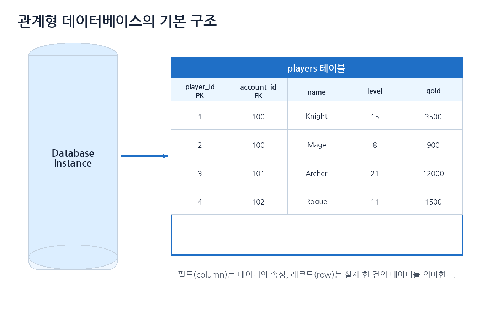
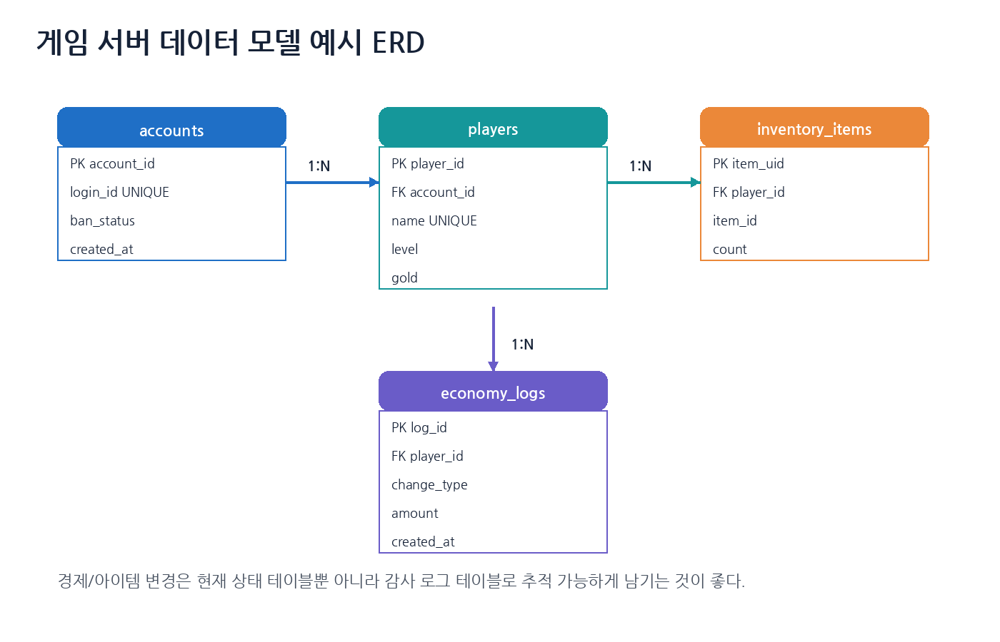
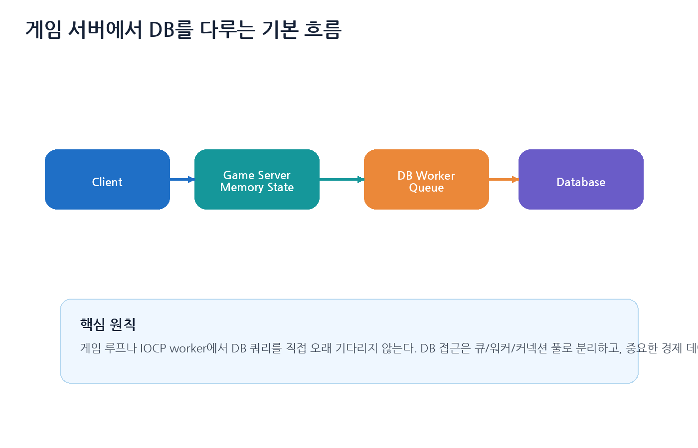
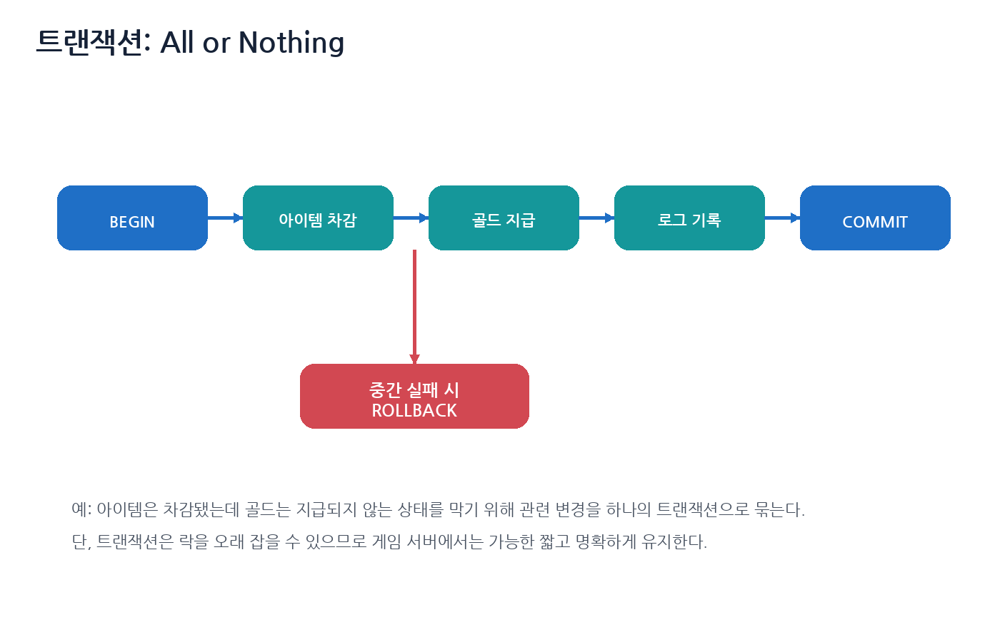
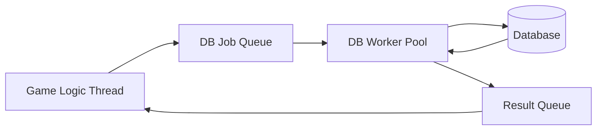
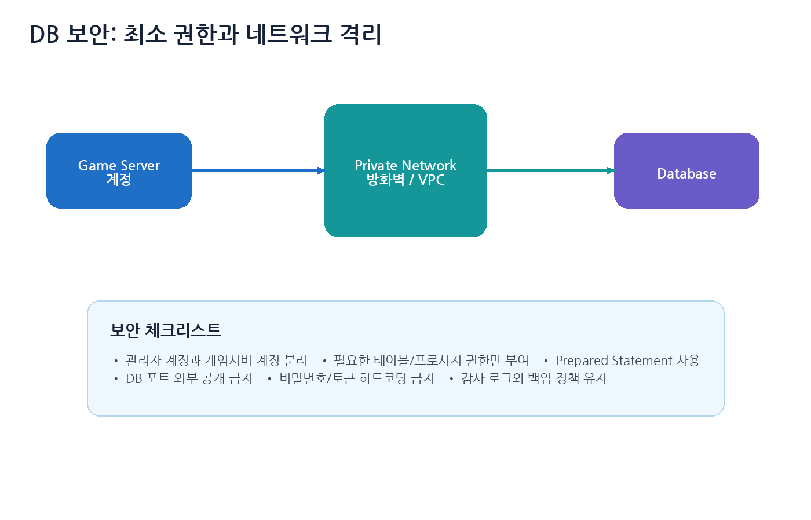

# 7장. 데이터베이스 기초

> 주 서적: **『게임 서버 프로그래밍 교과서』**  
> 정리 방식: 책을 읽으며 정리한 키워드를 기반으로, 게임 서버 운영 관점에서 필요한 내용을 보강했다.  
> 핵심 주제: **데이터 모델링, 인덱스, 키, 트랜잭션, 게임 서버 DB 접근 구조, 보안, 운영**

---

## 0. 이 장의 핵심 요약

데이터베이스는 단순히 데이터를 저장하는 공간이 아니다. 게임 서버에서는 다음 역할을 한다.

```text
1. 플레이어의 영속 상태 저장
2. 아이템, 재화, 결제, 보상 같은 중요한 데이터 보호
3. 여러 서버가 동시에 접근해도 데이터 일관성 유지
4. 장애 발생 후 복구할 수 있는 근거 제공
5. 운영자가 유저 상태를 조회하고 수정할 수 있는 기반 제공
```

게임 서버 관점에서 데이터베이스를 볼 때 핵심은 다음이다.

| 주제 | 핵심 |
|---|---|
| 테이블 설계 | 계정, 캐릭터, 인벤토리, 재화, 로그를 분리해 관리 |
| 키와 인덱스 | 빠른 조회와 중복 방지에 사용하지만 쓰기 비용이 증가 |
| 트랜잭션 | 아이템 지급/차감, 재화 변경처럼 원자성이 필요한 작업에 사용 |
| DB 접근 구조 | 게임 루프에서 직접 오래 기다리지 않고 DB worker/queue/pool로 분리 |
| 보안 | 최소 권한 계정, 네트워크 격리, prepared statement 사용 |
| 운영 | 백업, 마이그레이션, 감사 로그, 모니터링이 필수 |

---

## 1. 데이터베이스란?

데이터베이스는 데이터를 체계적으로 저장하고, 조회하고, 변경하고, 보호하기 위한 시스템이다.

게임 서버에서 데이터베이스가 필요한 이유는 명확하다. 서버 프로세스 메모리에 있는 데이터는 서버가 꺼지면 사라진다. 하지만 플레이어의 레벨, 아이템, 재화, 퀘스트 진행도는 서버 재시작 이후에도 남아 있어야 한다.

또한 여러 서버가 동시에 데이터를 변경할 수 있다. 예를 들어 게임 서버, 상점 서버, 운영툴, 이벤트 지급 서버가 같은 플레이어 데이터를 다룰 수 있다. 이때 데이터 경쟁 상태가 발생하지 않도록 데이터베이스의 트랜잭션, 락, 제약 조건을 활용한다.

---

## 2. 데이터베이스의 데이터 구성

관계형 데이터베이스는 보통 다음 단위로 데이터를 구성한다.



| 용어 | 의미 | 예시 |
|---|---|---|
| 데이터베이스 인스턴스 | DBMS 프로세스와 저장소 전체 | MySQL 서버, PostgreSQL 서버 |
| 데이터베이스 | 논리적 데이터 묶음 | `game_db` |
| 테이블 | 같은 종류의 레코드 집합 | `players`, `items` |
| 레코드 / 행 | 데이터 한 건 | 한 캐릭터 정보 |
| 필드 / 열 | 데이터 속성 | `level`, `gold`, `name` |

예를 들어 `players` 테이블은 다음처럼 구성할 수 있다.

```sql
CREATE TABLE players (
    player_id BIGINT PRIMARY KEY AUTO_INCREMENT,
    account_id BIGINT NOT NULL,
    name VARCHAR(32) NOT NULL,
    level INT NOT NULL DEFAULT 1,
    exp BIGINT NOT NULL DEFAULT 0,
    gold BIGINT NOT NULL DEFAULT 0,
    created_at TIMESTAMP DEFAULT CURRENT_TIMESTAMP
);
```

---

## 3. 키와 인덱스

### 3.1 키

키는 레코드를 식별하거나 테이블 간 관계를 연결하는 데 사용한다.

| 키 | 의미 | 예시 |
|---|---|---|
| Primary Key | 한 행을 고유하게 식별 | `player_id` |
| Foreign Key | 다른 테이블의 행을 참조 | `account_id` |
| Unique Key | 중복을 막음 | `character_name` |
| Composite Key | 여러 열을 묶어 식별 | `(player_id, item_id)` |

### 3.2 인덱스

인덱스는 빠른 검색을 위한 자료구조다. 책의 필기처럼 인덱스는 빠른 검색뿐 아니라 유니크 제약을 통해 중복 값을 막는 용도로도 쓰인다.


하지만 인덱스는 공짜가 아니다.

```text
SELECT는 빨라질 수 있다.
INSERT / UPDATE / DELETE는 느려질 수 있다.
디스크와 메모리를 더 사용한다.
잘못 만든 인덱스는 오히려 성능을 망칠 수 있다.
```

### 3.3 게임 서버에서 자주 필요한 인덱스

| 테이블 | 인덱스 후보 | 이유 |
|---|---|---|
| accounts | `login_id UNIQUE` | 로그인 ID 중복 방지 |
| players | `account_id` | 계정의 캐릭터 목록 조회 |
| players | `name UNIQUE` | 캐릭터명 중복 방지 |
| inventory_items | `(player_id, item_id)` | 특정 플레이어의 아이템 조회 |
| mails | `(player_id, received_at)` | 우편 목록 조회 |
| economy_logs | `(player_id, created_at)` | 유저별 재화 로그 조회 |
| ban_logs | `(account_id, created_at)` | 제재 이력 조회 |

인덱스 설계는 “어떤 쿼리를 자주 실행하는가”를 기준으로 해야 한다.

---

## 4. 데이터 저장 방식

게임 데이터는 크게 두 방식으로 저장할 수 있다.

### 4.1 문서 형태로 저장

플레이어 상태 전체를 JSON 같은 문서 형태로 저장하는 방식이다.

```sql
CREATE TABLE player_snapshots (
    player_id BIGINT PRIMARY KEY,
    snapshot_json JSON NOT NULL,
    updated_at TIMESTAMP DEFAULT CURRENT_TIMESTAMP
);
```

장점은 구조 변경이 비교적 쉽고, 한 번에 읽고 쓰기 편하다는 것이다. 단점은 특정 필드만 검색하거나 조인하기 어렵고, 일부 값만 안전하게 갱신하기 까다로울 수 있다는 것이다.

### 4.2 정규화된 테이블로 저장

플레이어, 인벤토리, 장비, 퀘스트 등을 각각 테이블로 나누는 방식이다.

```sql
CREATE TABLE inventory_items (
    item_uid BIGINT PRIMARY KEY AUTO_INCREMENT,
    player_id BIGINT NOT NULL,
    item_id INT NOT NULL,
    count INT NOT NULL,
    FOREIGN KEY (player_id) REFERENCES players(player_id)
);
```

장점은 검색, 제약 조건, 조인, 통계가 강하다는 것이다. 단점은 설계가 복잡해지고, 저장/조회 시 여러 테이블을 다뤄야 한다는 것이다.

### 4.3 게임 서버에서는 보통 혼합한다

| 데이터 | 추천 방식 |
|---|---|
| 계정, 캐릭터 기본 정보 | 정규화된 테이블 |
| 인벤토리, 장비 | 정규화된 테이블 |
| 설정값, UI 세팅 | JSON 문서 가능 |
| 로그, 이벤트 기록 | append-only 테이블 또는 로그 시스템 |
| 리플레이, 전투 기록 | 파일/오브젝트 스토리지/전용 테이블 |
| 세션 상태 | Redis 같은 메모리 저장소 가능 |

---

## 5. ERD와 게임 서버 데이터 모델

ERD는 테이블 사이의 관계를 표현하는 다이어그램이다.



가장 기본적인 게임 데이터 관계는 다음처럼 잡을 수 있다.

```text
accounts 1 : N players
players 1 : N inventory_items
players 1 : N economy_logs
```

### 5.1 예시 스키마

```sql
CREATE TABLE accounts (
    account_id BIGINT PRIMARY KEY AUTO_INCREMENT,
    login_id VARCHAR(64) NOT NULL UNIQUE,
    password_hash VARCHAR(255) NOT NULL,
    ban_status TINYINT NOT NULL DEFAULT 0,
    created_at TIMESTAMP DEFAULT CURRENT_TIMESTAMP
);

CREATE TABLE players (
    player_id BIGINT PRIMARY KEY AUTO_INCREMENT,
    account_id BIGINT NOT NULL,
    name VARCHAR(32) NOT NULL UNIQUE,
    level INT NOT NULL DEFAULT 1,
    gold BIGINT NOT NULL DEFAULT 0,
    created_at TIMESTAMP DEFAULT CURRENT_TIMESTAMP,
    FOREIGN KEY (account_id) REFERENCES accounts(account_id)
);

CREATE TABLE inventory_items (
    item_uid BIGINT PRIMARY KEY AUTO_INCREMENT,
    player_id BIGINT NOT NULL,
    item_id INT NOT NULL,
    count INT NOT NULL DEFAULT 1,
    FOREIGN KEY (player_id) REFERENCES players(player_id),
    INDEX idx_inventory_player_item (player_id, item_id)
);

CREATE TABLE economy_logs (
    log_id BIGINT PRIMARY KEY AUTO_INCREMENT,
    player_id BIGINT NOT NULL,
    change_type VARCHAR(32) NOT NULL,
    amount BIGINT NOT NULL,
    reason VARCHAR(128) NOT NULL,
    created_at TIMESTAMP DEFAULT CURRENT_TIMESTAMP,
    INDEX idx_economy_player_time (player_id, created_at)
);
```

경제 로그는 특히 중요하다. 현재 골드 값만 저장하면 버그나 어뷰징이 발생했을 때 추적이 어렵다. 재화와 아이템 변화는 가능하면 append-only 로그로 남기는 것이 좋다.

---

## 6. 질의 구문 실행과 DB 접근 비용

게임 서버가 데이터베이스에 질의를 자주 던지는 것은 비효율적일 수 있다. 이유는 두 가지다.

```text
1. 네트워크 왕복 지연이 발생한다.
2. DB는 디스크, 락, 인덱스, 버퍼 풀 등 여러 비용을 가진다.
```

게임 서버의 메인 로직이나 IOCP worker에서 DB 쿼리를 직접 기다리면, 유저 패킷 처리 전체가 밀릴 수 있다.



### 6.1 좋지 않은 구조

```cpp
void HandleUseItem(Session& session, int itemId)
{
    // 나쁜 예: 패킷 처리 스레드에서 DB를 직접 기다림
    auto item = db.Query("SELECT count FROM inventory WHERE ...");

    // DB가 느리면 이 스레드가 그대로 막힘
}
```

### 6.2 더 나은 구조

```cpp
struct DbJob
{
    int64_t playerId;
    int itemId;
};

void HandleUseItem(Session& session, int itemId)
{
    Player* player = session.GetPlayer();

    if (player == nullptr)
        return;

    if (!player->Inventory().Has(itemId))
    {
        SendUseItemResult(session, false);
        return;
    }

    // 먼저 서버 메모리 상태에서 검증 및 변경
    player->Inventory().Remove(itemId, 1);

    // DB 저장은 별도 워커에게 위임
    DbJob job{ player->Id(), itemId };
    dbJobQueue.Push(job);

    SendUseItemResult(session, true);
}
```

이 구조는 응답성을 높일 수 있지만, 서버 크래시 시 메모리 변경과 DB 저장 사이의 간격이 생긴다는 단점이 있다. 따라서 재화, 결제, 아이템 거래 같은 중요한 처리에는 더 강한 보장 방식이 필요하다.

---

## 7. 저장 프로시저

저장 프로시저는 DB 안에 미리 저장해두고 실행하는 SQL 프로그램이다.

```sql
DELIMITER //

CREATE PROCEDURE AddGold(
    IN p_player_id BIGINT,
    IN p_amount BIGINT,
    IN p_reason VARCHAR(128)
)
BEGIN
    UPDATE players
    SET gold = gold + p_amount
    WHERE player_id = p_player_id;

    INSERT INTO economy_logs(player_id, change_type, amount, reason)
    VALUES(p_player_id, 'ADD_GOLD', p_amount, p_reason);
END //

DELIMITER ;
```

게임 서버에서는 다음처럼 호출할 수 있다.

```sql
CALL AddGold(1001, 500, 'quest_reward');
```

### 7.1 저장 프로시저의 장점

| 장점 | 설명 |
|---|---|
| 왕복 횟수 감소 | 여러 SQL을 한 번의 호출로 처리 |
| DB 근처에서 실행 | 데이터 처리 로직 일부를 DB 내부로 이동 |
| 권한 제어 | 테이블 직접 접근 대신 프로시저 실행 권한만 부여 가능 |
| 공통 로직 통일 | 여러 서버가 같은 DB 로직 사용 |

### 7.2 저장 프로시저의 단점

| 단점 | 설명 |
|---|---|
| 버전 관리가 어려움 | 애플리케이션 코드와 DB 코드가 분리됨 |
| 테스트가 어려움 | 일반 코드보다 자동화 테스트가 번거로움 |
| DB 종속성 증가 | 특정 DBMS 문법에 묶임 |
| 로직 분산 | 게임 로직이 서버 코드와 DB에 나뉘어 이해가 어려워짐 |

따라서 저장 프로시저는 “무조건 좋다”가 아니라, 정말 DB에서 묶어 처리해야 하는 영역에 제한적으로 쓰는 것이 좋다.

---

## 8. 트랜잭션

트랜잭션은 여러 작업을 하나의 단위로 묶는 기능이다.



가장 중요한 개념은 **All or Nothing**이다.

```text
모든 작업이 성공하면 COMMIT
중간에 하나라도 실패하면 ROLLBACK
```

### 8.1 아이템 구매 트랜잭션 예시

```sql
START TRANSACTION;

UPDATE players
SET gold = gold - 1000
WHERE player_id = 1
  AND gold >= 1000;

-- 영향 받은 행이 1개인지 확인해야 함

INSERT INTO inventory_items(player_id, item_id, count)
VALUES(1, 3001, 1);

INSERT INTO economy_logs(player_id, change_type, amount, reason)
VALUES(1, 'BUY_ITEM', -1000, 'shop_buy_3001');

COMMIT;
```

주의할 점은 `gold >= 1000` 조건을 `UPDATE`에 포함해야 한다는 것이다. 먼저 SELECT로 골드를 읽고, 나중에 UPDATE를 하면 동시 요청에서 경쟁 상태가 생길 수 있다.

### 8.2 C++ 의사 코드

```cpp
bool BuyItem(Database& db, int64_t playerId, int itemId, int price)
{
    auto tx = db.BeginTransaction();

    int affected = tx.Execute(
        "UPDATE players SET gold = gold - ? "
        "WHERE player_id = ? AND gold >= ?",
        price, playerId, price
    );

    if (affected != 1)
    {
        tx.Rollback();
        return false;
    }

    tx.Execute(
        "INSERT INTO inventory_items(player_id, item_id, count) "
        "VALUES(?, ?, 1)",
        playerId, itemId
    );

    tx.Execute(
        "INSERT INTO economy_logs(player_id, change_type, amount, reason) "
        "VALUES(?, 'BUY_ITEM', ?, 'shop_buy')",
        playerId, -price
    );

    tx.Commit();
    return true;
}
```

---

## 9. 트랜잭션 격리 수준과 락

트랜잭션은 동시에 실행될 수 있다. 이때 격리 수준에 따라 서로의 변경을 어느 정도 볼 수 있는지가 달라진다.

대표 격리 수준은 다음과 같다.

| 격리 수준 | 설명 |
|---|---|
| Read Uncommitted | 커밋되지 않은 변경을 볼 수 있음 |
| Read Committed | 커밋된 데이터만 읽음 |
| Repeatable Read | 같은 트랜잭션 안에서 같은 행을 반복 읽으면 같은 결과 기대 |
| Serializable | 직렬 실행처럼 가장 강하게 격리 |

격리 수준이 강할수록 일관성은 좋아지지만, 동시성과 성능은 떨어질 수 있다.

게임 서버에서는 대부분의 경우 기본 격리 수준을 이해하고, 중요한 경제 처리에서 조건부 UPDATE, 짧은 트랜잭션, 재시도 로직을 사용하는 것이 현실적이다.

---

## 10. 교착상태와 재시도

DB에서도 교착상태가 발생할 수 있다.

```text
트랜잭션 1: A 잠금 → B 잠금 대기
트랜잭션 2: B 잠금 → A 잠금 대기
```

DBMS는 보통 이런 상황을 감지하고 둘 중 하나를 실패시킨다. 따라서 게임 서버는 데드락을 “절대 발생하지 않는 오류”가 아니라 “발생할 수 있는 재시도 대상 오류”로 다뤄야 한다.

### 10.1 재시도 의사 코드

```cpp
template <typename Func>
bool RunTransactionWithRetry(Func&& func)
{
    constexpr int kMaxRetry = 3;

    for (int attempt = 1; attempt <= kMaxRetry; ++attempt)
    {
        try
        {
            auto tx = db.BeginTransaction();
            func(tx);
            tx.Commit();
            return true;
        }
        catch (const DeadlockException&)
        {
            tx.Rollback();

            if (attempt == kMaxRetry)
                return false;

            SleepBackoff(attempt);
        }
    }

    return false;
}
```

### 10.2 데드락 줄이는 원칙

| 원칙 | 설명 |
|---|---|
| 항상 같은 순서로 row 접근 | 예: 작은 player_id부터 잠금 |
| 트랜잭션 짧게 유지 | 네트워크 호출, 파일 I/O, 긴 계산을 트랜잭션 안에서 하지 않기 |
| 필요한 행만 잠금 | 범위가 넓은 UPDATE 피하기 |
| 적절한 인덱스 사용 | 인덱스가 없으면 더 많은 행을 스캔하고 잠글 수 있음 |
| 실패 시 재시도 | deadlock victim은 정상적인 재시도 대상 |

---

## 11. 게임 서버에서 트랜잭션을 언제 써야 하는가?

필기에는 “게임서버는 플레이어 정보를 메모리에 보관하고 변경된 내용을 DB에 저장하며, 트랜잭션의 원자성보다 교착상태/병렬성 손실이 더 클 수 있다”는 흐름이 있다. 이 말은 절반은 맞고, 절반은 조심해야 한다.

### 11.1 트랜잭션이 꼭 필요한 경우

| 작업 | 이유 |
|---|---|
| 캐시 아이템 구매 | 재화 차감과 아이템 지급이 함께 성공해야 함 |
| 유저 간 거래 | 양쪽 인벤토리와 재화가 함께 변경되어야 함 |
| 우편 첨부 아이템 수령 | 우편 상태 변경과 아이템 지급이 함께 처리되어야 함 |
| 경매장 낙찰 | 판매자/구매자/아이템/수수료가 연결됨 |
| 결제 보상 지급 | 중복 지급 방지와 감사 로그 필요 |
| 길드 창고 | 여러 유저가 같은 자원에 접근 |

### 11.2 트랜잭션을 피하거나 약하게 해도 되는 경우

| 작업 | 이유 |
|---|---|
| 현재 위치 주기 저장 | 약간 이전 위치로 복구되어도 치명적이지 않음 |
| 마지막 접속 시간 | eventual consistency 허용 가능 |
| 일시적 매칭 상태 | Redis/메모리로 처리 가능 |
| 전투 중 임시 상태 | 게임 서버 메모리 권위로 처리 가능 |
| 통계 카운터 | 비동기 집계 가능 |

핵심은 “트랜잭션을 쓰지 말자”가 아니다.

> 중요한 경제/소유권 데이터에는 트랜잭션을 쓰고, 실시간 플레이 상태에는 DB를 직접 끼워 넣지 않는다.

---

## 12. 커넥션과 커넥션 풀

게임 서버가 DB에 접근하려면 DB 연결 객체가 필요하다. 이 연결은 TCP 연결과 비슷하게 생성 비용이 있다.

매 쿼리마다 새 연결을 열고 닫으면 비효율적이다. 그래서 보통 커넥션 풀을 사용한다.

```text
서버 시작
→ DB 커넥션 여러 개 미리 생성
→ DB 작업이 필요하면 하나 빌림
→ 작업 완료 후 풀에 반환
```

### 12.1 커넥션 풀 의사 코드

```cpp
class DbConnectionPool
{
public:
    DbConnection* Acquire()
    {
        std::unique_lock lock(mutex_);
        cv_.wait(lock, [&] { return !free_.empty(); });

        DbConnection* conn = free_.back();
        free_.pop_back();
        return conn;
    }

    void Release(DbConnection* conn)
    {
        {
            std::lock_guard lock(mutex_);
            free_.push_back(conn);
        }

        cv_.notify_one();
    }

private:
    std::mutex mutex_;
    std::condition_variable cv_;
    std::vector<DbConnection*> free_;
};
```

커넥션 풀 크기는 무조건 크게 잡으면 안 된다. DB가 처리할 수 있는 동시 쿼리 수보다 커지면 오히려 DB를 압박한다.

---

## 13. 게임 서버와 DB worker 구조

실시간 게임 서버에서는 DB 접근을 별도 worker로 분리하는 경우가 많다.



주의할 점은 DB 결과가 나중에 돌아온다는 것이다. 그 사이에 세션이 끊기거나 캐릭터가 다른 서버로 이동했을 수 있다.

```cpp
struct DbResult
{
    uint64_t requestId;
    int64_t playerId;
    bool success;
};

void OnDbResult(const DbResult& result)
{
    Session* session = FindSessionByPlayerId(result.playerId);

    if (session == nullptr)
    {
        // 이미 로그아웃했을 수 있음
        return;
    }

    if (session->CurrentRequestId() != result.requestId)
    {
        // 오래된 응답일 수 있음
        return;
    }

    // 안전하게 결과 반영
}
```

---

## 14. ORM

ORM은 객체와 테이블을 매핑해주는 도구다.

예를 들어 C#에서는 Entity Framework, Java에서는 Hibernate, C++에서는 SOCI, ODB 같은 도구가 있다.

### 14.1 ORM의 장점

| 장점 | 설명 |
|---|---|
| 생산성 | SQL을 덜 직접 작성 |
| 타입 안정성 | 객체 모델로 다룰 수 있음 |
| 마이그레이션 | 스키마 변경 관리 도구 제공 가능 |
| 보안 | 파라미터 바인딩을 쉽게 사용 |

### 14.2 ORM의 단점

| 단점 | 설명 |
|---|---|
| 성능 예측 어려움 | 의도치 않은 쿼리 발생 |
| N+1 문제 | 연관 객체를 반복 조회 |
| 복잡한 쿼리 한계 | 최적화가 어려울 수 있음 |
| DB 특화 기능 사용 어려움 | 힌트, 락, 프로시저 등 |

게임 서버에서는 ORM을 쓰더라도 중요한 경로는 실제 SQL과 실행 계획을 확인해야 한다.

---

## 15. 보안을 위한 주의사항

DB에는 계정, 재화, 아이템, 결제, 로그 등 중요한 데이터가 들어간다. 따라서 보안 설계가 필수다.



### 15.1 최소 권한 계정

관리자 계정과 게임 서버 계정을 분리해야 한다.

```sql
CREATE USER 'game_server'@'10.%' IDENTIFIED BY 'strong_password';

GRANT SELECT, INSERT, UPDATE
ON game_db.players
TO 'game_server'@'10.%';

GRANT SELECT, INSERT, UPDATE, DELETE
ON game_db.inventory_items
TO 'game_server'@'10.%';
```

게임 서버 계정이 `DROP DATABASE` 같은 권한을 갖고 있으면 위험하다.

### 15.2 네트워크 격리

DB 포트는 인터넷에 직접 열면 안 된다.

```text
인터넷
  X
DB 포트 직접 공개 금지

Game Server subnet
  → Private DB subnet
```

VPC, 보안 그룹, 방화벽, VPN 등을 사용해 DB 접근 주체를 제한한다.

### 15.3 SQL Injection 방지

SQL Injection은 사용자의 입력이 SQL 구문으로 해석될 때 발생한다.

나쁜 예시는 다음과 같다.

```cpp
std::string sql =
    "SELECT * FROM accounts WHERE login_id = '" + loginId + "'";
```

좋은 예시는 prepared statement 또는 parameterized query를 사용하는 것이다.

```cpp
auto stmt = db.Prepare(
    "SELECT * FROM accounts WHERE login_id = ?"
);

stmt.BindString(1, loginId);
auto result = stmt.ExecuteQuery();
```

문자열 escape를 직접 구현하는 것보다 검증된 DB 드라이버의 파라미터 바인딩을 사용해야 한다.

---

## 16. 운영에서 중요한 DB 관리

책의 기초 내용에 더해, 게임 서버 운영에서는 다음 항목이 매우 중요하다.

### 16.1 백업과 복구

백업은 “있다”가 아니라 “복구해봤다”가 중요하다.

| 항목 | 설명 |
|---|---|
| 정기 백업 | 매일 또는 더 자주 수행 |
| Point-in-Time Recovery | 특정 시점으로 복구 |
| 복구 리허설 | 실제로 복구 가능한지 테스트 |
| 백업 암호화 | 유출 시 피해 줄이기 |
| 보관 정책 | 며칠/몇 달 보관할지 결정 |

### 16.2 마이그레이션

서비스 중인 게임에서 테이블 구조를 바꾸는 일은 위험하다.

좋은 마이그레이션 원칙은 다음과 같다.

```text
1. 새 컬럼을 nullable 또는 default 값으로 추가
2. 서버 코드가 새 컬럼을 읽고 쓸 수 있게 배포
3. 백필 작업으로 기존 데이터 채움
4. 충분히 검증 후 old 컬럼 제거
```

한 번에 컬럼을 지우거나 타입을 바꾸면 구버전 서버와 충돌할 수 있다.

### 16.3 감사 로그

게임 운영에서 감사 로그는 매우 중요하다.

| 로그 | 이유 |
|---|---|
| 재화 증가/감소 | 버그, 어뷰징, 운영 지급 추적 |
| 아이템 생성/삭제 | 복구와 조사 |
| 거래 기록 | 사기, 복구, 분쟁 처리 |
| 우편 수령 | 중복 수령 조사 |
| 운영툴 사용 | 운영자 실수나 악용 방지 |

### 16.4 모니터링 지표

| 지표 | 의미 |
|---|---|
| QPS | 초당 쿼리 수 |
| 평균/상위 99% 쿼리 지연 | 체감 성능과 병목 |
| Slow Query | 최적화 대상 |
| Lock Wait | 락 경합 |
| Deadlock Count | 트랜잭션 충돌 |
| Connection Count | 풀 크기와 누수 |
| Replication Lag | 읽기 복제본 지연 |
| Buffer Pool Hit Ratio | 메모리 캐시 효율 |
| Disk I/O | 저장소 병목 |

---

## 17. 게임 서버 DB 설계 체크리스트

```text
[ ] 계정/캐릭터/인벤토리/재화/로그 테이블이 명확히 분리되어 있는가?
[ ] 중복되면 안 되는 값에 UNIQUE 제약이 있는가?
[ ] 자주 조회하는 조건에 인덱스가 있는가?
[ ] 인덱스가 너무 많아 쓰기 성능을 망치고 있지는 않은가?
[ ] 중요한 경제 처리에 트랜잭션이 있는가?
[ ] 트랜잭션 안에서 네트워크 호출이나 긴 계산을 하지 않는가?
[ ] 데드락 발생 시 재시도 로직이 있는가?
[ ] DB 쿼리가 게임 루프나 IOCP worker를 직접 막지 않는가?
[ ] 커넥션 풀이 있고 크기가 적절한가?
[ ] SQL Injection 방지를 위해 prepared statement를 쓰는가?
[ ] 게임 서버 DB 계정은 최소 권한인가?
[ ] DB 포트가 외부에 공개되어 있지 않은가?
[ ] 재화/아이템 변경 감사 로그가 남는가?
[ ] 백업을 실제로 복구 테스트해봤는가?
[ ] 스키마 마이그레이션 절차가 있는가?
```

---

## 18. 이 장의 최종 정리

```text
1. 데이터베이스는 게임 서버의 영속 상태와 중요한 경제 데이터를 보호한다.
2. 테이블, 레코드, 필드, 키, 인덱스의 의미를 정확히 알아야 한다.
3. 인덱스는 조회를 빠르게 하지만 쓰기 비용과 저장 공간을 증가시킨다.
4. 트랜잭션은 All or Nothing을 제공하지만 락과 교착상태를 고려해야 한다.
5. 게임 루프에서 DB 쿼리를 직접 오래 기다리면 서버 전체 응답성이 나빠진다.
6. DB 접근은 커넥션 풀, DB worker, job queue로 분리하는 것이 좋다.
7. 아이템, 재화, 거래, 결제 보상은 트랜잭션과 감사 로그가 필수다.
8. SQL Injection 방지를 위해 prepared statement를 사용해야 한다.
9. 게임 서버 DB 계정은 최소 권한이어야 하며 DB는 네트워크로 격리해야 한다.
10. 운영에서는 백업, 복구 테스트, 마이그레이션, 모니터링이 중요하다.
```

게임 서버 관점에서 데이터베이스의 핵심 문장은 다음이다.

> 실시간 상태는 서버 메모리에서 빠르게 처리하고, 중요한 영속 상태는 DB에서 안전하게 보호한다.

---

## 참고 자료

- 『게임 서버 프로그래밍 교과서』
- PostgreSQL Documentation, **Transaction Isolation**
  - https://www.postgresql.org/docs/current/transaction-iso.html
- PostgreSQL Documentation, **Transactions**
  - https://www.postgresql.org/docs/current/tutorial-transactions.html
- MySQL Reference Manual, **Deadlocks in InnoDB**
  - https://dev.mysql.com/doc/refman/8.4/en/innodb-deadlocks.html
- MySQL Reference Manual, **How to Minimize and Handle Deadlocks**
  - https://dev.mysql.com/doc/refman/8.4/en/innodb-deadlocks-handling.html
- OWASP Cheat Sheet Series, **SQL Injection Prevention Cheat Sheet**
  - https://cheatsheetseries.owasp.org/cheatsheets/SQL_Injection_Prevention_Cheat_Sheet.html
- Microsoft Learn, **SQL Server Connection Pooling**
  - https://learn.microsoft.com/en-us/dotnet/framework/data/adonet/sql-server-connection-pooling
- Martin Kleppmann, **Designing Data-Intensive Applications**
- Abraham Silberschatz, Henry F. Korth, S. Sudarshan, **Database System Concepts**
