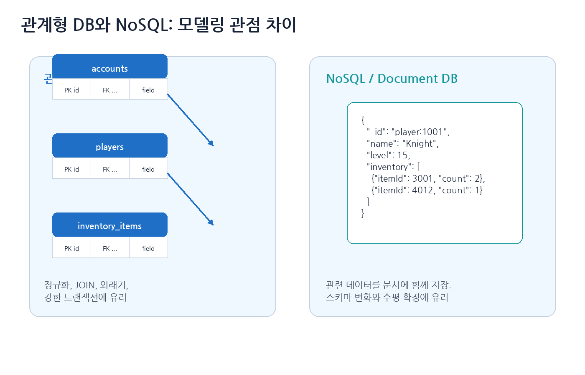
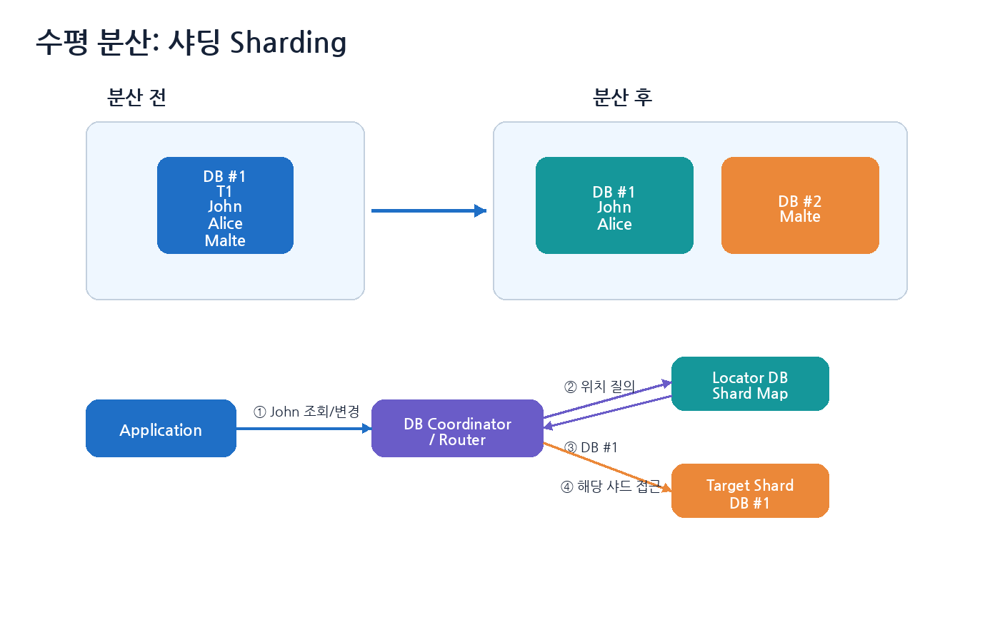
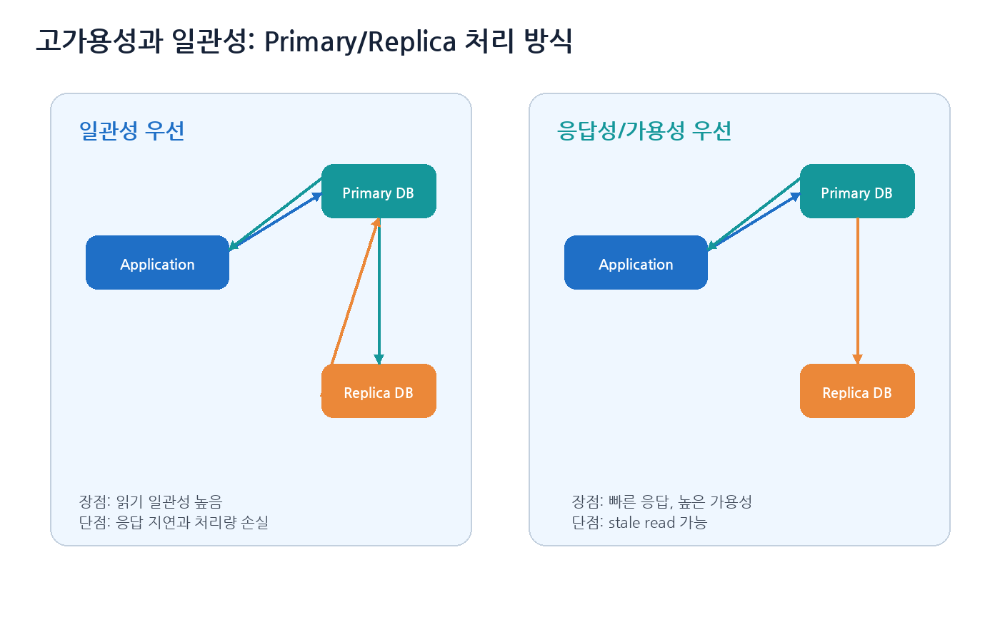
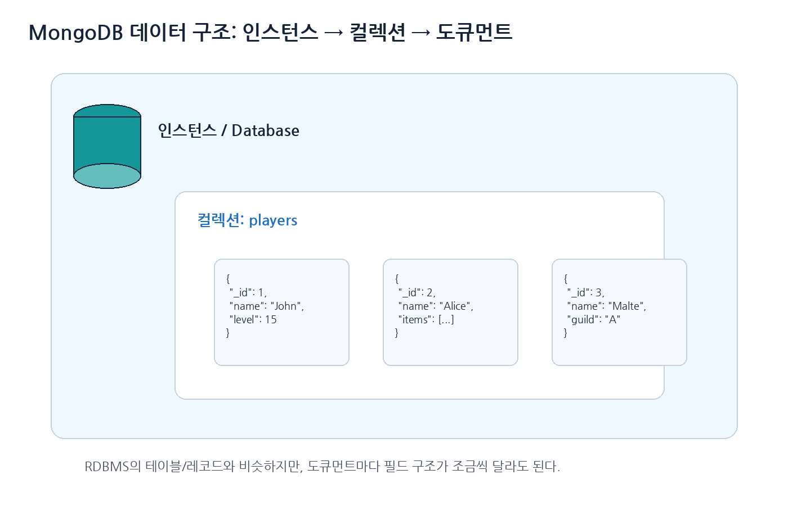
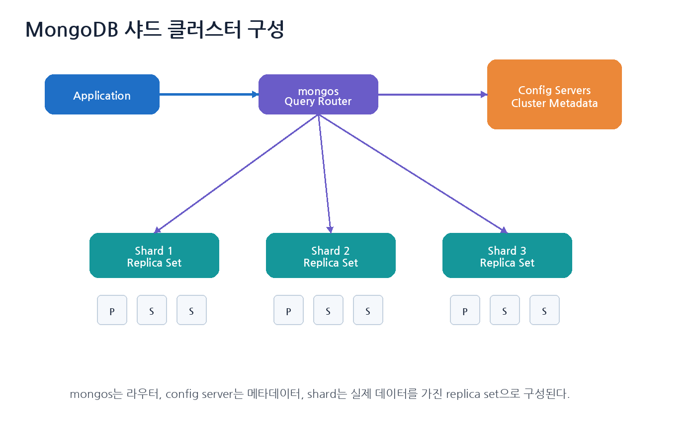
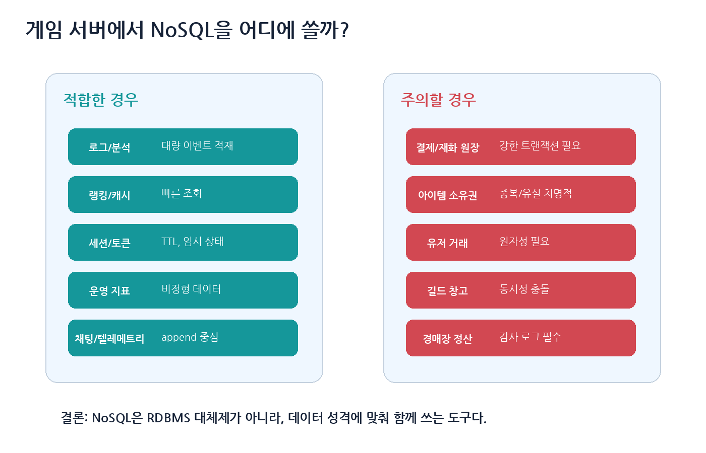

# 8장. NoSQL 기초

> 주 서적: **『게임 서버 프로그래밍 교과서』**  
> 정리 방식: 책을 읽으며 정리한 키워드를 기반으로, 게임 서버 운영 관점에서 필요한 내용을 보강했다.  
> 핵심 주제: **RDBMS와 NoSQL 차이, 수평 확장, 샤딩, 고가용성, 일관성, MongoDB, 게임 서버 활용 기준**

---

## 0. 이 장의 핵심 요약

NoSQL은 “SQL을 쓰지 않는 DB”라기보다, 관계형 데이터베이스가 강하게 지키는 스키마, 조인, 트랜잭션, 일관성 모델을 일부 완화하거나 다른 방식으로 처리해서 **확장성, 유연성, 고가용성, 대량 데이터 처리**를 얻으려는 데이터베이스 계열이다.

게임 서버 관점에서 가장 중요한 결론은 다음이다.

```text
NoSQL은 RDBMS의 상위 호환이 아니다.
RDBMS와 NoSQL은 서로 장단점이 다르다.
게임 서버에서는 데이터 성격에 따라 섞어 쓰는 것이 일반적이다.
```

| 데이터 종류 | 적합한 저장소 예시 |
|---|---|
| 계정, 결제, 아이템 소유권, 재화 원장 | RDBMS 중심 |
| 세션, 토큰, 매칭 임시 상태 | Redis 같은 Key-Value Store |
| 로그, 텔레메트리, 통계 원본 | Document DB, Column Store, Data Lake |
| 유저 프로필, 설정, 비정형 데이터 | Document DB |
| 랭킹, 카운터, 캐시 | Redis, DynamoDB, MongoDB 등 |
| 검색 | Elasticsearch / OpenSearch |

---

## 1. 관계형 데이터베이스와 NoSQL

관계형 데이터베이스는 테이블, 행, 열, 외래키, 조인, 트랜잭션을 중심으로 데이터를 관리한다. 반면 NoSQL은 문서, 키-값, 컬럼 패밀리, 그래프 등 다양한 모델을 사용한다.



### 1.1 관계형 데이터베이스의 장점

| 장점 | 설명 |
|---|---|
| 강한 일관성 | 트랜잭션과 제약 조건으로 데이터 무결성 유지 |
| 조인 | 여러 테이블의 데이터를 관계로 연결 |
| 정규화 | 중복을 줄이고 데이터 구조를 명확히 함 |
| SQL | 복잡한 질의와 집계에 강함 |
| 성숙한 운영 도구 | 백업, 복구, 모니터링, 튜닝 도구가 풍부 |

### 1.2 관계형 데이터베이스의 어려움

필기에서 말한 것처럼 테이블 필드 구조를 바꾸는 일이 부담될 수 있다. 예를 들어 이미 1억 개의 플레이어 레코드가 있는데 새 컬럼을 추가하거나, JSON 형태의 유연한 프로필 데이터를 계속 테이블로 쪼개야 한다면 운영 부담이 커질 수 있다.

또한 데이터가 커지고 트래픽이 증가하면 수평 분산이 어려워진다. 관계형 데이터베이스도 샤딩, 파티셔닝, 리플리케이션이 가능하지만, 애플리케이션 설계 난이도가 높아진다.

### 1.3 NoSQL의 장점과 단점

| 장점 | 설명 |
|---|---|
| 유연한 스키마 | 도큐먼트마다 필드 구조가 조금 달라도 됨 |
| 수평 확장 | 샤딩과 분산 저장을 전제로 설계된 제품이 많음 |
| 높은 쓰기 처리량 | 로그, 이벤트, 텔레메트리 적재에 유리 |
| 고가용성 | replica, quorum, eventual consistency 모델 사용 |
| 데이터 모델 다양성 | key-value, document, wide-column, graph 등 |

| 단점 | 설명 |
|---|---|
| 조인 약함 | 관계가 복잡한 데이터는 애플리케이션에서 처리해야 할 수 있음 |
| 트랜잭션 제약 | 제품마다 범위와 성능 특성이 다름 |
| 일관성 이해 필요 | stale read, eventual consistency를 고려해야 함 |
| 중복 데이터 증가 | 조회 성능을 위해 같은 데이터를 여러 곳에 저장하기 쉬움 |
| 운영 난이도 | 샤딩, replica lag, 핫 파티션, compaction 등을 이해해야 함 |

---

## 2. NoSQL의 주요 종류

NoSQL은 하나의 제품군이 아니라 여러 데이터 모델을 묶어 부르는 말이다.

| 종류 | 대표 제품 | 게임 서버 활용 예시 |
|---|---|---|
| Key-Value Store | Redis, DynamoDB | 세션, 토큰, 캐시, 랭킹 |
| Document DB | MongoDB, Couchbase | 유저 프로필, 로그, 운영 데이터 |
| Wide-Column Store | Cassandra, HBase | 대량 이벤트, 시계열성 데이터 |
| Search Engine | Elasticsearch, OpenSearch | 로그 검색, 채팅 검색, 운영툴 검색 |
| Graph DB | Neo4j | 친구 추천, 관계 분석 |

게임 서버에서는 “NoSQL 하나로 모든 것을 해결”하려고 하기보다, 기능별로 저장소를 나누는 것이 현실적이다.

---

## 3. 관계형 DB의 확장성: 수직 분산과 수평 분산

### 3.1 수직 분산

수직 분산은 기능별로 데이터베이스를 나누는 방식이다.

```text
Account DB
Player DB
Log DB
Billing DB
Chat DB
```

장점은 도메인별 책임이 분리된다는 것이다. 단점은 서로 다른 DB에 걸친 트랜잭션이 어려워진다는 것이다.

### 3.2 수평 분산: 샤딩

수평 분산은 같은 종류의 데이터를 여러 DB에 나누어 저장하는 방식이다. 이를 샤딩이라고 한다.



예를 들어 플레이어 ID 기준으로 샤드를 나눌 수 있다.

```text
player_id % 4 == 0 → shard 0
player_id % 4 == 1 → shard 1
player_id % 4 == 2 → shard 2
player_id % 4 == 3 → shard 3
```

```cpp
int GetShardId(int64_t playerId, int shardCount)
{
    return static_cast<int>(playerId % shardCount);
}

DbConnection& GetPlayerDb(int64_t playerId)
{
    int shardId = GetShardId(playerId, shardDbs.size());
    return shardDbs[shardId];
}
```

단순 모듈러 샤딩은 이해하기 쉽지만, 샤드 수가 바뀌면 많은 데이터의 위치가 바뀌는 문제가 있다. 그래서 대규모 시스템에서는 consistent hashing, shard map, locator DB, routing service 등을 사용한다.

---

## 4. 로케이터 DB와 DB 코디네이터

샤딩된 시스템에서 애플리케이션은 “John의 데이터가 어느 샤드에 있는지” 알아야 한다. 이를 해결하는 방법은 크게 두 가지다.

| 방식 | 설명 |
|---|---|
| 규칙 기반 | `player_id % shard_count`처럼 계산 |
| 로케이터 기반 | 별도 매핑 테이블에서 `player_id → shard_id` 조회 |

로케이터 방식은 샤드 이동, 일부 유저 이전, 핫 유저 분리 등에 유리하다.

```sql
CREATE TABLE shard_locations (
    player_id BIGINT PRIMARY KEY,
    shard_id INT NOT NULL,
    updated_at TIMESTAMP DEFAULT CURRENT_TIMESTAMP
);
```

로케이터 DB가 병목이나 단일 장애점이 되면 안 된다. 따라서 로케이터 DB도 캐시, 복제, 고가용성 구성이 필요하다.

---

## 5. 분산락

샤딩과 분산 저장이 들어가면 “동시에 같은 유저 데이터를 누가 수정할 수 있는가?”가 중요해진다.

분산락은 조심해서 써야 한다.

```text
분산락은 성능 최적화용으로는 쓸 수 있지만,
정확성을 보장해야 하는 핵심 경제 처리의 유일한 안전장치로 쓰면 위험하다.
```

좋은 설계는 보통 다음을 함께 사용한다.

| 기법 | 설명 |
|---|---|
| 소유권 모델 | 한 시점에 한 게임 서버만 특정 플레이어 상태를 수정 |
| fencing token | 오래된 락 소유자가 뒤늦게 쓰는 문제 방지 |
| DB 조건부 업데이트 | `version` 또는 `updated_at` 조건으로 충돌 감지 |
| 트랜잭션 | 핵심 경제 처리 보호 |
| idempotency key | 중복 요청 재처리 방지 |

```sql
UPDATE players
SET gold = gold - 1000,
    version = version + 1
WHERE player_id = 1001
  AND gold >= 1000
  AND version = 42;
```

영향 받은 행이 1개면 성공, 0개면 골드 부족이거나 버전 충돌이다.

---

## 6. 관계형 DB에서 고가용성

고가용성은 일부 장비가 죽어도 서비스를 계속할 수 있는 능력이다.

대표적인 방식은 primary-replica 구조다. 과거 책에서는 master-slave라고 표현하지만, 최근 문서와 업계에서는 primary-replica 또는 primary-secondary 표현을 더 많이 사용한다.



### 6.1 일관성 우선

일관성을 중요하게 보면 primary에 쓴 내용이 replica에 반영된 뒤 성공 응답을 줄 수 있다.

장점은 읽기 일관성이 높다는 것이다. 단점은 응답 시간이 길어지고 처리량이 떨어질 수 있다는 것이다.

### 6.2 응답성 우선

응답성을 중요하게 보면 primary에만 쓰고 곧바로 성공 응답을 준 뒤, replica에는 나중에 반영할 수 있다.

장점은 빠르다는 것이다. 단점은 replica에서 읽으면 잠시 예전 값을 볼 수 있다는 것이다. 이를 stale read라고 한다.

### 6.3 게임 서버에서의 판단

| 데이터 | 일관성 우선 | 응답성 우선 |
|---|---:|---:|
| 결제 결과 | 매우 중요 | 부적합 |
| 캐시 재화 | 매우 중요 | 부적합 |
| 아이템 거래 | 매우 중요 | 부적합 |
| 랭킹 표시 | 상황에 따라 | 가능 |
| 친구 접속 상태 | 낮음 | 가능 |
| 로그/분석 | 낮음 | 가능 |
| 추천 목록 | 낮음 | 가능 |

---

## 7. ACID와 BASE

관계형 데이터베이스는 보통 ACID를 강조한다.

| ACID | 의미 |
|---|---|
| Atomicity | 모두 성공하거나 모두 실패 |
| Consistency | 제약 조건을 만족하는 올바른 상태 유지 |
| Isolation | 동시에 실행돼도 서로 간섭하지 않는 것처럼 처리 |
| Durability | 커밋된 데이터는 장애 후에도 보존 |

반면 많은 분산 NoSQL 시스템은 BASE 성향을 가진다고 설명한다.

| BASE | 의미 |
|---|---|
| Basically Available | 장애가 있어도 가능한 응답 제공 |
| Soft State | 복제/동기화 중 상태가 일시적으로 변할 수 있음 |
| Eventual Consistency | 시간이 지나면 결국 일관된 상태로 수렴 |

정확히 말하면 요즘 NoSQL이 모두 ACID를 포기하는 것은 아니다. MongoDB도 단일 도큐먼트 쓰기는 원자적이고, 여러 도큐먼트 트랜잭션도 지원한다. DynamoDB도 강한 일관성 읽기를 선택할 수 있다. 중요한 것은 제품별 일관성 모델과 비용을 이해하는 것이다.

---

## 8. Eventual Consistency와 Stale Data

Eventual Consistency는 “지금 당장 모든 복제본이 같지는 않을 수 있지만, 새 쓰기가 없으면 시간이 지나 결국 같은 상태가 된다”는 모델이다.

예를 들어 랭킹 시스템에서 점수가 갱신된 직후 다른 서버에서 예전 점수가 보일 수 있다. 하지만 몇 초 뒤에는 최신 점수로 수렴한다면 랭킹 표시 용도로는 허용 가능할 수 있다.

반대로 아이템 구매나 결제 보상에서 stale data가 보이면 심각한 문제가 된다.

| 허용 가능 | 위험 |
|---|---|
| 랭킹이 몇 초 늦게 갱신 | 캐시 재화가 예전 값으로 표시되어 중복 구매 |
| 친구 접속 상태가 잠시 늦음 | 아이템 수량이 예전 값으로 보여 중복 사용 |
| 로그 검색이 늦게 반영 | 결제 보상 중복 지급 |
| 추천 목록이 예전 데이터 | 경매장 정산 오류 |

---

## 9. MongoDB를 위한 JSON 이해

MongoDB는 BSON(Binary JSON) 형태로 도큐먼트를 저장한다. 개발자는 보통 JSON과 비슷한 구조로 데이터를 다룬다.

```json
{
  "_id": "player:1001",
  "name": "Knight",
  "level": 15,
  "inventory": [
    { "itemId": 3001, "count": 2 },
    { "itemId": 4012, "count": 1 }
  ],
  "settings": {
    "language": "ko",
    "showDamageText": true
  }
}
```

관계형 DB라면 플레이어, 인벤토리, 설정을 여러 테이블로 나눌 수 있다. MongoDB에서는 한 도큐먼트 안에 함께 넣을 수 있다.

---

## 10. MongoDB 데이터 구조

MongoDB의 구조는 다음처럼 볼 수 있다.



| RDBMS | MongoDB |
|---|---|
| Instance | Instance |
| Database | Database |
| Table | Collection |
| Row / Record | Document |
| Column | Field |
| Join | Embedding 또는 Reference |

도큐먼트 모델의 장점은 애플리케이션에서 한 번에 필요한 데이터를 한 도큐먼트로 가져오기 쉽다는 것이다. 단점은 도큐먼트가 너무 커지거나, 중복 데이터가 많아지거나, 여러 도큐먼트에 걸친 일관성이 필요해지면 복잡해진다는 것이다.

---

## 11. MongoDB 샤드 클러스터

MongoDB의 샤드 클러스터는 크게 다음 요소로 구성된다.



| 구성 요소 | 역할 |
|---|---|
| shard | 실제 데이터를 저장하는 단위 |
| replica set | 각 shard의 고가용성을 위한 복제 구성 |
| mongos | 애플리케이션 요청을 알맞은 shard로 라우팅 |
| config server | 클러스터 메타데이터와 shard map 저장 |

MongoDB 공식 문서는 sharded cluster 구성 요소로 shard, mongos router, config server를 설명하고, replica set은 동일한 데이터 집합을 유지하는 `mongod` 프로세스 그룹으로 중복성과 고가용성을 제공한다고 설명한다.

---

## 12. MongoDB 모델링 시 주의점

### 12.1 Embedding vs Reference

MongoDB 모델링에서 가장 중요한 선택 중 하나는 데이터를 문서 안에 넣을지, 다른 문서로 참조할지다.

| 방식 | 적합한 경우 |
|---|---|
| Embedding | 함께 조회되고 크기가 제한적인 데이터 |
| Reference | 독립적으로 커지거나 자주 변경되는 데이터 |

예를 들어 유저 설정은 플레이어 문서 안에 넣어도 괜찮다. 하지만 인벤토리 아이템 수가 매우 많고 자주 변경된다면 별도 컬렉션으로 나누는 것이 나을 수 있다.

### 12.2 도큐먼트 크기 제한

MongoDB에는 BSON document size 제한이 있다. 따라서 “플레이어의 모든 것을 하나의 문서에 넣자”는 방식은 위험할 수 있다.

```text
players
player_settings
player_inventory
player_quest_progress
player_logs
```

### 12.3 인덱스

MongoDB도 인덱스가 중요하다.

```javascript
db.players.createIndex({ accountId: 1 })
db.players.createIndex({ name: 1 }, { unique: true })
db.inventory.createIndex({ playerId: 1, itemId: 1 })
```

인덱스가 없으면 컬렉션 전체를 스캔할 수 있다. 반대로 인덱스가 너무 많으면 쓰기 성능과 저장 공간이 나빠진다.

---

## 13. 게임 서버에서 NoSQL을 어디에 써야 하나?



### 13.1 NoSQL에 적합한 경우

| 용도 | 이유 |
|---|---|
| 로그 수집 | append 중심, 스키마 변화 잦음 |
| 게임 텔레메트리 | 대량 이벤트 적재 |
| 운영 분석 | 비정형 필드가 많음 |
| 랭킹 캐시 | 빠른 조회와 갱신 |
| 세션/토큰 | TTL과 key-value 접근 |
| 매치메이킹 임시 상태 | 빠른 조회, 만료 처리 |
| 채팅 기록 일부 | 대량 write, 검색 연동 |

### 13.2 RDBMS가 더 안전한 경우

| 용도 | 이유 |
|---|---|
| 결제 | 강한 일관성, 감사 로그, 중복 방지 |
| 캐시 재화 | 중복 지급/소모 방지 |
| 아이템 소유권 | 유실/복제 치명적 |
| 유저 간 거래 | 양쪽 변경 원자성 필요 |
| 경매장 정산 | 트랜잭션과 추적 필요 |
| 길드 창고 | 여러 유저 동시 접근 |

NoSQL은 게임플레이 데이터 전체를 무조건 대체하기보다는, 로그/분석/캐시/세션/비정형 데이터에서 강점을 발휘하는 경우가 많다.

---

## 14. Redis, DynamoDB, MongoDB를 구분해서 보기

| 저장소 | 특징 | 게임 서버 활용 |
|---|---|---|
| Redis | 인메모리 key-value, 매우 빠름, TTL | 세션, 토큰, 랭킹, 매치 큐 |
| MongoDB | document DB, 유연한 스키마, 샤딩 | 프로필, 로그, 운영 데이터 |
| DynamoDB | 관리형 key-value/document, 자동 확장 | 글로벌 서비스, 세션/이벤트/랭킹 |
| Cassandra | wide-column, 대량 write, 분산 | 대규모 이벤트 로그, 시계열성 데이터 |
| Elasticsearch | 검색 엔진 | 로그 검색, 채팅 검색, 운영툴 |

선택 기준은 “무엇이 더 유명한가”가 아니라 **데이터 접근 패턴**이다.

---

## 15. 분산 시스템에서 중요한 운영 이슈

### 15.1 Hot Partition

특정 key나 shard에 요청이 몰리는 문제다. 예를 들어 랭킹 key 하나에 모든 유저가 동시에 접근하면 해당 파티션만 과부하된다.

대응 방법은 key 분산, shard key 재설계, write sharding, 캐시 계층 추가, 요청 rate limit 등이다.

### 15.2 Replica Lag

쓰기 primary에 반영된 데이터가 replica에 아직 도착하지 않은 상태다. 이때 replica에서 읽으면 stale data를 볼 수 있다.

### 15.3 Backfill과 Re-sharding

샤드 수를 늘리거나 shard key를 바꾸면 기존 데이터를 이동해야 한다. 데이터가 클수록 비용이 크다. 운영 중 re-sharding은 반드시 사전 테스트와 모니터링이 필요하다.

### 15.4 TTL과 데이터 보존 정책

세션, 토큰, 임시 매치 데이터는 TTL로 자동 삭제하면 편하다. 하지만 로그나 결제 관련 데이터는 법적/운영 요구사항에 따라 보존 기간을 명확히 정해야 한다.

---

## 16. 보안과 백업

NoSQL도 DB이므로 보안과 백업이 중요하다.

| 항목 | 설명 |
|---|---|
| 인증/권한 | 관리자 계정과 애플리케이션 계정 분리 |
| 네트워크 격리 | DB 포트를 인터넷에 직접 노출하지 않기 |
| 암호화 | 전송 중/저장 시 암호화 |
| 백업 | 스냅샷과 PITR 지원 여부 확인 |
| 감사 로그 | 관리자 작업, 데이터 변경 추적 |
| 비밀 관리 | 접속 문자열과 암호를 코드에 하드코딩하지 않기 |

MongoDB든 Redis든 Elasticsearch든, 인터넷에 열린 상태로 운영하면 매우 위험하다.

---

## 17. 2026년 기준으로 추가로 알아야 할 것

### 17.1 “NoSQL = eventual consistency”는 너무 단순하다

요즘 NoSQL은 제품마다 강한 일관성 옵션, 트랜잭션, quorum read/write, multi-document transaction 등을 제공한다. 반대로 RDBMS도 replica read를 사용하면 stale read가 생길 수 있다.

따라서 중요한 것은 제품 이름이 아니라 다음 질문이다.

```text
이 읽기는 최신 값이어야 하는가?
이 쓰기는 다른 쓰기와 원자적으로 묶여야 하는가?
이 데이터는 잠시 틀려도 되는가?
샤드 간 트랜잭션이 필요한가?
```

### 17.2 게임 서버는 Polyglot Persistence가 현실적이다

Polyglot Persistence는 데이터 성격에 따라 여러 저장소를 함께 쓰는 접근이다.

```text
MariaDB/PostgreSQL: 계정, 결제, 아이템, 재화
Redis: 세션, 토큰, 매치 큐, 랭킹 캐시
MongoDB/OpenSearch: 로그, 운영 조회, 비정형 이벤트
S3/Data Lake: 장기 보관 로그, 리플레이
```

### 17.3 분산락보다 소유권과 idempotency가 중요하다

분산락을 남발하면 시스템이 느려지고 장애 시 복구가 어려워진다. 게임 서버에서는 가능하면 다음 구조를 우선 고려한다.

```text
한 플레이어의 권위 상태는 한 게임 서버가 소유한다.
중요 요청에는 request_id/idempotency_key를 붙인다.
DB 쓰기는 조건부 업데이트와 버전으로 충돌을 감지한다.
중복 지급이 치명적인 보상은 감사 로그와 유니크 키로 막는다.
```

---

## 18. NoSQL 도입 체크리스트

```text
[ ] 이 데이터는 강한 일관성이 필요한가?
[ ] stale read가 몇 초까지 허용되는가?
[ ] shard key는 무엇인가?
[ ] 특정 key에 트래픽이 몰리지 않는가?
[ ] 인덱스 없이 전체 스캔하는 쿼리가 없는가?
[ ] 도큐먼트가 너무 커지지 않는가?
[ ] 중복 데이터는 어디에서 갱신되는가?
[ ] 백업과 복구 절차가 있는가?
[ ] replica lag을 모니터링하는가?
[ ] DB 포트가 외부에 노출되어 있지 않은가?
[ ] 결제/재화/아이템 같은 핵심 데이터는 별도 강한 보장 장치가 있는가?
```

---

## 19. 이 장의 최종 정리

```text
1. NoSQL은 RDBMS보다 무조건 좋은 것이 아니라 다른 트레이드오프를 가진다.
2. RDBMS는 트랜잭션, 조인, 강한 일관성, 정형 데이터에 강하다.
3. NoSQL은 유연한 스키마, 수평 확장, 고가용성, 대량 데이터 처리에 강하다.
4. 샤딩은 데이터를 여러 DB에 나누는 방식이며 shard key 설계가 중요하다.
5. 로케이터 DB나 라우터는 데이터가 어느 샤드에 있는지 찾는 역할을 한다.
6. primary-replica 구조에서는 응답성과 일관성 사이의 선택이 필요하다.
7. eventual consistency는 stale data를 허용하는 대신 확장성과 가용성을 얻는 모델이다.
8. MongoDB는 collection과 document 기반으로 데이터를 저장한다.
9. 게임 서버에서는 NoSQL을 로그, 분석, 세션, 캐시, 랭킹 등에 주로 활용하고, 결제/재화/아이템 소유권은 강한 보장이 필요하다.
10. 2026년 기준으로는 한 DB만 고집하기보다 데이터 성격에 따라 여러 저장소를 함께 쓰는 polyglot persistence 관점이 중요하다.
```

> NoSQL은 RDBMS를 버리는 선택이 아니라, 데이터의 성격에 맞는 저장소를 추가로 선택하는 것이다.

---

## 참고 자료

- 『게임 서버 프로그래밍 교과서』
- MongoDB Manual, **Sharded Cluster Components**
  - https://www.mongodb.com/docs/manual/core/sharded-cluster-components/
- MongoDB Manual, **Replication**
  - https://www.mongodb.com/docs/manual/replication/
- MongoDB Manual, **Replica Set Deployment Architectures**
  - https://www.mongodb.com/docs/manual/core/replica-set-architectures/
- Amazon DynamoDB Developer Guide, **Read consistency**
  - https://docs.aws.amazon.com/amazondynamodb/latest/developerguide/HowItWorks.ReadConsistency.html
- Martin Kleppmann, **How to do distributed locking**
  - https://martin.kleppmann.com/2016/02/08/how-to-do-distributed-locking.html
- Martin Kleppmann, **Designing Data-Intensive Applications**
