# 9장. 분산 서버 구조

> 주 서적: **『게임 서버 프로그래밍 교과서』**  
> 정리 방식: 책을 읽으며 정리한 키워드를 기반으로, 게임 서버 운영 관점에서 필요한 내용을 보강했다.  
> 핵심 주제: **Scale Up / Scale Out, 데이터 분산, 기능 분산, 동기·비동기 분산 처리, 데이터 응집도, 고가용성, DB 분산**

---

## 0. 이 장의 핵심 요약

분산 서버 구조는 “서버를 여러 대로 나누면 성능이 좋아진다” 정도로 끝나는 주제가 아니다. 핵심은 다음 질문이다.

> 어떤 데이터를, 어떤 기능을, 어떤 기준으로 나누어야 성능·안정성·운영 복잡도 사이의 균형을 맞출 수 있는가?

분산 서버의 목적은 크게 세 가지다.

```text
1. 성능 확장: 더 많은 유저와 더 많은 요청 처리
2. 장애 격리: 하나가 죽어도 전체 서비스가 죽지 않게 함
3. 운영 편의: 서버별 배포, 모니터링, 증설, 축소 가능
```

하지만 분산은 공짜가 아니다.

```text
분산하면 생기는 비용
- 네트워크 통신 비용
- 상태 동기화 비용
- 디버깅 난이도 증가
- 장애 원인 추적 어려움
- 데이터 일관성 문제
- 배포와 운영 복잡도 증가
```

따라서 좋은 분산 설계는 “많이 나누는 것”이 아니라 **나누어야 할 곳만 정확히 나누는 것**이다.

---

## 1. Scale Up과 Scale Out

사용자 수가 늘어나도 서버 성능을 유지하려면 서버 자원을 늘려야 한다. 대표 방식은 수직 확장과 수평 확장이다.

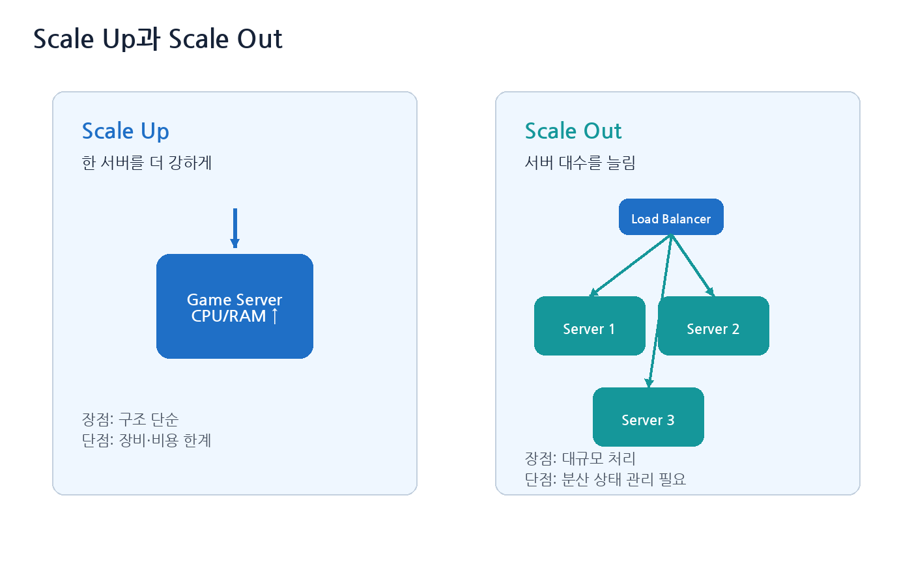

| 구분 | 의미 | 장점 | 단점 |
|---|---|---|---|
| Scale Up | 한 서버의 CPU, RAM, 네트워크 성능을 높임 | 구조가 단순함 | 장비 성능과 비용의 한계 |
| Scale Out | 서버 대수를 늘림 | 대규모 처리에 유리함 | 분산 상태 관리가 어려움 |

게임 서버에서는 처음부터 무리하게 분산 구조를 만들기보다, 먼저 단일 서버 구조를 안정적으로 만들고 병목을 측정한 뒤 분산하는 것이 좋다.

---

## 2. 서버 분산이 없다면 생기는 문제

동시접속자가 많아질 때 단일 서버에서는 다음 문제가 생긴다.

| 자원 | 발생 문제 |
|---|---|
| CPU | 게임 로직, 패킷 처리, 직렬화/역직렬화 비용 증가 |
| 메모리 | 세션, 객체, 버퍼, 월드 상태 증가 |
| 네트워크 | 송수신 대역폭 포화 |
| DB | 쿼리 지연, 락 대기, 디스크 I/O 증가 |
| 스레드 | 컨텍스트 스위칭, 큐 대기 증가 |

사용자 입장에서 보이는 현상은 다음과 같다.

```text
접속이 오래 걸림
응답이 늦음
매칭이 늦음
캐릭터 이동이 끊김
keep-alive / ping timeout 발생
TCP connect timeout 발생
서버가 주기적으로 멈춘 것처럼 보임
```

게임 서버는 보통 CPU와 메모리 사용량이 먼저 문제가 된다. 반면 데이터베이스는 디스크 I/O, 락 대기, 인덱스 갱신 비용이 병목이 되는 경우가 많다.

---

## 3. 고전적인 게임 서버 분산: 인증 서버 + 채널 서버

가장 이해하기 쉬운 구조는 인증 서버 하나와 여러 채널 서버를 두는 방식이다.

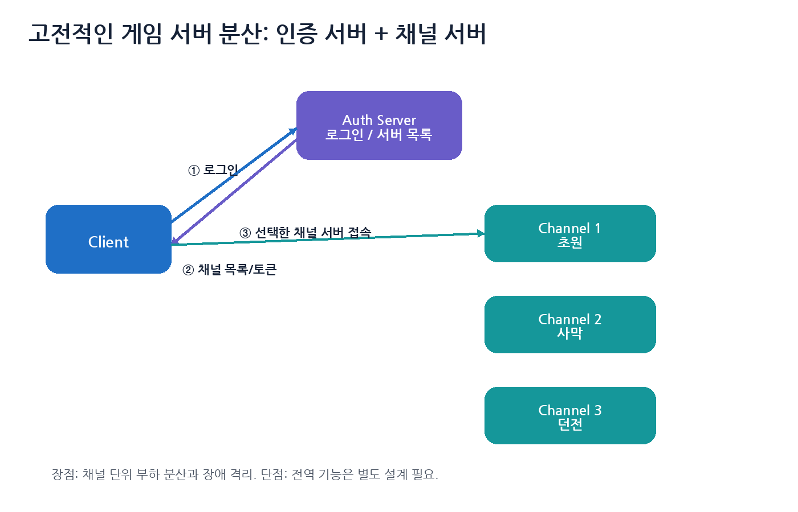

흐름은 다음과 같다.

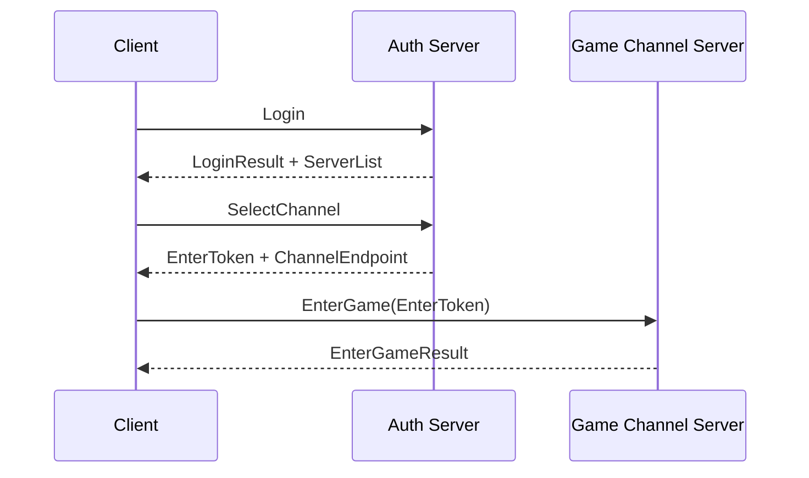

### 3.1 장점

- 구조가 단순하다.
- 채널 단위로 부하를 나눌 수 있다.
- 특정 채널이 죽어도 다른 채널은 살아 있을 수 있다.
- 운영자가 채널 증설/점검을 하기 쉽다.

### 3.2 단점

- 채널 간 이동이 필요할 수 있다.
- 친구, 파티, 길드, 채팅, 경매장 같은 전역 기능은 별도 서버가 필요하다.
- 특정 채널에만 유저가 몰리는 문제가 생길 수 있다.
- 채널 간 데이터 일관성 문제가 생길 수 있다.

---

## 4. 먼저 단일 서버를 제대로 분석해야 한다

분산 처리 전에 반드시 해야 할 일이 있다.

```text
1. 단일 서버로 가능한 구조를 만든다.
2. 부하 테스트를 한다.
3. 프로파일링으로 병목을 찾는다.
4. 병목이 CPU인지, 메모리인지, 네트워크인지, DB인지 구분한다.
5. 정말 분산해야 하는 지점을 선택한다.
```

분산 처리를 먼저 도입하면 코드가 복잡해져서 병목 원인을 찾기 더 어려워질 수 있다.

### 4.1 프로파일링에서 봐야 할 지표

| 영역 | 지표 |
|---|---|
| CPU | tick time, worker thread 사용률, hot function |
| 메모리 | 세션당 메모리, 객체 수, allocator 비용 |
| 네트워크 | 초당 패킷 수, 송수신 바이트, send queue length |
| DB | 쿼리 지연, slow query, lock wait |
| 큐 | job queue length, 처리 대기 시간 |
| OS | context switch, page fault, socket error |

Windows 서버라면 Windows Performance Analyzer, Visual Studio Profiler, Concurrency Visualizer, ETW 등을 사용할 수 있고, Linux 서버라면 `perf`, eBPF, flamegraph, Prometheus/Grafana 계열을 사용할 수 있다.

---

## 5. 데이터 분산 vs 기능 분산

서버를 나누는 방식은 크게 데이터 분산과 기능 분산으로 볼 수 있다.

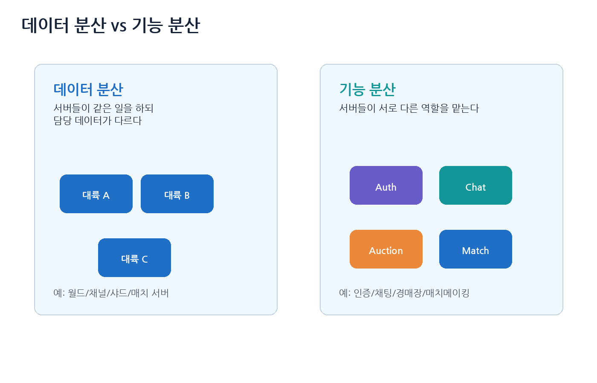

### 5.1 데이터 분산

데이터 분산은 서버들이 같은 종류의 일을 하지만 담당 데이터가 다른 구조다.

```text
World Server 1: 대륙 A 담당
World Server 2: 대륙 B 담당
World Server 3: 대륙 C 담당
```

또는 다음처럼 매치 단위로 나눌 수도 있다.

```text
Match Server 1: Match #1001
Match Server 2: Match #1002
Match Server 3: Match #1003
```

데이터 분산은 게임 서버에서 가장 자연스러운 분산 방식이다. 유저와 몬스터가 같은 지역 또는 같은 매치 안에서 주로 상호작용하기 때문이다.

### 5.2 기능 분산

기능 분산은 서버들이 서로 다른 역할을 맡는 구조다.

```text
Auth Server
Chat Server
Matchmaking Server
Auction Server
Guild Server
Ranking Server
Log Server
```

기능 분산은 특정 기능을 독립적으로 확장하거나 장애 격리하기 좋다. 하지만 기능 간 동기 호출이 많아지면 오히려 전체 지연이 증가할 수 있다.

---

## 6. 로직 처리의 분산 방식

분산 서버 사이에서 로직을 처리하는 방식은 크게 세 가지로 볼 수 있다.

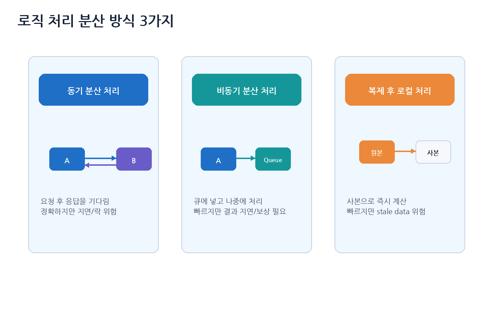

### 6.1 동기 분산 처리

동기 분산 처리는 다른 서버에 요청을 보내고 응답을 기다린 뒤 다음 처리를 하는 방식이다.

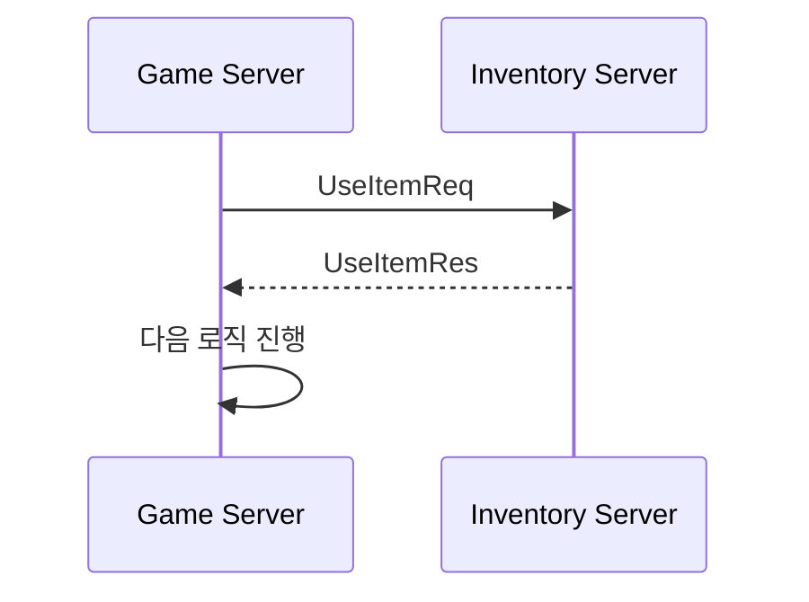

장점은 결과가 명확하다는 것이다. 단점은 상대 서버가 느리면 나도 느려진다는 것이다. 특히 게임 틱 안에서 원격 서버 응답을 기다리는 구조는 위험하다.

### 6.2 비동기 분산 처리

비동기 분산 처리는 요청을 큐에 넣고 나중에 처리하는 방식이다.

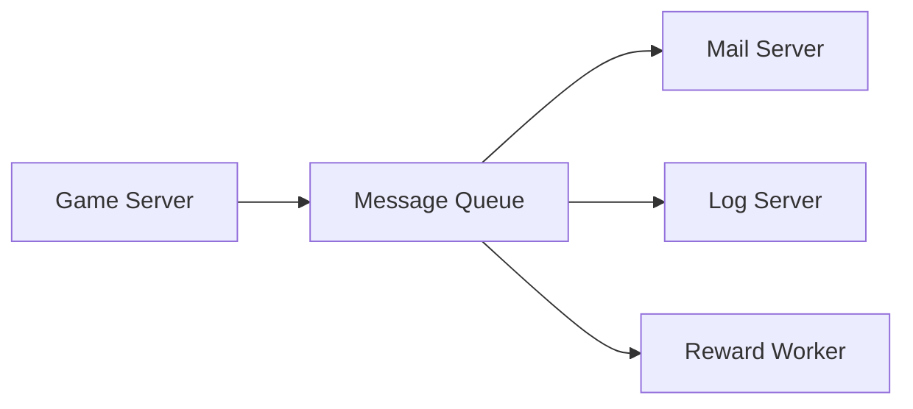

장점은 게임 서버의 응답성을 유지하기 쉽다는 것이다. 단점은 결과가 늦게 반영될 수 있고, 실패했을 때 보상 처리나 재시도가 필요하다는 것이다.

| 적합한 작업 | 이유 |
|---|---|
| 로그 저장 | 즉시 결과가 필요하지 않음 |
| 통계 집계 | 나중에 처리 가능 |
| 우편 발송 | 짧은 지연 허용 가능 |
| 이벤트 보상 지급 | 재시도와 중복 방지 설계 가능 |
| 매치 결과 기록 | 게임 종료 후 비동기 저장 가능 |

### 6.3 데이터 복제 및 로컬 처리

각 서버가 필요한 데이터의 사본을 가지고 로컬에서 처리하는 방식이다.

```text
장점: 원격 호출 없이 빠르게 처리
단점: stale data, 동기화 지연, 디버깅 어려움
```

예를 들어 매치 서버가 유저의 MMR 사본을 들고 있다가 매칭에 사용하면 빠르다. 하지만 MMR이 막 변경된 직후라면 오래된 값으로 매칭할 수 있다.

---

## 7. 데이터 응집도

분산 처리에서 매우 중요한 기준이 데이터 응집도다.

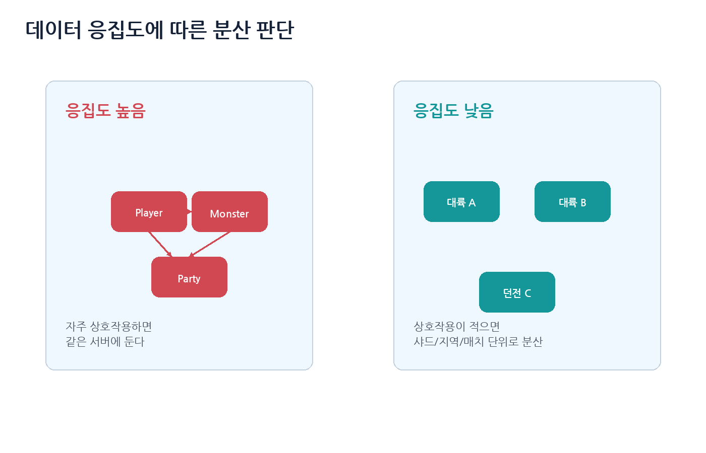

응집도가 높은 데이터는 자주 함께 읽고 쓰이며 서로 강하게 영향을 준다. 이런 데이터는 가급적 같은 서버 또는 같은 프로세스에 두는 것이 좋다.

| 응집도 높은 데이터 | 이유 |
|---|---|
| 같은 전투 안의 플레이어와 몬스터 | 매 틱 상호작용 |
| 파티 던전의 플레이어들 | 스킬, 버프, 어그로, 보상 공유 |
| 거래 중인 두 플레이어의 아이템/재화 | 원자성 필요 |
| 길드 창고 | 여러 유저가 같은 자원 접근 |

| 응집도 낮은 데이터 | 이유 |
|---|---|
| 서로 다른 대륙의 몬스터 | 상호작용 거의 없음 |
| 서로 다른 매치의 플레이어 | 독립적 |
| 로그 데이터와 실시간 전투 | 즉시 상호작용하지 않음 |
| 랭킹 집계와 필드 이동 | 비동기 처리 가능 |

핵심 원칙은 다음이다.

> 자주 함께 바뀌는 데이터는 붙이고, 독립적으로 움직이는 데이터는 나눈다.

---

## 8. 기능 분산은 언제 쓰는가?

기능 분산은 유용하지만 조심해서 써야 한다.

예를 들어 경매장 서버를 따로 두는 것은 자연스럽다. 경매장은 월드 이동과 달리 실시간 틱에 강하게 묶이지 않고, 자체 DB와 트랜잭션을 가진 독립 기능이기 때문이다.

반대로 전투 판정 중 매번 Inventory Server, Skill Server, Buff Server, DB Server에 동기 호출을 하면 성능이 급격히 나빠진다.

| 기능 분산에 적합한 기능 | 이유 |
|---|---|
| 인증 | 게임 플레이와 분리 가능 |
| 채팅 | 별도 확장과 필터링 가능 |
| 경매장 | DB 트랜잭션 중심, 월드와 느슨한 결합 |
| 랭킹 | 비동기 집계 가능 |
| 매치메이킹 | 대기열과 조건 계산이 독립적 |
| 로그/분석 | 비동기 처리 적합 |

| 조심해야 할 기능 | 이유 |
|---|---|
| 전투 판정 | 틱 지연에 민감 |
| 이동 처리 | 매 프레임/틱 처리 필요 |
| 충돌 판정 | 월드 상태와 강하게 결합 |
| 스킬 효과 적용 | 대상, 버프, 위치, 쿨타임과 강한 결합 |

---

## 9. 분산처리를 엄선해야 하는 이유

분산 서버는 디버깅이 어렵다. 단일 서버라면 콜스택과 로그를 보면 되지만, 분산 구조에서는 하나의 요청이 여러 서버를 지나간다.

```text
Client
→ Gateway
→ Game Server
→ Inventory Server
→ DB Worker
→ Database
→ Log Server
```

어느 단계에서 느려졌는지, 어느 서버에서 실패했는지 추적하려면 도구가 필요하다.

| 도구 | 목적 |
|---|---|
| 통합 로그 | 서버 전체 로그를 한 곳에서 검색 |
| Trace ID | 하나의 요청 흐름을 여러 서버에서 추적 |
| Metrics | CPU, RAM, QPS, latency, queue length |
| APM | 서비스 간 호출 지연 분석 |
| Alert | 장애 발생 시 알림 |
| Remote Debugger | 특정 서버의 문제 조사 |
| Distributed Tracing | OpenTelemetry 같은 분산 추적 |

분산 서버에서는 로그에 최소한 다음 값을 넣는 것이 좋다.

```text
trace_id
account_id
character_id
session_id
server_id
request_id
packet_id
latency_ms
error_code
```

---

## 10. 분산처리 전략

분산 처리는 다음 순서로 결정하는 것이 좋다.

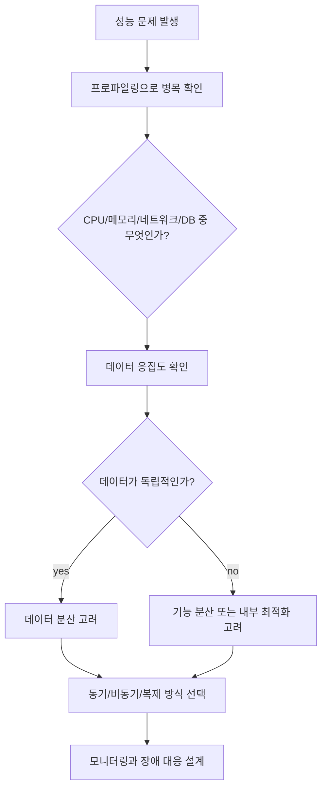

### 10.1 판단 기준

| 질문 | 의미 |
|---|---|
| 병목이 실제로 있는가? | 추측이 아니라 측정이 먼저 |
| 어떤 자원이 부족한가? | CPU, 메모리, 네트워크, DB |
| 데이터 응집도가 높은가? | 자주 함께 바뀌면 나누기 어렵다 |
| 동기 응답이 필요한가? | 필요하면 지연이 늘어날 수 있다 |
| 약간 늦어도 되는가? | 비동기 처리 후보 |
| stale data가 허용되는가? | 복제 후 로컬 처리 후보 |
| 장애 시 어느 범위까지 영향이 가는가? | fault isolation 설계 필요 |

---

## 11. 분산 서버의 또 다른 장점: 안정성

분산 서버는 성능뿐 아니라 안정성에도 도움이 된다.

예를 들어 채팅 서버가 죽어도 게임 월드 서버가 살아 있으면 전투는 계속 진행할 수 있다. 특정 채널 서버가 죽어도 다른 채널은 정상 운영할 수 있다.

이것을 장애 격리라고 볼 수 있다.

```text
장애 격리
- 하나의 장애가 전체 서비스로 전파되지 않도록 경계를 만드는 것
```

---

## 12. 고가용성

고가용성은 사용자가 항상 서비스를 이용할 수 있게 만드는 능력이다.

```text
고가용성 = 장애가 절대 발생하지 않는 것 X
고가용성 = 장애가 발생해도 서비스 중단을 최소화하는 것 O
```

대표 기법은 다음과 같다.

| 기법 | 설명 |
|---|---|
| 다중화 | 같은 역할 서버를 여러 대 둠 |
| 장애 감지 | heartbeat, health check |
| 장애극복 failover | 죽은 서버의 역할을 다른 서버가 대신함 |
| 로드밸런싱 | 요청을 여러 서버에 분산 |
| 자동 복구 | 죽은 프로세스/컨테이너 재시작 |
| AZ 다중화 | 물리적으로 분리된 데이터센터에 배치 |

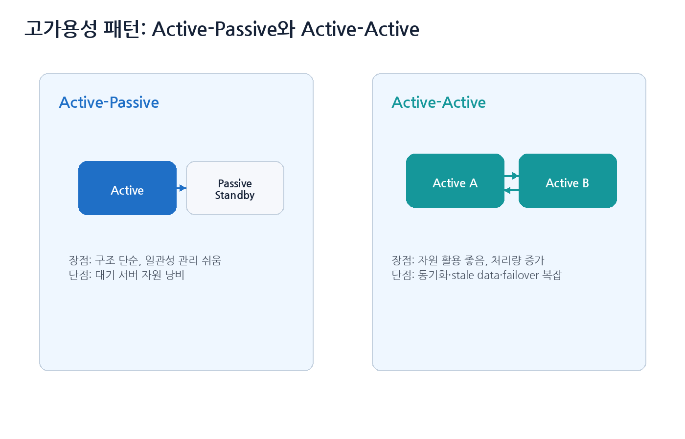

### 12.1 Active-Passive

Active-Passive는 하나의 서버가 실제 요청을 처리하고, 다른 서버는 대기 상태로 있는 구조다.

```text
Active: 실제 요청 처리
Passive: 복제만 받다가 장애 시 승격
```

장점은 구조가 비교적 단순하고 일관성 관리가 쉽다는 것이다. 단점은 passive 서버 자원이 평소에는 놀고 있다는 것이다.

### 12.2 Active-Active

Active-Active는 여러 서버가 모두 요청을 처리하는 구조다.

장점은 자원 활용률이 높고 처리량이 좋다는 것이다. 단점은 데이터 동기화, stale data, 충돌 해결, 장애 시 부하 집중 문제가 더 어렵다는 것이다.

---

## 13. 공유 메모리 서버와 상태 저장소

Active-Active 구조에서 두 서버가 같은 상태를 봐야 하는 경우, Redis 같은 메모리 저장소를 중간에 둘 수 있다.

```text
Game Server A ─┐
               ├─ Redis / Memory Store
Game Server B ─┘
```

이 방식은 편리하지만 주의점이 있다.

| 문제 | 설명 |
|---|---|
| 네트워크 왕복 | 상태 접근마다 서버 간 통신 발생 |
| 저장소 병목 | 모든 서버가 같은 Redis에 몰리면 Redis가 병목 |
| 저장소 장애 | Redis가 죽으면 관련 기능 전체 장애 |
| 일관성 문제 | 캐시와 DB 사이 불일치 가능 |

그래서 메모리 저장소도 replica, sentinel, cluster, 백업, 모니터링을 함께 고려해야 한다.

---

## 14. 오케스트레이션과 2026년 기준 운영 관점

분산 서버가 많아지면 사람이 직접 서버를 켜고 끄는 방식은 한계가 있다. 그래서 컨테이너 오케스트레이션 도구를 사용한다. 대표적으로 Kubernetes가 있다.

### 14.1 오케스트레이션 도구가 해주는 일

| 기능 | 설명 |
|---|---|
| 배포 | 새 버전 배포와 롤백 |
| 스케줄링 | 어느 노드에 서버를 띄울지 결정 |
| 재시작 | 죽은 컨테이너 자동 재시작 |
| 서비스 디스커버리 | 서버 주소 자동 발견 |
| 오토스케일링 | 부하에 따라 서버 수 조절 |
| 설정 관리 | ConfigMap, Secret |
| 헬스 체크 | readiness/liveness probe |
| 롤링 업데이트 | 한 번에 모두 내리지 않고 순차 배포 |

### 14.2 게임 서버에서 주의할 점

Kubernetes가 모든 게임 서버 문제를 해결해주지는 않는다. 실시간 게임 서버는 다음 특성이 있기 때문이다.

```text
1. 세션이 오래 유지된다.
2. TCP/UDP 연결 상태가 있다.
3. 매치/방 단위로 서버에 유저가 붙는다.
4. 서버 종료 시 graceful shutdown이 필요하다.
5. 갑자기 scale down하면 진행 중인 게임이 끊길 수 있다.
```

따라서 게임 서버에서는 다음 설계가 필요하다.

| 항목 | 설명 |
|---|---|
| Drain | 새 유저를 받지 않고 기존 세션 종료 대기 |
| Graceful shutdown | 진행 중 매치 종료 후 서버 종료 |
| Match allocation | 빈 게임 서버에 매치 배정 |
| Session handoff | 필요 시 다른 서버로 이전 |
| Health check | 살아 있음과 입장 가능 상태를 구분 |
| Region/AZ 배치 | 유저 지연과 장애 격리 고려 |

---

## 15. 데이터베이스의 분산

게임 서버보다 데이터베이스가 더 강한 고가용성을 요구하는 경우가 많다. DB가 죽으면 아이템, 재화, 로그인, 저장이 모두 영향을 받기 때문이다.

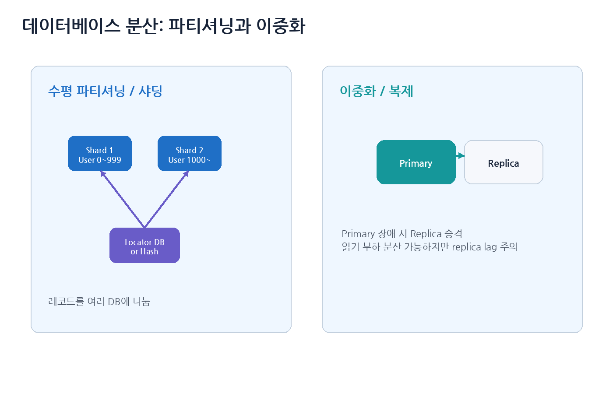

### 15.1 파티셔닝

파티셔닝은 데이터를 나누어 저장하는 것이다.

| 종류 | 설명 | 예시 |
|---|---|---|
| 수평 파티셔닝 | 같은 테이블의 레코드를 여러 DB에 분산 | player_id 기준 샤딩 |
| 수직 파티셔닝 | 테이블 또는 컬럼을 기능별 DB로 분리 | account DB, inventory DB |
| 시간 파티셔닝 | 시간 기준으로 로그 테이블 분리 | 월별 로그 테이블 |

### 15.2 샤딩

샤딩은 수평 파티셔닝의 대표 방식이다.

```cpp
int GetShardId(int64_t playerId, int shardCount)
{
    return static_cast<int>(playerId % shardCount);
}
```

하지만 샤드 수를 바꾸면 데이터 재배치 문제가 생긴다. 그래서 consistent hashing, locator DB, shard map 같은 구조를 사용할 수 있다.

### 15.3 DB 이중화

DB 이중화는 장애 대비를 위한 구조다.

```text
Primary DB: 쓰기 담당
Replica DB: 복제본, 읽기 분산 또는 failover 대기
```

주의할 점은 replica lag다. primary에서 막 변경된 데이터가 replica에 아직 반영되지 않았을 수 있다. 따라서 중요한 읽기는 primary에서 하거나, read-after-write consistency가 필요한 구간을 별도 처리해야 한다.

---

## 16. 로드밸런싱

로드밸런싱은 요청을 여러 서버로 나누는 것이다.

| 방식 | 설명 |
|---|---|
| Round Robin | 순서대로 분산 |
| Least Connection | 연결 수가 적은 서버로 분산 |
| Hash 기반 | 유저 ID, IP, room ID 기준 |
| Region 기반 | 가까운 리전으로 분산 |
| Matchmaker 기반 | 빈 서버나 조건 맞는 서버로 배치 |

게임 서버에서는 단순 round-robin만으로 부족할 수 있다. 매치 서버는 “현재 들어갈 수 있는 방/서버”를 알아야 하고, MMO 월드 서버는 특정 지역이나 채널의 상태를 알아야 한다.

---

## 17. 장애 대응과 운영 체크리스트

분산 서버는 장애가 복잡하게 전파될 수 있으므로, 운영 설계가 개발만큼 중요하다.

```text
[ ] 분산 전 단일 서버 성능 프로파일링을 했는가?
[ ] 병목이 CPU, 메모리, 네트워크, DB 중 어디인지 확인했는가?
[ ] 데이터 응집도가 높은 데이터를 억지로 나누고 있지 않은가?
[ ] 동기 원격 호출이 게임 틱 안에 들어가 있지 않은가?
[ ] 비동기 처리 실패 시 재시도와 중복 방지 키가 있는가?
[ ] 복제 데이터의 stale 문제를 허용 가능한가?
[ ] 각 서버에 health check가 있는가?
[ ] graceful shutdown과 drain이 가능한가?
[ ] 장애 시 영향 범위가 제한되는가?
[ ] trace_id로 요청 흐름을 추적할 수 있는가?
[ ] 통합 로그, 메트릭, 알림이 있는가?
[ ] DB shard/replica lag를 모니터링하는가?
[ ] AZ 또는 region 장애에 대한 계획이 있는가?
```

---

## 18. 이 장의 최종 정리

```text
1. Scale Up은 단순하지만 한계가 있고, Scale Out은 강력하지만 분산 상태 관리가 어렵다.
2. 서버 분산 전에는 반드시 프로파일링으로 실제 병목을 찾아야 한다.
3. 데이터 분산은 같은 역할 서버가 서로 다른 데이터를 맡는 방식이다.
4. 기능 분산은 인증, 채팅, 매치메이킹처럼 서로 다른 기능을 나누는 방식이다.
5. 동기 분산 처리는 정확하지만 지연과 락 위험이 있다.
6. 비동기 분산 처리는 응답성이 좋지만 재시도와 중복 방지가 필요하다.
7. 데이터 복제 후 로컬 처리는 빠르지만 stale data 문제가 생긴다.
8. 응집도가 높은 데이터는 가급적 함께 두고, 응집도가 낮은 데이터부터 분산한다.
9. 고가용성은 장애가 없어지는 것이 아니라 장애 영향을 줄이는 것이다.
10. 분산 서버 운영에는 오케스트레이션, 통합 로그, 메트릭, 트레이싱, 자동 복구가 필수다.
```

> 좋은 분산 서버 구조는 서버를 많이 나눈 구조가 아니라, 장애와 부하가 전파되지 않도록 경계를 잘 나눈 구조다.

---

## 참고 자료

- 『게임 서버 프로그래밍 교과서』
- Kubernetes Documentation, **Overview**
  - https://kubernetes.io/docs/concepts/overview/
- AWS Well-Architected Framework, **Reliability Pillar: Use fault isolation to protect your workload**
  - https://docs.aws.amazon.com/wellarchitected/latest/reliability-pillar/use-fault-isolation-to-protect-your-workload.html
- OpenTelemetry Documentation, **Traces**
  - https://opentelemetry.io/docs/concepts/signals/traces/
- AWS, **Availability Zones - Fault Isolation Boundaries**
  - https://docs.aws.amazon.com/whitepapers/latest/aws-fault-isolation-boundaries/availability-zones.html
- Martin Kleppmann, **Designing Data-Intensive Applications**
- Andrew S. Tanenbaum, Maarten Van Steen, **Distributed Systems**
