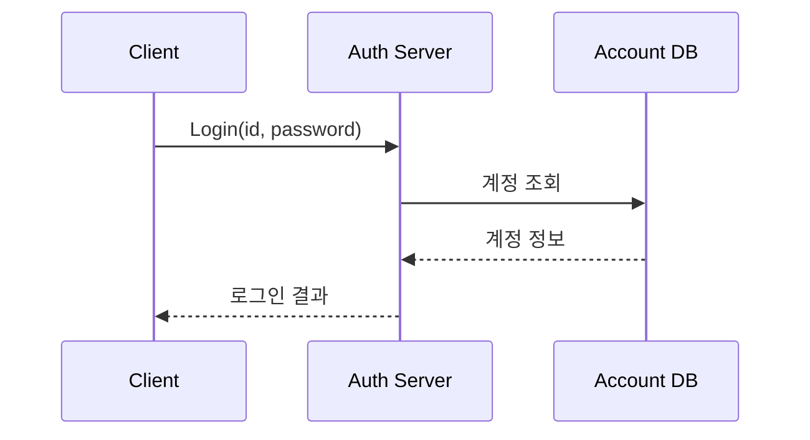
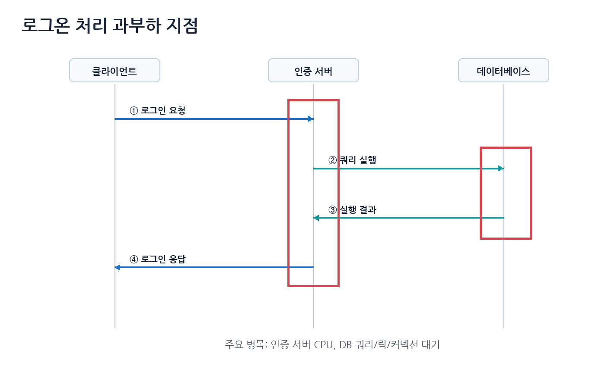
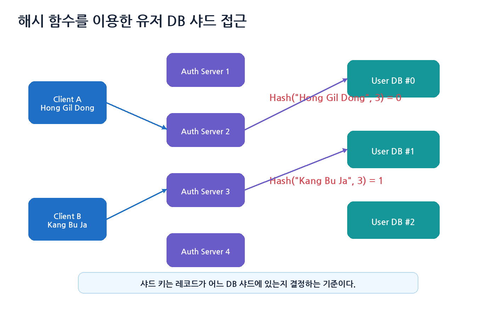
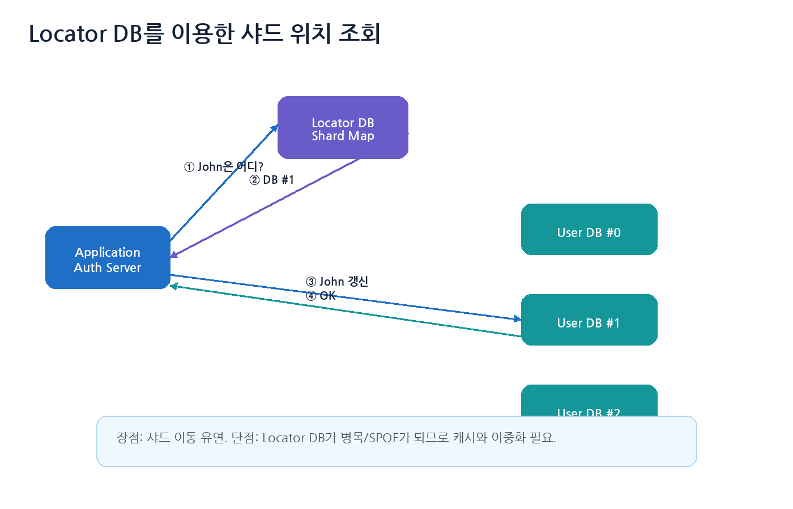
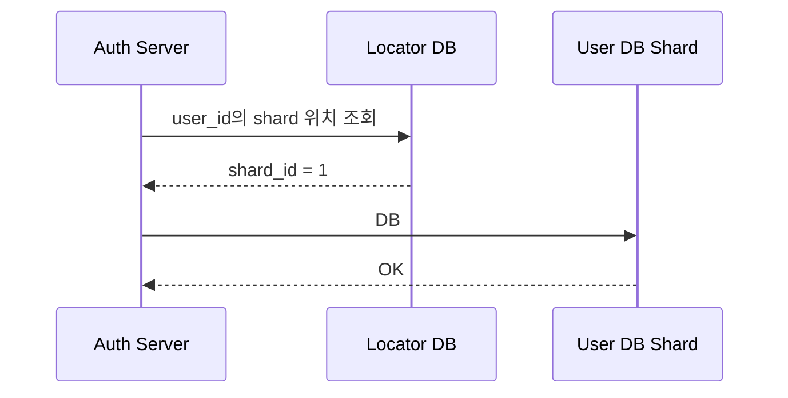
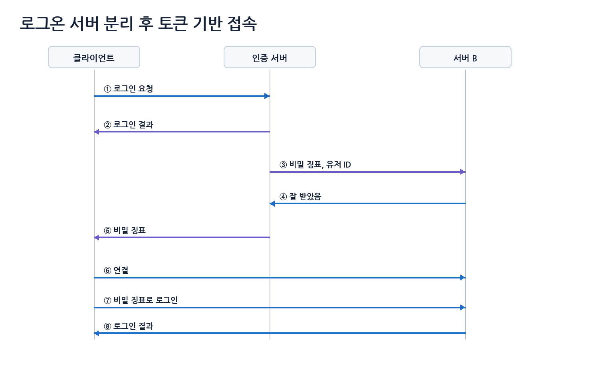
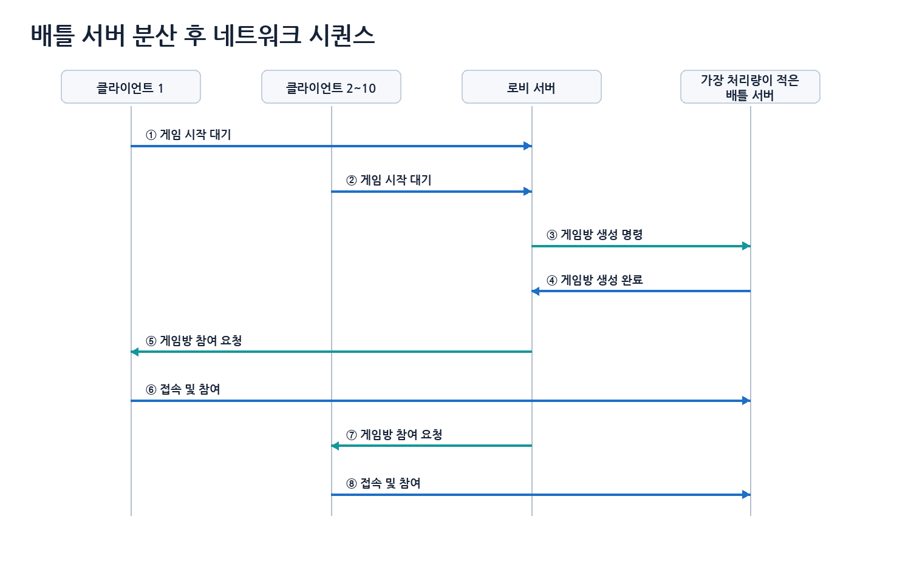
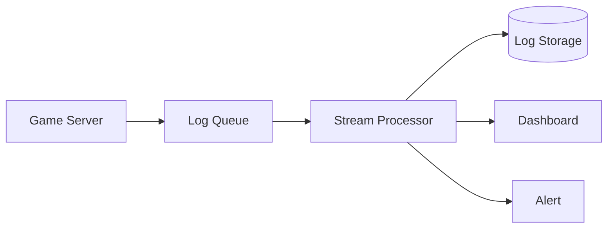
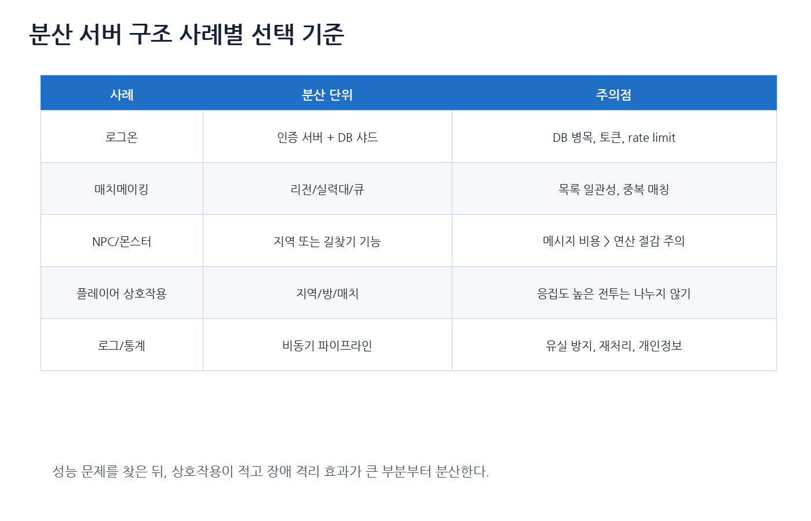

# 10장. 분산 서버 구조 사례

> 주 서적: **『게임 서버 프로그래밍 교과서』**  
> 정리 방식: 책을 읽으며 정리한 키워드를 기반으로, 게임 서버 운영 관점에서 필요한 내용을 보강했다.  
> 핵심 주제: **로그온 분산, DB 샤딩, 리해시, 매치메이킹 분산, 배틀 서버 할당, 인증 토큰, NPC 처리 분산, 로그/통계 분산**

---

## 0. 이 장의 핵심 요약

9장이 “분산 서버 구조의 원리”였다면, 10장은 “실제로 어디를 어떻게 나눌 것인가”를 다룬다.

게임 서버에서 자주 분산하는 대상은 다음과 같다.

| 대상 | 왜 분산하는가 |
|---|---|
| 로그온 처리 | 동시 접속이 몰릴 때 인증 서버와 DB가 병목이 됨 |
| 유저 DB | 계정 수가 많아지면 단일 DB 조회/쓰기 한계가 옴 |
| 매치메이킹 | 리전, 실력, 대기열을 기준으로 분산 가능 |
| 배틀 서버 | 한 게임방/매치를 독립 서버에 배정 가능 |
| NPC/몬스터 처리 | 길찾기, AI, 시뮬레이션 비용이 클 수 있음 |
| 로그/통계 | 대량 데이터 수집과 분석을 비동기로 분산 가능 |

> 분산 서버 사례를 볼 때는 “서버를 몇 대 쓰는가”보다 **어떤 상태를 누가 소유하고, 장애가 났을 때 어떻게 복구하는가**를 봐야 한다.

---

## 1. 로그온 처리의 분산

로그온 처리는 많은 유저가 동시에 몰리는 대표 지점이다. 특히 점검 종료 직후, 이벤트 시작 직후, 대형 업데이트 직후에 인증 요청이 폭증한다.





| 지점 | 병목 원인 |
|---|---|
| 인증 서버 | 비밀번호 검증, 토큰 발급, 세션 생성, TLS 처리 |
| DB 서버 | 계정 조회, 인덱스 탐색, 커넥션 대기, 락, 디스크 I/O |

인증 서버는 가능한 stateless하게 만드는 것이 좋다. 특정 인증 서버 메모리에만 로그인 상태가 있으면 수평 확장이 어려워진다.

---

## 2. 인증 서버 수평 확장

인증 서버는 비교적 수평 확장이 쉬운 편이다. 로그인 요청은 대부분 독립적이고, 인증 서버가 세션 상태를 과도하게 들고 있지 않으면 여러 대로 늘리기 쉽다.

```text
Client
→ Load Balancer 또는 DNS
→ Auth Server Pool
→ Account DB / Redis
```

로드밸런서는 정상 서버만 대상으로 요청을 분산하고, DNS는 지역 기반 라우팅이나 장애 우회에 사용할 수 있다. 다만 DNS는 TTL과 캐시가 있어서 즉각적인 장애 전환에는 한계가 있다.

AWS Route 53은 latency-based routing과 geolocation routing 같은 정책을 제공한다. 이런 기능은 글로벌 게임에서 유저를 가까운 인증 진입점으로 보내는 데 활용할 수 있다.

---

## 3. 데이터베이스의 수평 확장

인증 서버를 여러 대로 늘려도 모든 인증 서버가 하나의 DB를 바라보면 DB가 병목이 된다. 그래서 유저 정보를 여러 DB 샤드에 나누어 저장한다.

### 3.1 해시 기반 샤딩



```text
shard_index = Hash(user_id) % shard_count
```

```cpp
int GetShardIndex(const std::string& userId, int shardCount)
{
    StableHash hash; // 실제 서버에서는 버전 고정된 해시 사용
    return hash(userId) % shardCount;
}
```

C++ `std::hash`처럼 구현체에 따라 결과가 달라질 수 있는 해시를 샤딩 기준으로 쓰면 위험하다. 서버 버전이나 플랫폼이 바뀌어도 결과가 유지되는 stable hash를 써야 한다.

### 3.2 샤드 키 선택

| 샤드 키 | 장점 | 단점 |
|---|---|---|
| account_id | 균등 분산 쉬움 | 닉네임 검색은 별도 인덱스 필요 |
| login_id hash | 로그인 조회와 맞음 | 이름 변경/ID 정책 고려 필요 |
| region_id | 지역별 운영 쉬움 | 특정 리전에 유저가 몰릴 수 있음 |
| guild_id | 길드 단위 응집성 좋음 | 대형 길드가 hot shard가 될 수 있음 |

좋은 샤드 키는 대부분의 조회가 해당 키로 시작하고, 값이 골고루 분포하며, 나중에 변경될 가능성이 낮아야 한다.

---

## 4. 리해시와 데이터 재배치 문제

단순히 `hash(id) % shard_count`를 사용하면 샤드 수가 바뀔 때 문제가 생긴다.

```text
샤드 3개: hash(id) % 3
샤드 4개: hash(id) % 4
```

이렇게 되면 기존 유저의 상당수가 다른 샤드로 이동해야 할 수 있다.

| 방법 | 설명 |
|---|---|
| Consistent Hashing | 샤드 변경 시 이동량을 줄임 |
| Virtual Node | 샤드별 부하를 더 균등하게 분산 |
| Locator DB | 유저 → 샤드 매핑을 별도 DB에 저장 |
| Shard Map Cache | 자주 쓰는 매핑을 인증 서버에 캐시 |
| Online Migration | 서비스 중 점진적으로 데이터 이동 |

---

## 5. Mapping DB / Locator DB

책의 정리처럼 레코드가 어느 샤드에 있는지 찾기 위해 별도 매핑 DB를 둘 수 있다.





장점은 샤드 수가 바뀌어도 전체 재해시가 필요하지 않을 수 있고, 특정 유저를 다른 샤드로 옮기기 쉽다는 것이다. 단점은 Locator DB가 병목이나 SPOF가 될 수 있다는 것이다.

따라서 Locator DB도 캐시, 복제, 장애 전환, 백업이 필요하다.

---

## 6. 로그온 토큰 기반 서버 이동

로그온 서버를 분리하면 다른 서버가 “이 클라이언트가 정말 인증된 유저인지” 알아야 한다. 이를 위해 인증 서버는 짧은 수명의 비밀 징표, 즉 token을 발급한다.



| 항목 | 설명 |
|---|---|
| 짧은 만료 시간 | 탈취되어도 오래 쓰지 못하게 함 |
| 일회성 사용 | 재전송 공격 방지 |
| 서버 ID 포함 | 특정 게임 서버에서만 사용 가능 |
| 유저 ID 포함 | 토큰과 유저 매핑 확인 |
| nonce 포함 | 중복 사용 방지 |
| 서명 또는 서버 저장 | 위조 방지 |
| 사용 후 폐기 | enter token 재사용 방지 |

JWT 같은 self-contained token을 쓸 수도 있고, Redis에 저장된 opaque token을 쓸 수도 있다. 게임 서버 입장에서는 enter token을 검증한 뒤 세션을 생성하고, 토큰은 재사용 불가능하게 만드는 것이 좋다.

---

## 7. 매치메이킹의 분산 처리

매치메이킹은 플레이어를 조건에 맞는 게임방 또는 배틀 서버에 배정하는 작업이다.

```text
Lobby Server
- 매치메이킹 큐 관리
- 실력, 리전, 파티, 대기 시간 조건 계산
- 빈 Battle Server 할당

Battle Server
- 실제 게임방 실행
- 게임 로직, 전투, 이동, 결과 처리
```



| 기준 | 설명 |
|---|---|
| 리전 | 플레이어들에게 가장 낮은 RTT를 제공하는 지역 |
| 현재 매치 수 | 이미 실행 중인 게임방 수 |
| CPU/RAM | 서버 자원 사용량 |
| Tick Time | 게임 루프가 밀리는지 |
| 입장 가능 상태 | drain 중인 서버는 제외 |
| 버전 | 클라이언트와 서버 빌드 버전 일치 |
| 게임 모드 | 모드별 서버 풀 구분 |

### 7.1 플레이어 목록 불일치 문제

로비 서버를 여러 대로 나누면 플레이어 목록 불일치가 생길 수 있다.

```text
1. Lobby A가 플레이어 X를 매칭 후보로 본다.
2. 그 사이 플레이어 X가 취소하거나 다른 Lobby에서 매칭된다.
3. Lobby A가 오래된 정보로 게임방에 넣으려고 한다.
```

| 방법 | 설명 |
|---|---|
| 중앙 대기열 | Redis 같은 저장소에 대기 상태를 한 곳에서 관리 |
| 상태 전이 원자화 | WAITING → ALLOCATING → MATCHED |
| compare-and-set | 아직 WAITING일 때만 MATCHED로 변경 |
| idempotency key | 같은 요청 중복 처리 방지 |
| timeout | ALLOCATING 상태가 오래 지속되면 복구 |

---

## 8. 전용 게임 서버 관리와 2026년 운영 관점

2026년 기준으로는 Kubernetes 위에서 전용 게임 서버를 관리하는 도구도 많이 언급된다. 대표적으로 Agones가 있다.

```text
Fleet
- 미리 켜둔 Battle Server 풀

GameServerAllocation
- 매치메이커가 빈 Battle Server 하나를 안전하게 할당받는 요청
```

직접 구현하더라도 같은 개념이 필요하다.

```text
1. 빈 게임 서버 목록 관리
2. 서버 상태: Ready / Allocated / Draining / Shutdown
3. 동시에 두 매치가 같은 서버를 잡지 않게 원자적 할당
4. 매치 종료 후 서버 반환 또는 재시작
```

---

## 9. NPC / 몬스터 처리의 분산

몬스터는 플레이어보다 훨씬 많을 수 있다. 몬스터 처리에는 이동 시뮬레이션, AI 상태 갱신, 길찾기 A*, 어그로 계산, 스킬 판단, 주변 플레이어에게 상태 전송 비용이 들어간다.

별도 NPC 서버가 항상 좋은 것은 아니다. NPC 처리를 별도 서버로 빼면 메시지 왕복, 상태 동기화, 장애 복구 비용이 생긴다. 만약 몬스터 AI 연산보다 메시지 송수신 비용이 더 크다면 분산 효과가 없다.

| 병목 | 분산 후보 |
|---|---|
| 길찾기 A* | Pathfinding Worker 또는 Navigation Service |
| AI 의사결정 | AI Worker |
| 대규모 군집 이동 | 지역 단위 World Server 분산 |
| 상태 전송 | AOI, replication frequency 조절 |
| 스폰/디스폰 | 월드 서버 내부 최적화 |

```cpp
struct PathRequest
{
    uint64_t requestId;
    int monsterId;
    Vec3 start;
    Vec3 goal;
};

struct PathResult
{
    uint64_t requestId;
    int monsterId;
    std::vector<Vec3> waypoints;
    bool success;
};

void MonsterAI::OnPathResult(const PathResult& result)
{
    if (result.requestId != lastPathRequestId)
        return; // 오래된 path 결과는 버린다.

    if (result.success)
        currentPath = result.waypoints;
}
```

---

## 10. 플레이어 간 상호작용 분산 처리

플레이어 간 상호작용은 일반적으로 함부로 분산하지 않는 것이 좋다.

```text
좋은 분산:
지역 A와 지역 B처럼 상호작용이 거의 없는 플레이어를 나눔

나쁜 분산:
같은 전투 안의 플레이어 A와 B를 다른 서버에 두고 매 공격마다 동기 호출
```

MMORPG에서는 채널, 지역 서버, 인스턴스 던전, 심리스 월드 같은 방식으로 분산할 수 있다. 심리스 MMO는 플레이어가 지역 경계를 넘을 때 상태 이관과 ghost entity, cross-zone messaging이 필요해서 난이도가 높다.

---

## 11. 로그 및 통계 분석의 분산 처리

로그와 통계는 분산 처리에 매우 적합하다. 실시간 게임 루프와 강하게 묶이지 않고, 대량 데이터를 비동기로 처리할 수 있기 때문이다.



| 로그 | 용도 |
|---|---|
| 접속 로그 | DAU, CCU, 리전별 접속 분석 |
| 전투 로그 | 밸런스 분석, 버그 추적 |
| 경제 로그 | 재화 흐름, 어뷰징 탐지 |
| 아이템 로그 | 지급/삭제/거래 추적 |
| 매치 로그 | 매칭 품질, 이탈률 분석 |
| 에러 로그 | 장애 원인 분석 |
| 보안 로그 | 핵/비정상 요청 탐지 |

로그 파이프라인은 유실, 중복 처리, 개인정보, 비용, 실시간 알림, 순서 보장을 함께 고려해야 한다.

---

## 12. 게임 장르별 분산 서버 형태

### 12.1 MMORPG

```text
Auth Server
World/Channel Server
Zone Server
Chat Server
Guild Server
Auction Server
DB Shard
Log Pipeline
```

MMORPG에서는 플레이어 이동, 몬스터 AI, AOI, 채널/지역 이동, 경제 데이터가 중요하다.

### 12.2 심리스 MMO

| 기술 | 설명 |
|---|---|
| Zone Partitioning | 월드를 영역으로 나눔 |
| Interest Management | 주변 객체만 동기화 |
| Handoff | 서버 간 플레이어 상태 이관 |
| Ghost Entity | 경계 근처 객체를 이웃 서버에 복제 |
| Cross-zone Messaging | 경계 너머 상호작용 처리 |
| Load Rebalancing | 특정 지역 과밀 시 재배치 |

### 12.3 SNG / 모바일 RPG

```text
Client
→ API Gateway
→ Auth / Player / Inventory / Shop Service
→ DB / Cache
→ Log / Analytics
```

이 장르는 HTTP/gRPC 기반 백엔드와 DB/캐시 설계가 중요하다. 실시간 월드 서버보다는 API 서버 확장, DB 샤딩, 캐시, 보상 중복 방지가 핵심이다.

### 12.4 FPS / 세션 기반 액션 게임

```text
Lobby / Matchmaking Server
→ Dedicated Battle Server Allocation
→ Match 종료 후 결과 저장
```

중요한 것은 배틀 서버 위치다. 플레이어와 가까운 리전의 서버를 배정해야 지연이 줄어든다.

---

## 13. 분산 서버 구조 사례별 선택 기준



분산 후보를 정할 때는 다음 순서로 판단한다.

```text
1. 실제 병목이 있는가?
2. 해당 기능은 독립적으로 분리 가능한가?
3. 동기 응답이 꼭 필요한가?
4. 데이터 일관성 요구가 얼마나 강한가?
5. 장애가 났을 때 영향 범위를 줄일 수 있는가?
6. 운영 도구로 관측 가능한가?
```

---

## 14. 실전 관리 체크리스트

```text
[ ] 로그인 서버는 stateless하게 확장 가능한가?
[ ] 로그인 폭주 시 rate limit과 queueing 전략이 있는가?
[ ] DB 샤드 키가 균등하고 안정적인가?
[ ] 샤드 증설 시 리해시/마이그레이션 계획이 있는가?
[ ] Locator DB 또는 shard map이 SPOF가 되지 않는가?
[ ] enter token은 짧은 수명, 일회성, 서버 지정, 재사용 방지가 되는가?
[ ] 매치메이킹 큐 상태 전이가 원자적인가?
[ ] 같은 Battle Server가 두 매치에 중복 할당되지 않는가?
[ ] Battle Server에 drain/graceful shutdown이 있는가?
[ ] NPC 분산 전 실제 병목을 프로파일링했는가?
[ ] 원격 NPC 처리보다 메시지 비용이 더 큰지 검토했는가?
[ ] 플레이어 간 전투처럼 응집도 높은 데이터를 억지로 나누지 않았는가?
[ ] 로그 파이프라인은 유실/중복/개인정보/비용을 고려했는가?
[ ] trace_id로 로그인, 매치, 게임 입장 흐름을 추적할 수 있는가?
```

---

## 15. 이 장의 최종 정리

```text
1. 로그온 처리 분산은 인증 서버와 DB 병목을 따로 봐야 한다.
2. 인증 서버는 stateless하게 만들수록 수평 확장이 쉽다.
3. DB 샤딩에서는 샤드 키 선택과 리해시 문제가 중요하다.
4. Locator DB는 유연하지만 SPOF와 병목이 되기 쉽다.
5. 인증 서버에서 발급한 enter token으로 게임 서버 입장을 검증할 수 있다.
6. 매치메이킹은 리전, 실력, 대기 시간, 서버 부하를 함께 고려한다.
7. Battle Server 할당은 원자적으로 처리되어야 한다.
8. NPC 처리는 무조건 분리하지 말고, 실제 병목을 측정한 뒤 분리해야 한다.
9. 플레이어 간 상호작용은 응집도가 높으므로 지역/방/매치 단위로 나누는 것이 보통이다.
10. 로그와 통계는 비동기 분산 처리에 적합하지만 유실, 중복, 개인정보를 고려해야 한다.
```

> 분산 서버 구조 사례를 공부할 때는 “나누는 방법”보다 “나눈 뒤 생기는 상태·장애·운영 문제를 어떻게 관리할 것인가”를 함께 봐야 한다.

---

## 참고 자료

- 『게임 서버 프로그래밍 교과서』
- AWS Route 53 Developer Guide, **Choosing a routing policy**
  - https://docs.aws.amazon.com/Route53/latest/DeveloperGuide/routing-policy.html
- AWS Route 53 Developer Guide, **Latency-based routing**
  - https://docs.aws.amazon.com/Route53/latest/DeveloperGuide/routing-policy-latency.html
- Agones Documentation, **Fleet Specification**
  - https://agones.dev/site/docs/reference/fleet/
- Agones Documentation, **GameServerAllocation Specification**
  - https://agones.dev/site/docs/reference/gameserverallocation/
- OpenTelemetry Documentation, **Traces**
  - https://opentelemetry.io/docs/concepts/signals/traces/
- Martin Kleppmann, **Designing Data-Intensive Applications**
- Andrew S. Tanenbaum, Maarten Van Steen, **Distributed Systems**
